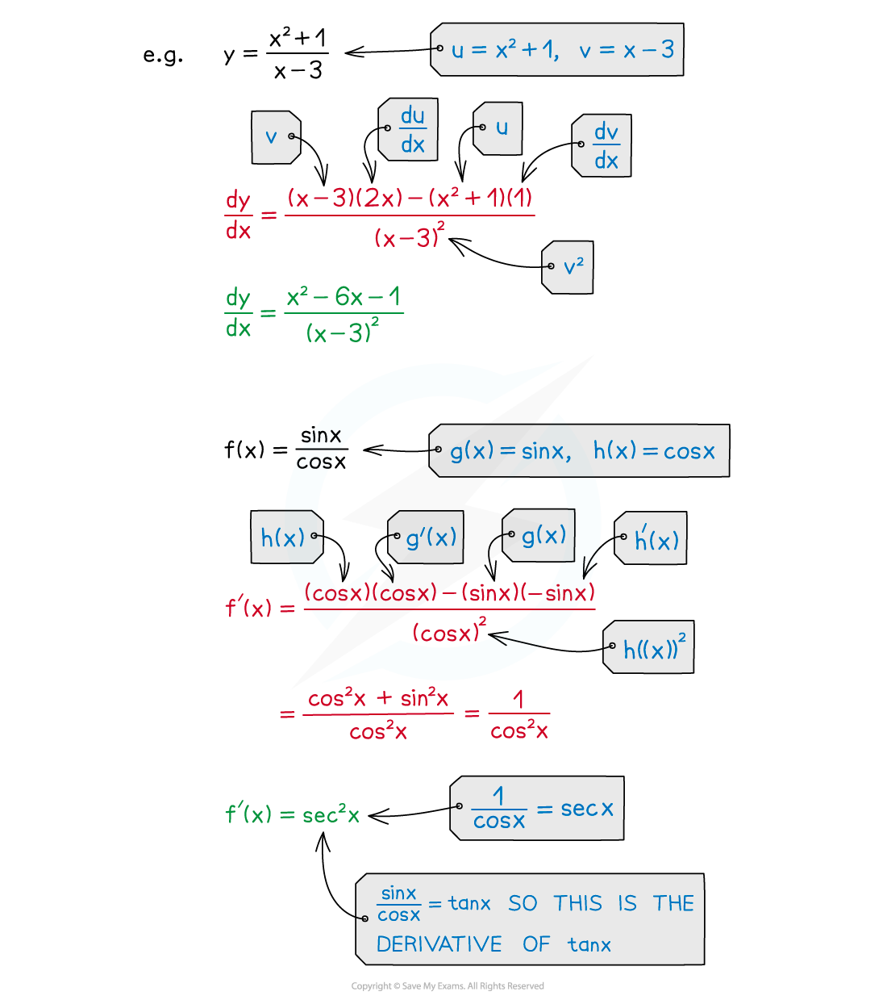

# Quotient Rule

## Quotient Rule

> **Spec point** — `spcpt_NMz2QnW3vCFZCZmm`

## Quotient rule

### What is the quotient rule?

- The quotient rule is a formula that allows you to differentiate a **quotient of two functions** (ie one function divided by another)
- If $y=\frac{u}{v}$ where ***u ***and ***v***** **are functions of** *****x*** then the quotient rule is:

$\frac{dy}{dx}=\frac{v\frac{du}{dx}-u\frac{dv}{dx}}{v^{2}}$

- In **function notation, **if $f(x)=\frac{g(x)}{h(x)}$ then the quotient rule can be written as:

$f'(x)=\frac{h(x)g'(x)-g(x)h'(x)}{(h(x))^{2}}$

> **Exam Hint**
> - The quotient rule formula is in the formulae booklet – you don't have to memorise it.
> - Be careful using the formula – because of the minus sign in the numerator the order of the functions is important.
> - Look out for functions of the form $f(x)=g(x)(h(x))^{-1}$
> 
>   - You could differentiate that using a combination of the **chain rule** and the **product rule** (and it can be good practice for you to try it!)
>   - But it can also be seen as just a quotient rule question in disguise
>   
>     - $g(x)(h(x))^{-1}=\frac{g(x)}{h(x)}$

> **Worked Example**
> 
