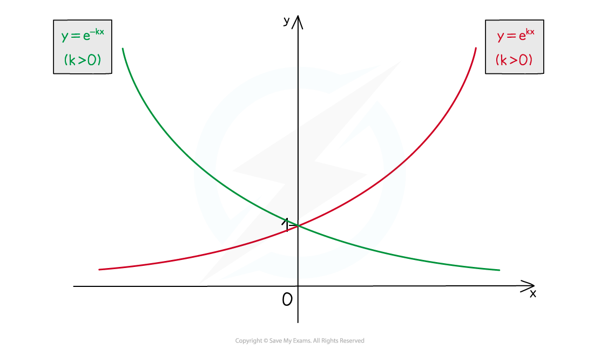

# Derivatives of Exponential Functions

## Derivatives of Exponential Functions

> **Spec point** — `spcpt_ZNpcttH3C8QZc9WH`

## Derivatives of exponential functions

### What is the derivative of ex?

- **y = e****x** has the particular property that

$\frac{dy}{dx}=e^{x}$

- i.e. for *every* real number **x**, the gradient of **y = e****x** is also equal to **e****x **(see Derivatives of Exponential Functions)

- **e ≈ 2.718 **(see "e")
- Recall that the derivative is the gradient function for a curve (see First Principles Differentiation)

### What is the derivative of y = ekx and y=e-kx?

- ** **The derivative of **y = e****kx** is

  - $\frac{dy}{dx}=ke^{kx}$
- The derivative of **y = e****-kx** is

  - $\frac{dy}{dx}=-ke^{-kx}$

> **Exam Hint**
> - Remember that (like **π**) **e** is a **number**.
> - Exam questions can ask for answers to be given as exact values in terms of **e** (see the Worked Example below).

> **Worked Example**
> 
> 
> 
> 
> 
> 
> 
> 
> 
