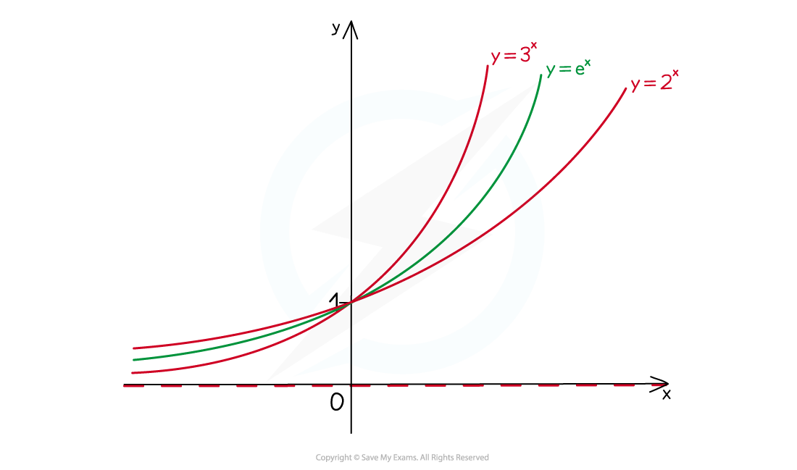
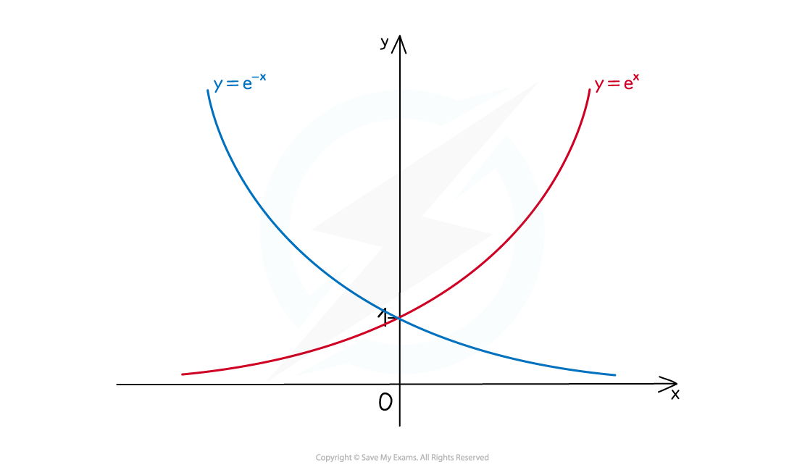
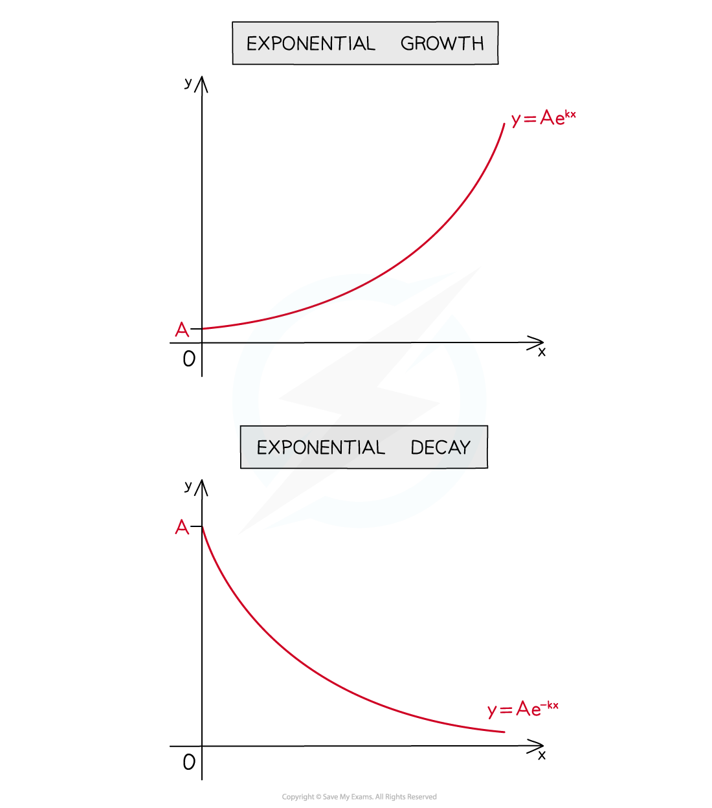

# e & ln

## "e"

> **Spec point** — `spcpt_RN7njy7mfmQdHSc3`

## "e"

### What is the number "e" in maths?

- **e** is an *irrational* number, sometimes called Euler's number

  - **e ≈ 2.718**

### How do I sketch y = ex?

- As other exponential graphs do, **y = e****x**

  - passes through (0, 1)
  - has the x-axis as an asymptote

### What is the special property of "e"?

- **y = e****x** has the particular property

  - **dy/dx = e****x**
  - ie for *every* real number **x**, the gradient of **y = e****x** is also equal to **e****x** (see  Derivatives of Exponential Functions)

### How do I sketch y = e-x?

** **

- **y = e****-x** is a reflection in the **y**-axis of **y = e****x**

  - They are of the form **y = f(x)** and **y = f(-x)** (see  Transformations of Functions - Reflections)

### What is exponential growth and decay?

** **

- **y = Ae****kx** (**k > 0**) is exponential growth
- **y = Ae****-kx** (**k > 0**) is exponential decay
- **A** is the initial value
- **k** is a (usually positive) constant
- “-“ is used in the equation making clear whether it is growth or decay

> **Worked Example**
> 
> 
> 

## "ln"

> **Spec point** — `spcpt_XgXVbHC78KpKttrb`

## "ln"

### What is ln x?

- **ln** is a function that stands for **natural logarithm**
- It is a logarithm where the **base** is the constant "**e**"

  - $\mathrm{ln}x\equiv\mathrm{log}_{e}x$
  - It is important to remember that **ln** is a function and **not a number**

### What properties of ln x do I need to know?

- Using the **definition** of a **logarithm** you can see

  - $\mathrm{ln}1=0$
  - $\mathrm{ln}e=1$
  - $\mathrm{ln}e^{x}=x$
  - $\mathrm{ln}x$ is only defined for positive *x*
- As ln is a logarithm you can use the **laws of logarithms**

  - $\mathrm{ln}a+\mathrm{ln}b=\mathrm{ln}(ab)$
  - $\mathrm{ln}a-\mathrm{ln}b=\mathrm{ln}(\frac{a}{b})$
  - $n\mathrm{ln}a=\mathrm{ln}(a^{n})$
- Any logarithm can be written in terms of the natural logarithm using the **change of base** formula

  - `log subscript a invisible function application b equals fraction numerator ln invisible function application b over denominator ln invisible function application a end fraction`

### How do I solve equations involving ex & ln x?

- The functions $e^{x}$ and $\mathrm{ln}x$ are **inverses** of each other

  - If $e^{f(x)}=g(x)$ then `straight f stretchy left parenthesis x stretchy right parenthesis equals ln invisible function application space straight g stretchy left parenthesis x stretchy right parenthesis`
  - If `ln invisible function application space straight f left parenthesis x right parenthesis equals straight g open parentheses x close parentheses` then `straight f open parentheses x close parentheses equals straight e to the power of straight g open parentheses x close parentheses end exponent`
- If your equation involves "e" then try to get all the "e" terms on one side

  - If "e" terms are multiplied, you can add the powers
  
    - $e^{x}\timese^{y}=e^{x+y}$
    - You can then apply ln to both sides of the equation
  - If "e" terms are added, try transforming the equation with a substitution
  
    - For example: If $y=e^{x}$ then $e^{4x}=y^{4}$
    - You can then solve the resulting equation (usually a quadratic)
    - Once you solve for *y* then solve for *x *using the substitution formula
- If your equation involves "ln", try to combine all "ln" terms together

  - Use the laws of logarithms to combine terms into a single term
  - If you have `ln invisible function application space straight f open parentheses x close parentheses equals ln invisible function application space straight g left parenthesis x right parenthesis` then solve `straight f open parentheses x close parentheses equals straight g left parenthesis x right parenthesis`
  - If you have `ln invisible function application space straight f open parentheses x close parentheses equals k` then solve `straight f open parentheses x close parentheses equals straight e to the power of k`

> **Worked Example**
> 

> **Exam Hint**
> - Always simplify your answer if you can
> 
>   - for example, $\frac{1}{2}\mathrm{ln}25=\mathrm{ln}\sqrt{25}=\mathrm{ln}5$
>   - you wouldn't leave your final answer as $\sqrt{25}$ so don't leave your final answer as $\frac{1}{2}\mathrm{ln}25$
