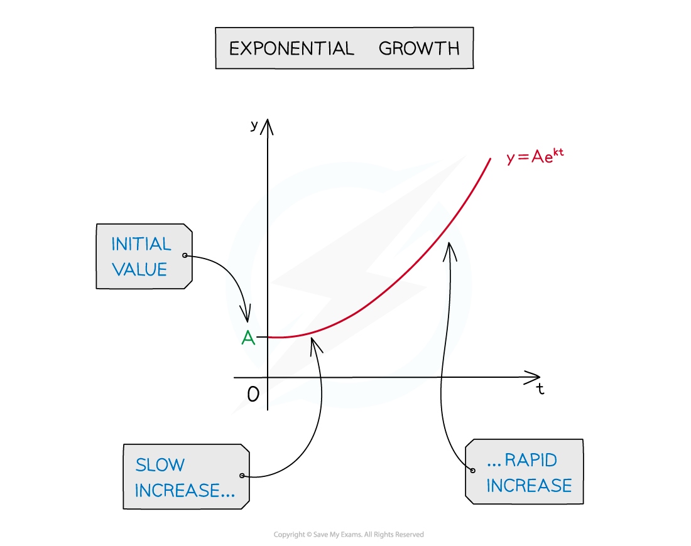
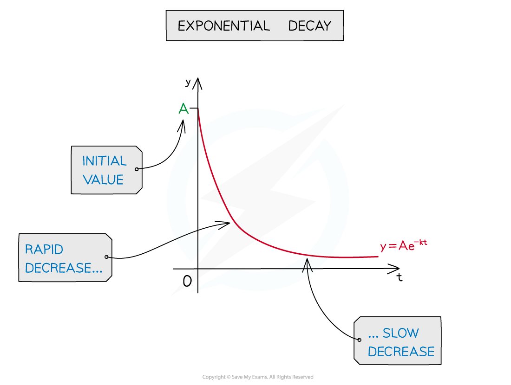
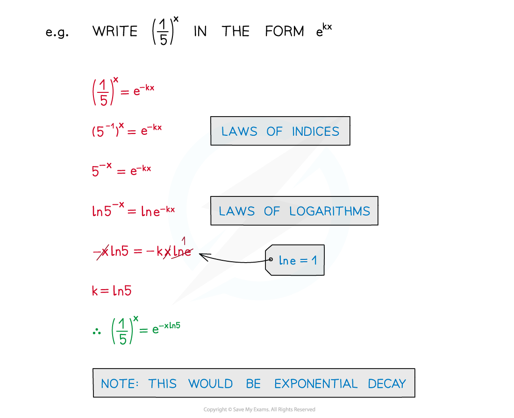
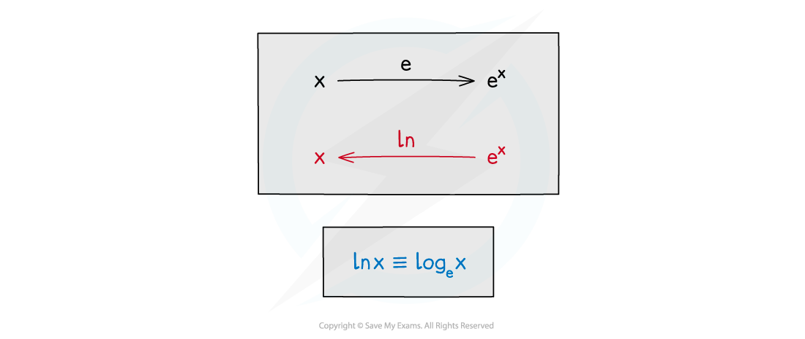
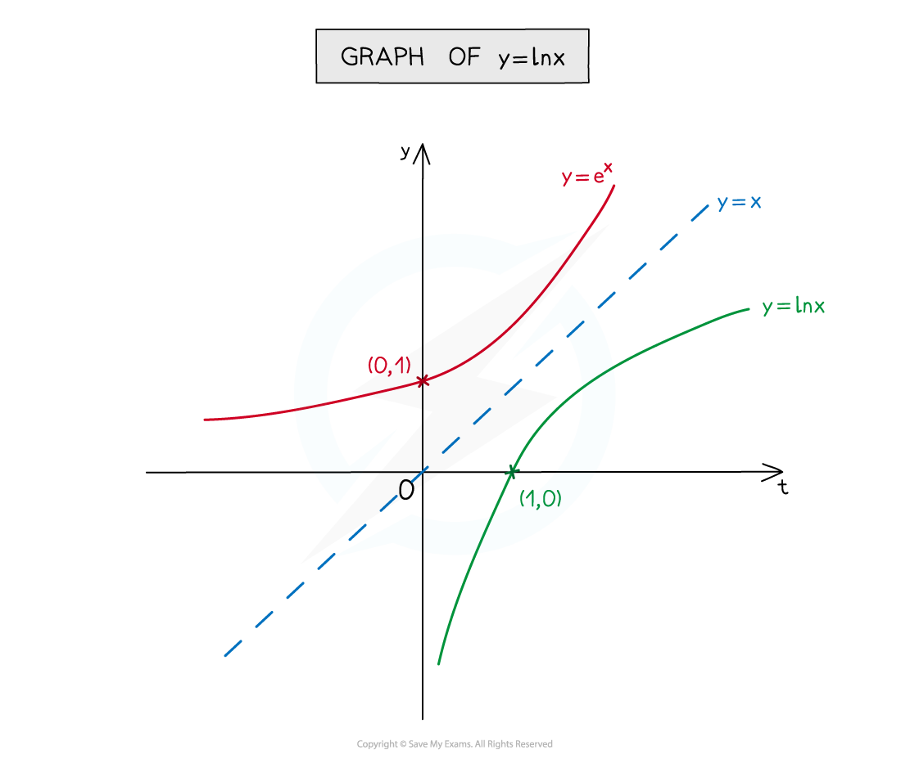

# Exponential Growth & Decay

## Exponential Growth & Decay

> **Spec point** — `spcpt_jVPhCHgQ5XCm23Hg`

## Exponential growth & decay

### What is exponential growth?

- **y = Ae****kt** is exponential **growth**

### What is exponential decay?

- **y = Ae****-kt** is exponential **decay**

- **k > 0** so plus or minus sign in equation immediately indicates growth or decay
- **A** is the **starting** value or **initial** value, when **t = 0**
- **t** is often used, rather than **x**, as many models are time-dependent

### How do I write a^x in terms of e^x?

- Using **e** makes the maths easier
- With the proper choice of **k**, all exponential functions of the form **a****x** can be written in the form **e****kx**

  - **a****x**** = e****kx**

### How are ex and ln x inverses of each other?

- **ln** is the inverse of **e**

- The graph of **y = ln** **x** is the reflection of the graph of **y = e****x** in the line** y = x**

> **Worked Example**
> 
> 
> 
> 
> 
