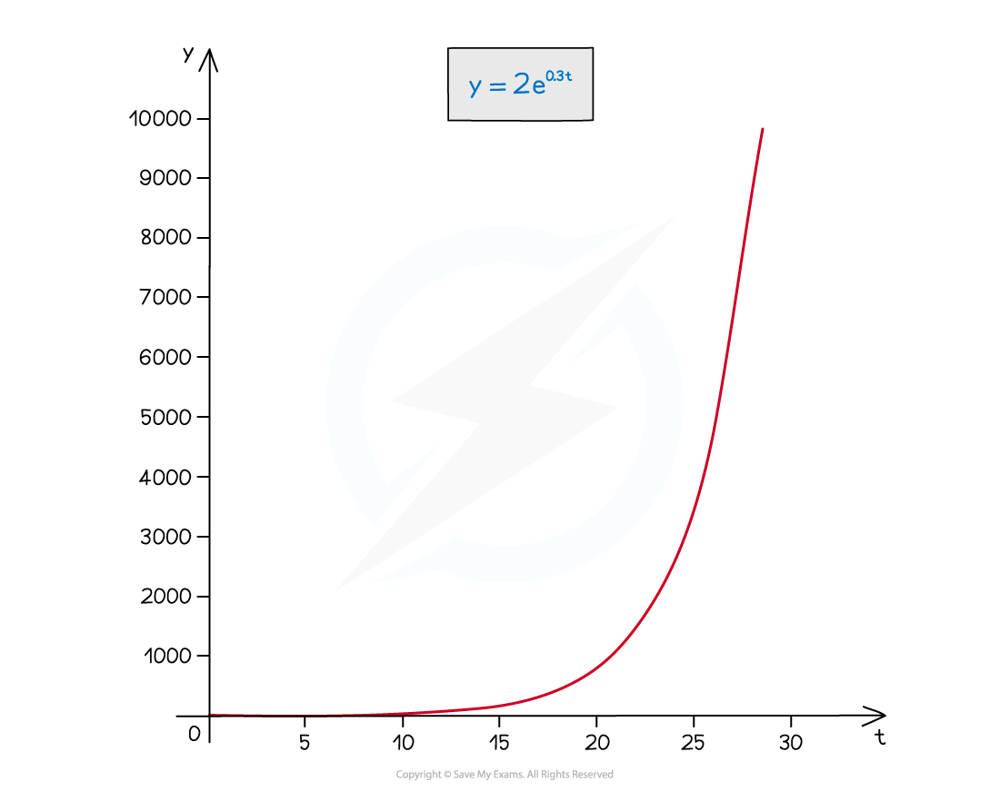
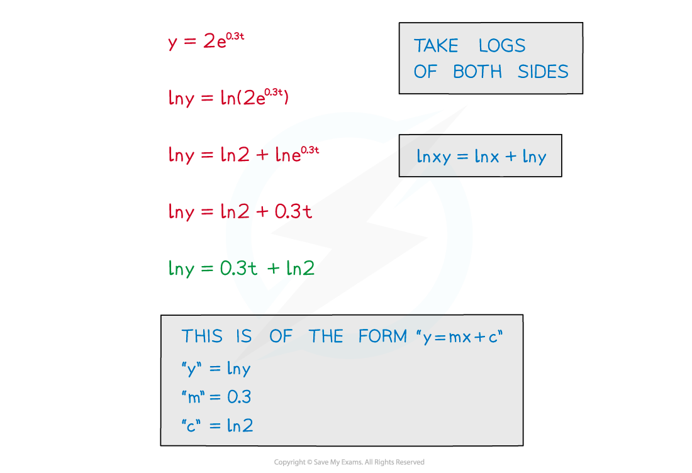
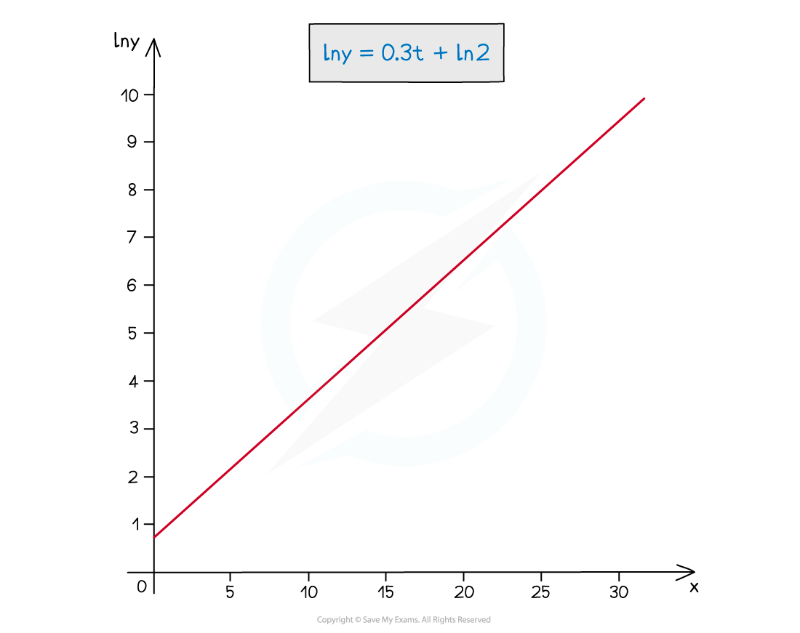
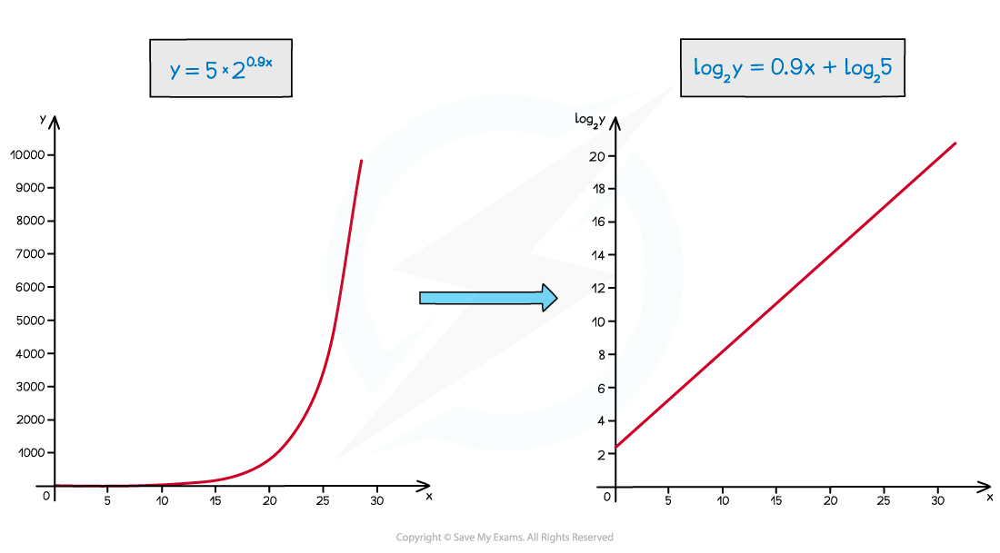
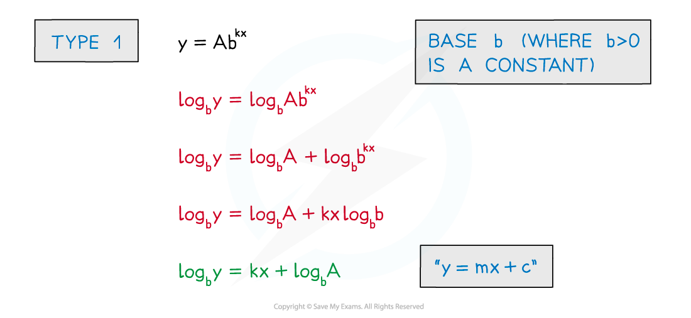
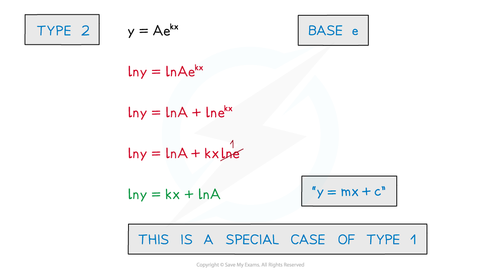
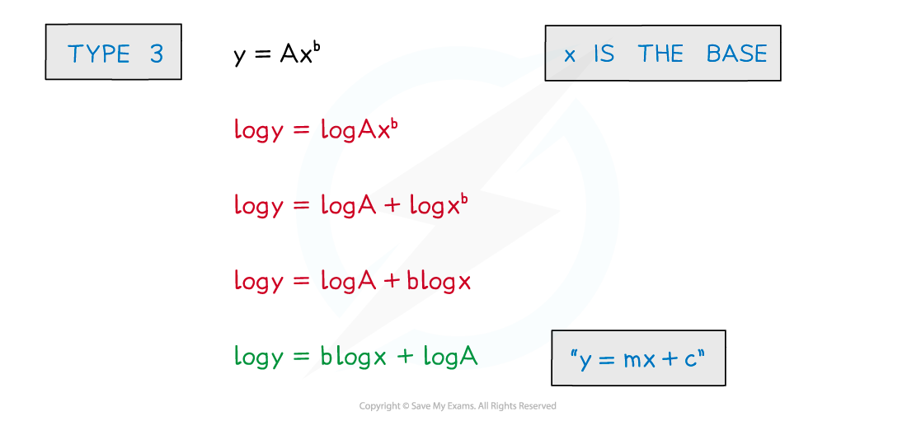
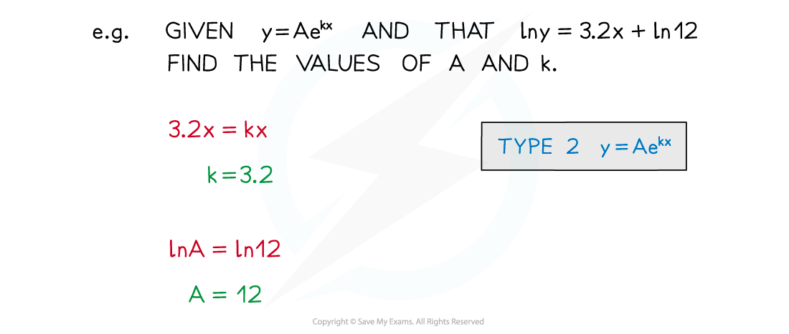

# Transforming Graphs using Logs

## Using Log Graphs in Modelling

> **Spec point** — `spcpt_SmtQ68v57r6fDHmN`

## Transforming graphs using logs

### What are logarithmic axes?

- For graphs that increase or decrease exponentially

  - it can be very difficult to read specific values from the scales on the axes

- Taking **ln** of both sides allows the equation to be rearranged into the form “**y = mx + c**”

- Plotting **ln y** against **t** produces a straight line

  - The $y$-axis is a **logarithmic axis**

- Note the second graph has **ln y** on the **y**-axis

  - Log graphs have at least one logarithmic axis
- Reading a value for **ln y** at ***t***** = 20** is easier than reading the value for ***y***

- Logarithmic axes are used where a wide range of numbers can occur

  - it makes numbers smaller and easier to deal with
  - a curve can be turned into a straight line

### How do I transform graphs into straight lines using logs?

- Exponential models are of the form

  - **y=Ab****kx**** (growth)**
  - **y=Ab****-kx**** (decay)**
- To use a model to make predictions the values of **A**, **b** and **k** are needed
- **A**, **b** and **k** will usually be estimated from observed data values

  - **A** may be known exactly, as it is a starting/initial value
- Estimating from a straight line graph is easier than from a curve

> **Worked Example**
> 
> 
> 
