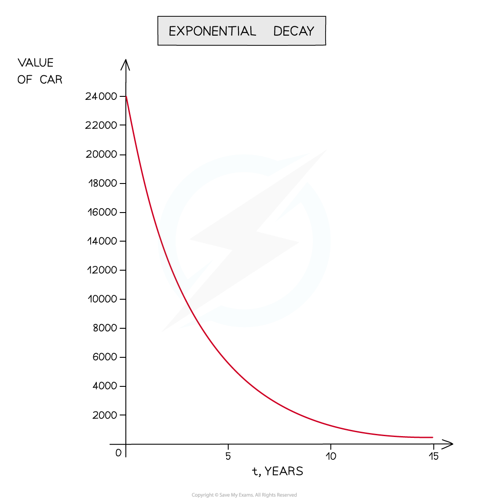
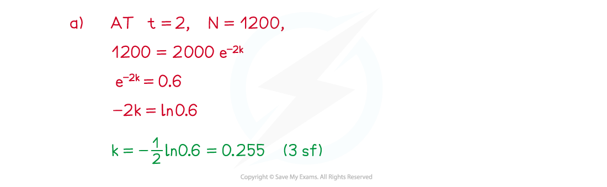
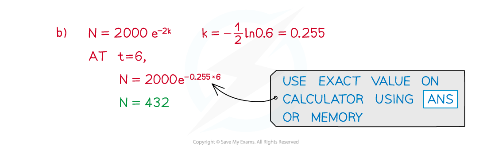

# Using Exponentials in Modelling

## Using Exps & Logs in Modelling

> **Spec point** — `spcpt_bynSkFNmPxyyRkY6`

## Using exponentials in modelling

### What is exponential modelling?

- Exponential modelling is where real-life situations are modelled using exponential growth and decay

- Exponential growth is typically used for …

  - … population (animals and humans) increase
  - … the value of an investment under *compound interest*

- Exponential decay is typically used for …

  - … levels of radioactivity
  - … quantity of a drug in a person’s bloodstream
  - … depreciation (eg value of a standard car)

- It is important to consider if a model is only relevant for a certain period of time
- Can a population increase forever?

  - Will a very old car still be worth a small amount of money?
- For example: Consider a substance that initially contains 2000 radioactive atoms where the number of radioactive atoms, N, at time, t hours, is modelled by $N=2000e^{-kt}$

  - **y** is **N**
  - **A = 2000 **– the initial number of radioactive atoms
  - **k > 0** so the negative indicates this must be exponential **decay**
  - **t** is used (rather than **x**) as the situation is time-dependent

### How do I use exponential models?

- Recognise the form of an exponential model

  - Growth **y = Ae****kt**
  - Decay **y = Ae****-kt**
- **A** (constant) is the starting or initial value

  - When **t = 0**, **e****kt**** = e****0**** = 1** so   **y = A**

- **k** (constant) determines the **rate** of growth/decay
- Many modelling problems are about **rates** **of** **change** –

  - If **y = Ae****kt** then     **dy/dt = Ake****kt**
  - If **y = Ae****-kt** then     **dy/dt = -Ake****-kt**

> **Worked Example**
> 
> 
> 
> 
> 
> 
> 
> 
> 
> 
> 
