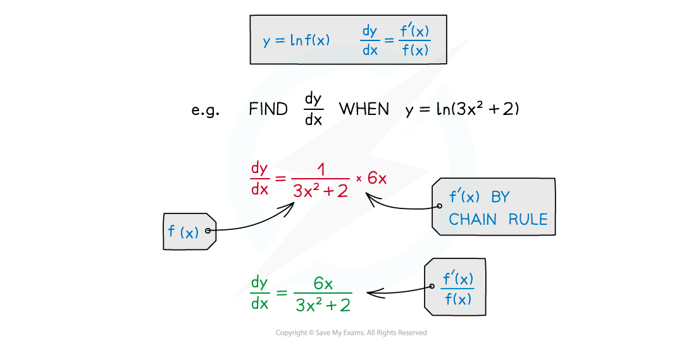

# Integrating f'(x)/f(x)

## f'(x)/f(x)

> **Spec point** — `spcpt_JwrdCCvhVRQqRksD`

## Integrating f'(x)/f(x)

### How do I integrate 1/x?

- The technique for integrating fractions depends on the type of fraction
- For **polynomial** **denominators** see Integration using Partial Fractions
- If $\frac{dy}{dx}=\frac{1}{x}$ then **y = ln |x| + c** – see Integrating Other Functions
- The type of fraction dealt with here is a specific case of Reverse Chain Rule

### How do I integrate f'(x)/f(x)?

- “The top is ‘almost’ the derivative of the bottom”

  - 'almost' here meaning 'a multiple of' (see below)
- The integral will involve **ln |f(x)|** - ie **ln** of the bottom

  - Due to reverse chain rule

 <!-- asset download failed -->

### How do I adjust a fraction into the form f'(x)/f(x)?

 <!-- asset download failed -->

- There may be coefficients to ‘adjust’ and ‘compensate’ for

> **Exam Hint**
> - If you're unsure if the fraction is of the form **f’(x)/f(x)**, differentiate the denominator.
> - Compare this to the numerator but you can ignore any **coefficients**.
> - If the coefficients do not match then ‘adjust’ and ‘compensate’ for them.

> **Worked Example**
> 
> 
> 
