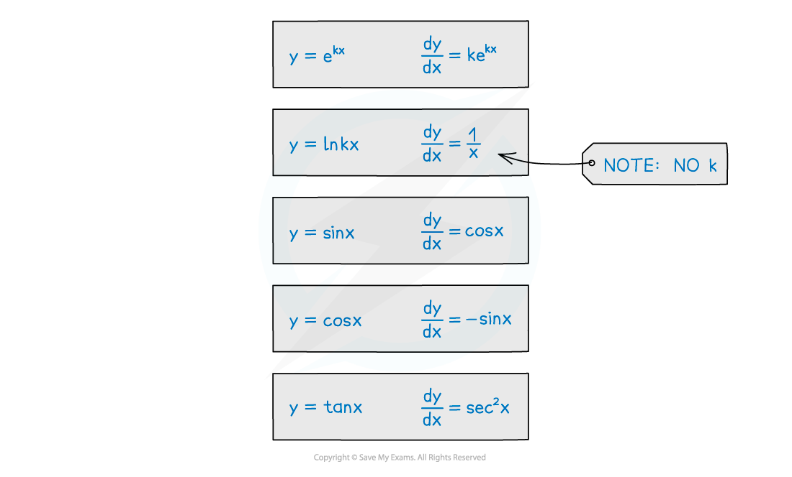

# Integrating Other Functions

## Integrating Other Functions (Trig, ln & e etc)

> **Spec point** — `spcpt_JSx6YPY39mt6vdzt`

## Integrating other functions

### Is integration the reverse of differentiation?

- Yes, but remember “+c”, the constant of integration …

  - … unless finding a definite integral
- Recognising common results helps to make integration easier (See Differentiating Other Functions)

### How do I integrate ex and ekx?

- The gradient of **e****kx** is **ke****kx**

  - ie **y = e****kx**, **dy/dx = ke****kx**
- The reverse applies when integrating
- This is an example of **reverse chain rule**

### How do I integrating 1/x?

- Remember $\frac{1}{x}=x^{-1}$

  - The method for integrating powers does **not** apply if the power is -1

### How do I integrating sin x and cos x?

- Note the minus in the integral of **sin x**

### How do I integrate tan x?

- The integral of **tan x** is **ln|sec x| + c**

> **Exam Hint**
> - Make sure you have a copy of the formula booklet during revision but don't try to remember everything in the formula booklet.
> - However, do be familiar with the **layout** of the formula booklet – you’ll be able to locate quickly whatever you are after, and you do not want to be searching every line of every page!
> - For formulae you think you have remembered, use the booklet to double-check.

> **Worked Example**
> 
> 
> 
> 
> 
