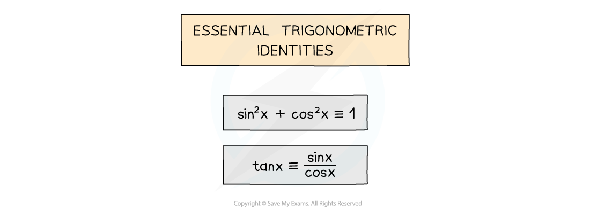
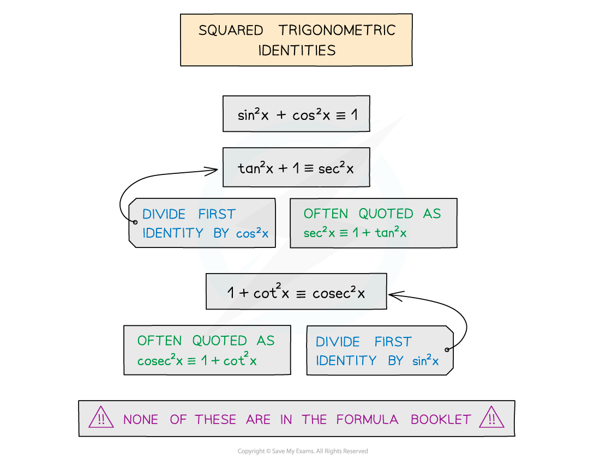
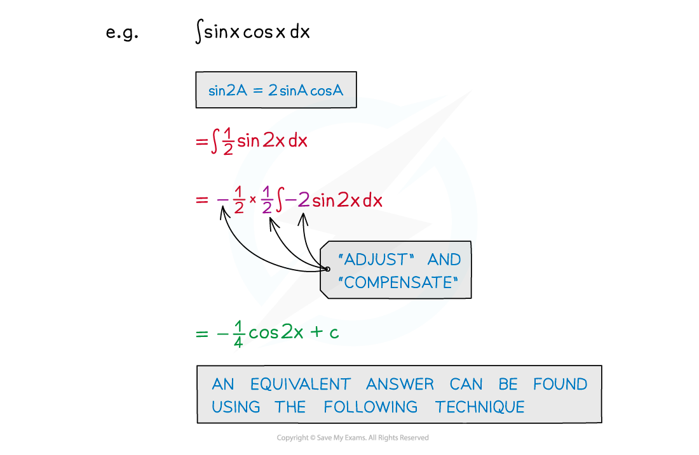
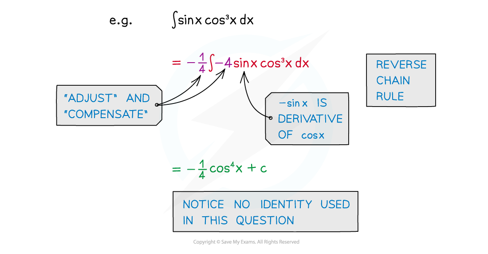
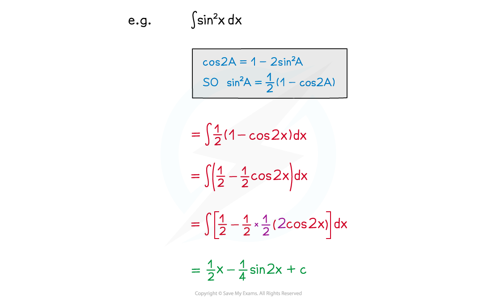
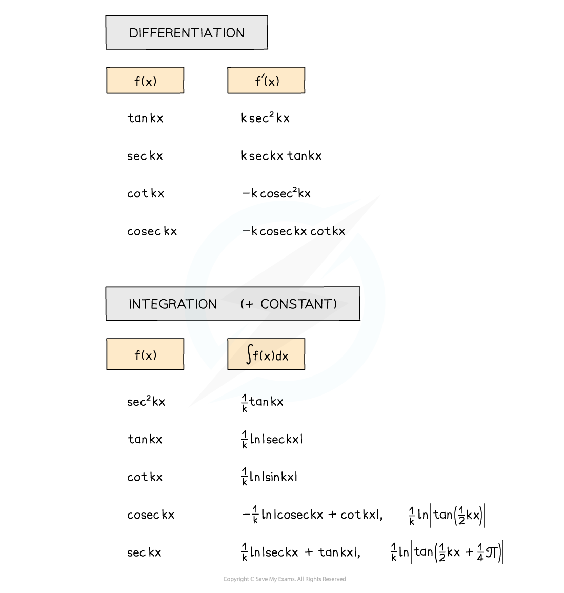
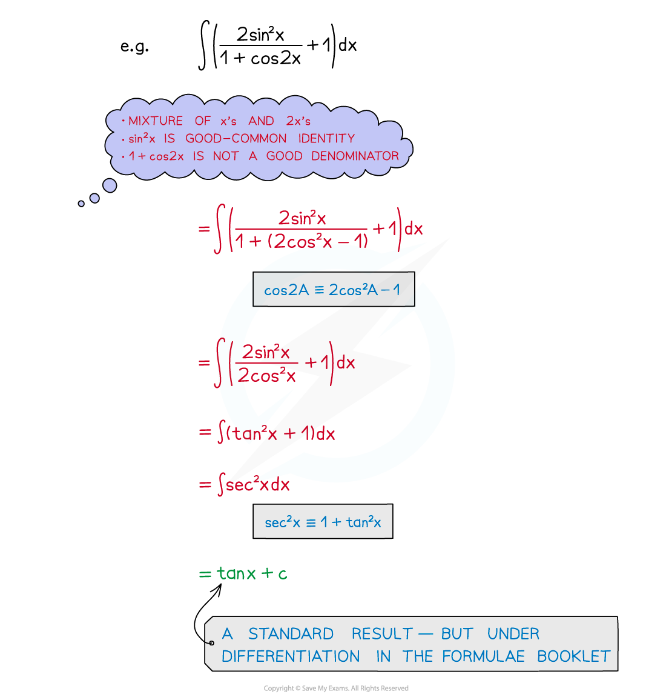

# Integrating with Trigonometric Identities

## Integrating with Trigonometric Identities

> **Spec point** — `spcpt_phxNfbj7rSHTghdc`

## Integrating with trigonometric identities

### What are trigonometric identities?

- Some are given in the formulae booklet 

  - Be sure to note the difference between the **±** and **∓** symbols!

### How do I know which trigonometric identities to use?

- There is no set method
- This is a matter of experience, familiarity and recognition

  - Practice as many questions as possible
  - Be familiar with trigonometric functions that can be integrated easily
  - Be familiar with common identities – especially **squared** terms
  - **sin****2 ****x**, **cos****2 ****x**, **tan****2 ****x**, **cosec****2 ****x**, **sec****2 ****x**, **cot****2 ****x** all appear in identities

### How do I integrate tan2x, cot2x, sec2x and cosec2x?

- The **integral** of **sec****2*****x*** is **tan *****x***** (+c)**

  - This is because the **derivative** of tan x is sec2x
- The **integral** of **cosec****2*****x*** is **-cot *****x***** (+c)**

  - This is because the **derivative** of cot x is -cosec2x
- The **integral** of **tan****2*****x*** can be found by using the identity to rewrite tan2*x *before integrating:

  - 1 + tan2*x* = sec2*x*
- The **integral** of **cot****2*****x*** can be found by using the identity to rewrite cot2*x *before integrating:

  - 1 + cot2*x* = cosec2*x*

### How do I integrate expressions involving sin x and cos x?

- For functions of the form **sin kx**, **cos kx** … see Integrating Other Functions
- **sin kx × cos kx** can be integrated using the identity for **sin 2A**

  - **sin 2A = 2sinAcosA**

- **sin****n ****kx cos kx** or **sin kx cos****n ****kx** can be integrated using **reverse chain rule** or **substitution**
- Notice no identity is used here but it looks as though there should be!

- sin2 kx and cos2 kx can be integrated by using the identity for cos 2A

  - For sin2 A, cos 2A = 1 - 2sin2 A
  - For cos2 A, cos 2A = 2cos2 A – 1

### How do I integrate tan x?

- This is a standard result from the formulae booklet

### How do I integrate other expressions involving trig functions?

- The formulae booklet lists many standard trigonometric derivatives and integrals

  - Check both the “Differentiation” and “Integration” sections
  - For integration using the "Differentiation" formulae, remember that the integral of **f'(x)** is **f(x)** !

- Experience, familiarity and recognition are important – practice, practice, practice!
- Problem-solving techniques

> **Exam Hint**
> - Make sure you have a copy of the formulae booklet during revision.
> - Questions are likely to be split into (at least) two parts:
> 
>   - The first part may be to show or prove an identity
>   - The second part may be the integration
> - If you cannot do the first part, use a given result to attempt the second part.

> **Worked Example**
> 
> 
> 
