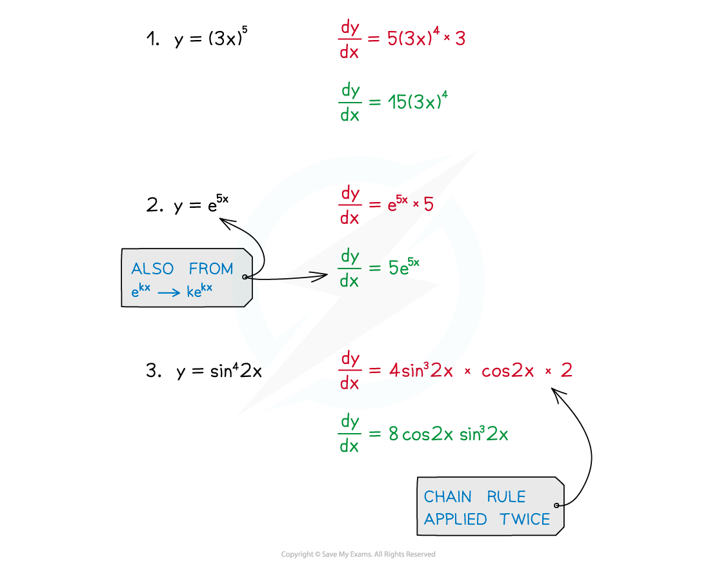
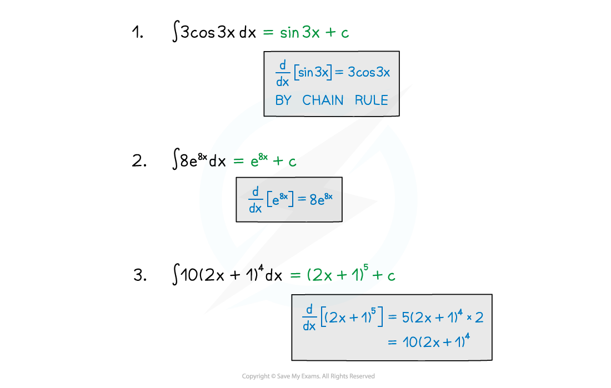
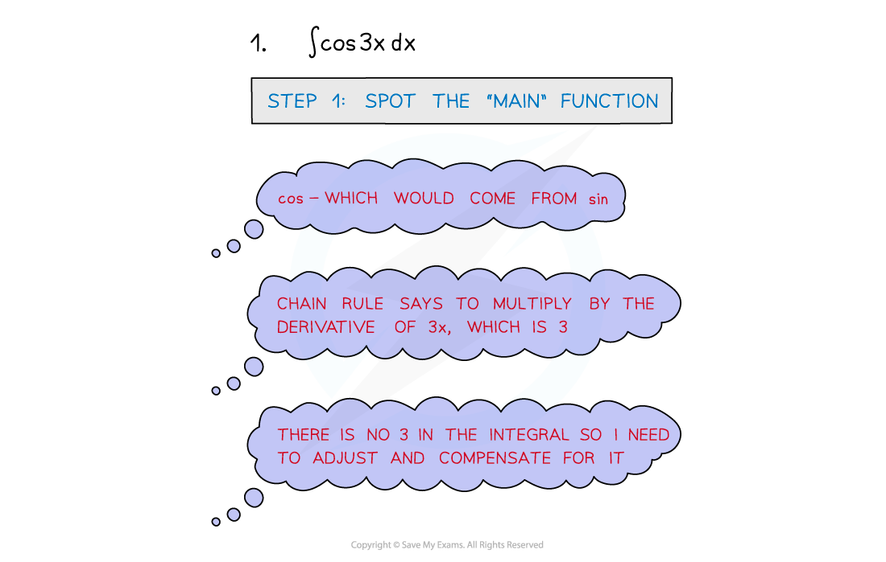
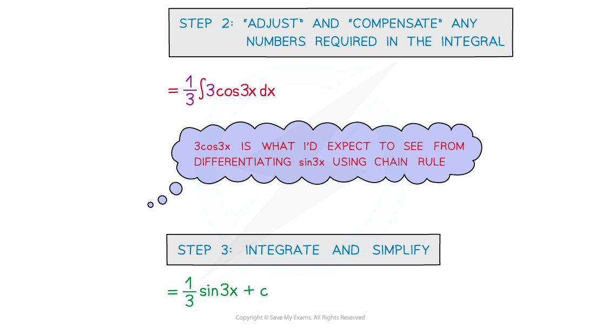

# Reverse Chain Rule

## Reverse Chain Rule

> **Spec point** — `spcpt_D4wJgrNQvPv7GK8x`

## Reverse chain rule

### What is the chain rule?

- The Chain Rule is a way of differentiating two (or more) functions

- In many simple cases the above formula/substitution is not needed

- The same can apply for the reverse – integration

### How do I integrate using the reverse chain rule?

- In more awkward cases it can help to write the numbers in before integrating

- STEP 1: Spot the ‘main’ function
- STEP 2: ‘Adjust’ and ‘compensate’ any numbers/constants required in the integral
- STEP 3: Integrate and simplify

> **Exam Hint**
> - If in doubt you can always use a substitution.
> - Differentiation is easier than integration so if stuck try the opposite, eg. **sin** and **cos** are linked (remember that minus!) so if integrating a **sin** function, start by differentiating the corresponding **cos** function.
> - Lastly, check your final answer by differentiating it.

> **Worked Example**
> 
> 
> 
> 
> 
> 
> 
