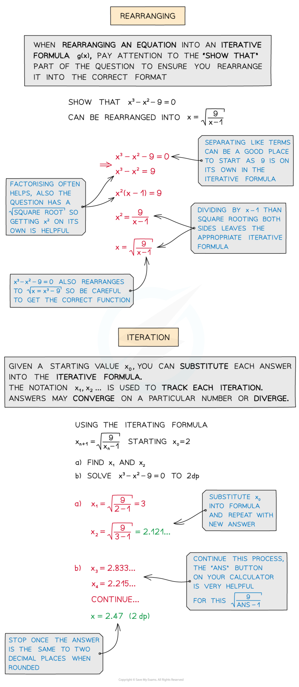
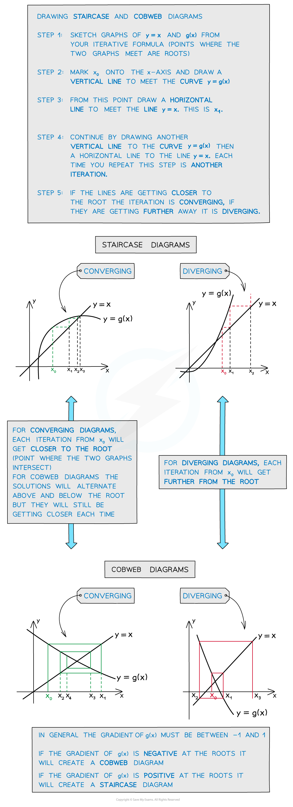

# x = g(x) Iteration

## x = g(x) Iteration

> **Spec point** — `spcpt_BfHcWctk2Fw8QtZj`

## x = g(x) iteration

### What is iteration?

- When an equation cannot be solved using the usual **analytical methods**, we can still find **approximate solutions** to a certain degree of accuracy
- **Iteration** is one way to do this, by repeatedly using each answer as the new starting value for a function, we can achieve an ever more accurate answer

### What does xn + 1 = g(xn) mean?

- Iterations are shown using the notation xn + 1 = g(xn)
- This is a **recurrence relation** where, starting with a number (xn), we will get an answer xn + 1 which we can then reuse in the original function
- Equations need to be rearranged into an **iterative formula** – ie. the form x = g(x)

### What are staircase diagrams and cobweb diagrams?

- Iterations can be shown on diagrams called **staircase** or **cobweb** diagrams
- These can be drawn by **plotting the graphs** of **y = x** against **y = g(x)** from your iterative formula

> **Exam Hint**
> - You must show all your steps when rearranging an equation into an iterative formula
> - Working backwards can often be helpful to figure out how an equation has been rearranged but you must write your answer as if you worked forwards
> - Use ANS button on your calculator to calculate repeated iterations
> - Keep track of your iterations using x2, x3… notation
> - Iteration may be part of bigger numerical methods questions

> **Worked Example**
> 
