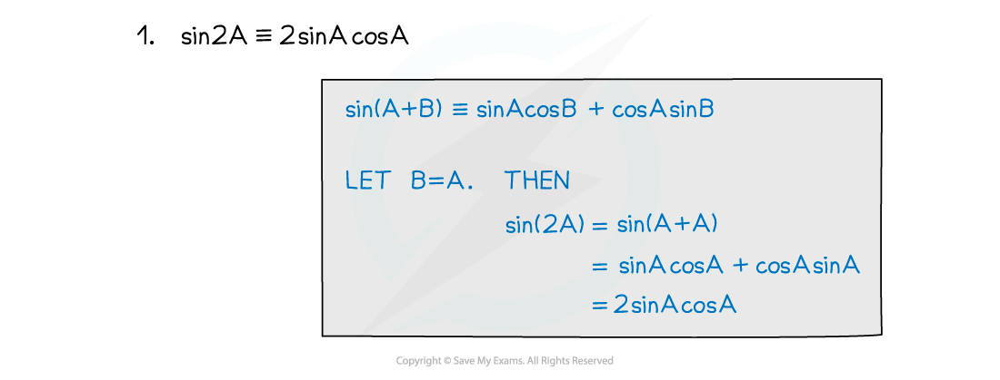
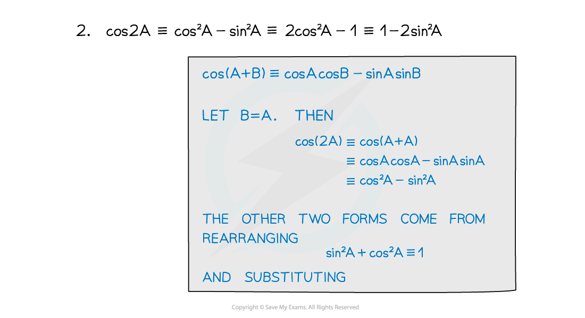
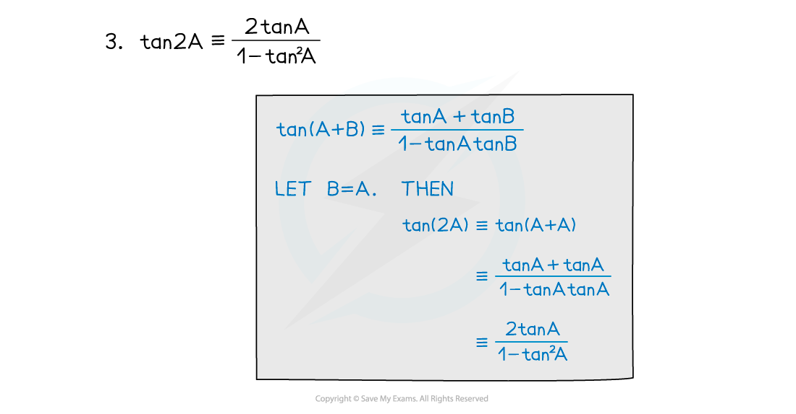

# Double Angle Formulae

## Double Angle Formulae

> **Spec point** — `spcpt_tQXwyKYJQhQ3r39D`

## Double angle formulae

### What are the double angle formulae?

- The **double angle formulae** are derived from the 'A+B' versions of the **compound angle formulae**:

  - `sin open parentheses 2 A close parentheses identical to 2 sin A cos A`
  - $\mathrm{cos}(2A)\equiv\mathrm{cos}^{2}A-\mathrm{sin}^{2}A$
  
    - $\mathrm{cos}(2A)\equiv2\mathrm{cos}^{2}A-1$
    - $\mathrm{cos}(2A)\equiv1-2\mathrm{sin}^{2}A$
  - $\mathrm{tan}(2A)\equiv\frac{2\mathrm{tan}A}{1-\mathrm{tan}^{2}A}$

> **Exam Hint**
> - The double angle formulae are **not** included in the formula booklet – you have to know them.
> - If you forget them, you can always derive them from the compound angle formulae (which *are* in the formula booklet) as shown above.

> **Worked Example**
> 
