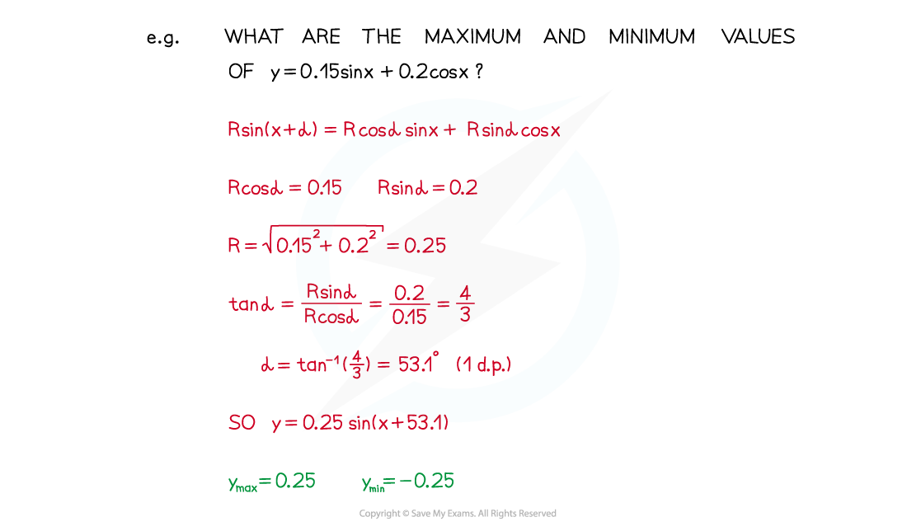
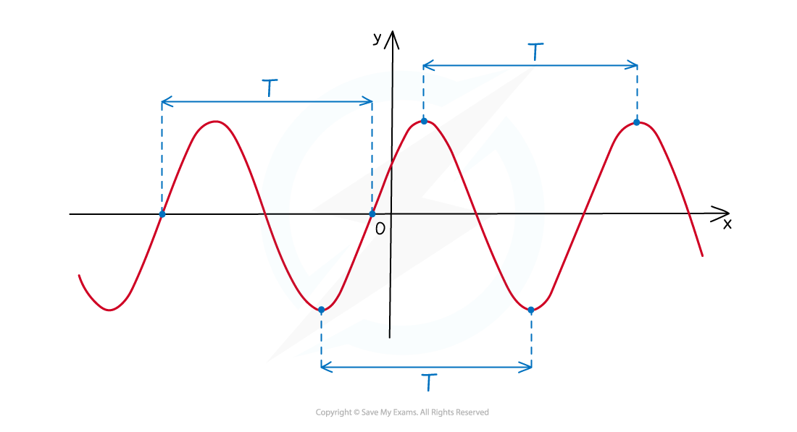

# Modelling with Trigonometric Functions

## Modelling with Trigonometric Functions

> **Spec point** — `spcpt_vFH3CxCYCv8Qs93q`

## Modelling with trigonometric functions

### How do I model with trigonometric functions?

- Various real-life situations can be modelled using trigonometric functions
- You need to be able to interpret the equations used in the model
- If you need to identify maximum or minimum values of a formula, remember the bounds of the **sin** and **cos** functions: 

  - **-1 ≤ sin *****x *****≤ 1**
  - **-1 ≤ cos *****x *****≤ 1**

- You may need to **simplify trigonometric expressions** to make the behaviour of an equation clearer

- You may also need to discuss the **period** of an equation

  - The period is often indicated by ***T***
  - For a periodic function in ***x*** like **sin** or **cos**, the **period** is how much ***x*** has to change by for the function to go through one complete cycle

- For functions of the form **cos (*****qx*****+ *****r*****)** or **sin (*****qx***** + *****r*****)** the period ***T*** is:

> **Exam Hint**
> - The variable in these questions is often ***t*** for time.
> - Read the question carefully to make sure you know what you are being asked to solve.

> **Worked Example**
> 
