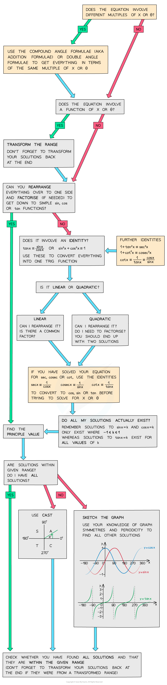

# Strategy for Further Trigonometric Equations

## Strategy for Further Trigonometric Equations

> **Spec point** — `spcpt_J2NtwHHQN4RKv9bY`

## Strategy for further trigonometric equations

### How do I solve harder trig equations?

- You can solve harder trig equations, such as those involving **reciprocal** and **inverse** functions in a variety of different ways

  - Using** further trigonometric identities**
  - Using **compound or double angle** formulas
  - Factorising** quadratic** trig equations
  - Then finding all solutions using **CAST** or **sketching graphs**
- The final rearranged equation you solve will involve **sin**, **cos** or **tan** – don’t try to solve an equation with **cosec**, **sec**, or **cot** directly
- If you’re having trouble solving a trig equation, this flowchart might help:

> **Exam Hint**
> - Try to use identities and formulas to reduce the equation into its simplest terms.
> - Don’t forget to check the function range and ensure you have included all possible solutions.
> - If the question involves a function of x or θ ensure you transform the range first (and ensure you transform your solutions back again at the end!).

> **Worked Example**
> 
