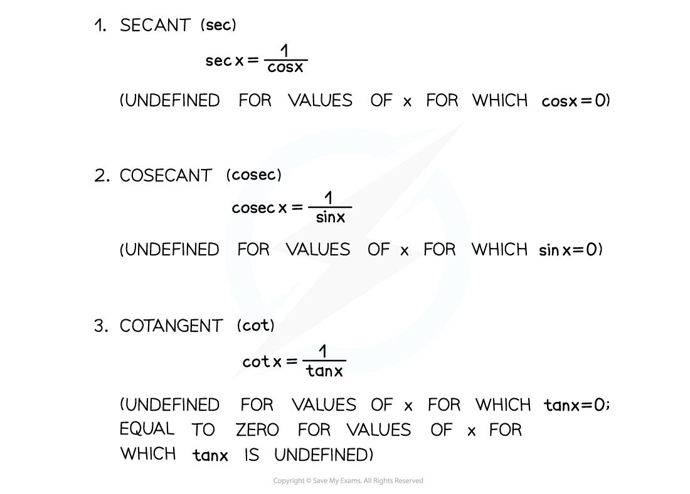

# Definitions of Reciprocal Trigonometric Functions

## Reciprocal Trig Functions - Definitions

> **Spec point** — `spcpt_BKyqGnK3G7766CYn`

## Definitions of reciprocal trigonometric functions

### What are the reciprocal trigonometric functions?

- There are three reciprocal trig functions corresponding to the three regular trig functions

- Cotangent can also be written in terms of sine and cosine

> **Exam Hint**
> - To solve equations with the reciprocal trig functions, convert them into the regular trig functions and solve in the usual way.
> - Don't forget that both **tan** and **cot** can be written in terms of **sin** and **cos** (see the Worked Example below).
> - You will sometimes see **csc** instead of **cosec** for cosecant.

> **Worked Example**
> 
