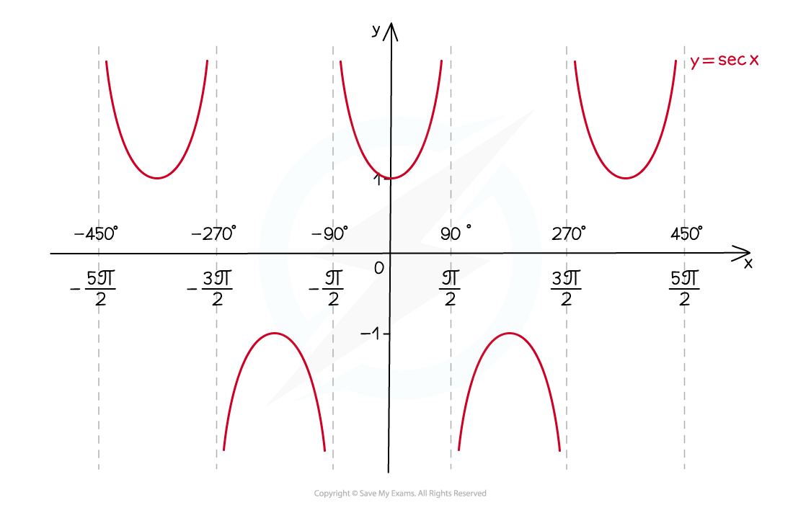
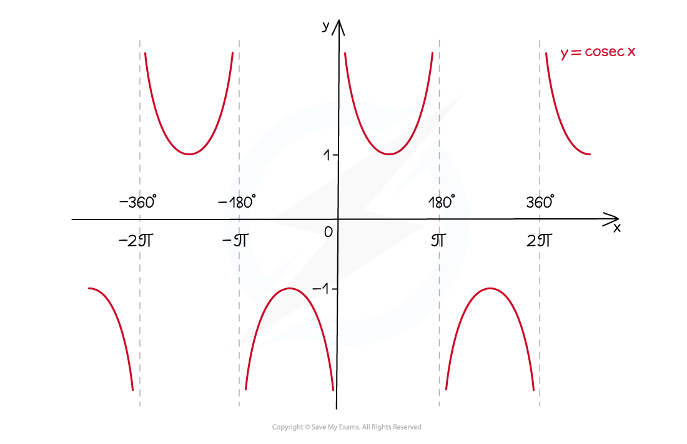
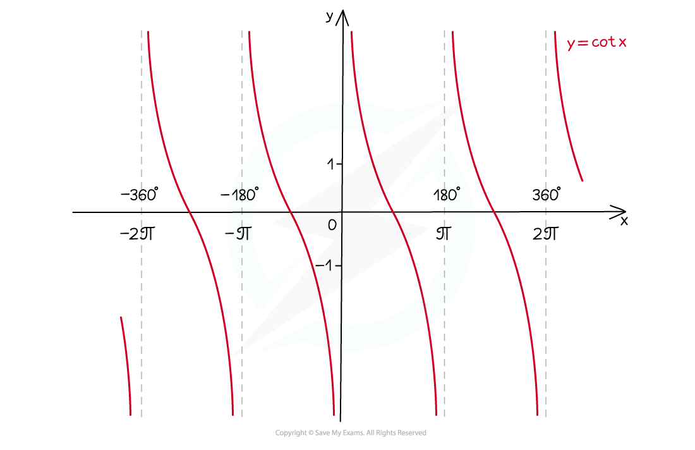

# Graphs of Reciprocal Trigonometric Functions

## Reciprocal Trig Functions - Graphs

> **Spec point** — `spcpt_rm8J5XdBtFyt8r2y`

## Graphs of reciprocal trigonometric functions

### How do I sketch the graph of y = sec x?

- The graph of ***y *****= sec*****x*** looks like this:

- ***y*****-axis** is a **line of symmetry**
- has **period** (ie repeats every) **360°** or **2π** radians
- vertical **asymptotes** wherever **cos *****x*****= 0**
- **domain **is all *x* **except** **odd multiples of 90°** (90°, -90°, 270°, -270°, etc.)
- the **domain in radians** is all *x* **except odd multiples of π/2** (π/2, - π/2, 3π/2, -3π/2, etc.)
- **range** is ***y *****≤ -1 or y ≥ 1**

### How do I sketch the graph of y = cosec x?

- The graph of ***y *****= cosec *****x*** looks like this:

- has **period** (ie repeats every) **360°** or **2π** radians
- vertical **asymptotes** wherever **sin *****x*****= 0**
- **domain **is all *x* **except multiples of 180°** (0°, 180°, -180°, 360°, -360°, etc.)
- the **domain in radians** is all *x* **except multiples of π** (0, π, - π, 2π, -2π, etc.)
- **range** is ***y *****≤ -1 or y ≥ 1**

### How do I sketch the graph of y = cot x?

- The graph of ***y *****= cot *****x*** looks like this:

- has **period** (ie repeats every) **180°** or **π** radians
- vertical **asymptotes** wherever **tan *****x*****= 0**
- **domain **is all *x* **except multiples of 180°** (0°, 180°, -180°, 360°, -360°, etc.)
- the **domain in radians** is all *x* **except multiples of π** (0, π, - π, 2π, -2π, etc.)
- **range** is ***y *****∈ ℝ **(ie **cot** can take *any* real number value)

> **Exam Hint**
> - Make sure you know the shapes of the graphs for **cos**, **sin** and **tan**.
> - The shapes of the reciprocal trig function graphs follow from those graphs plus the definitions **sec = 1/cos**, **cosec = 1/sin** and **cot = 1/tan**

> **Worked Example**
> 
