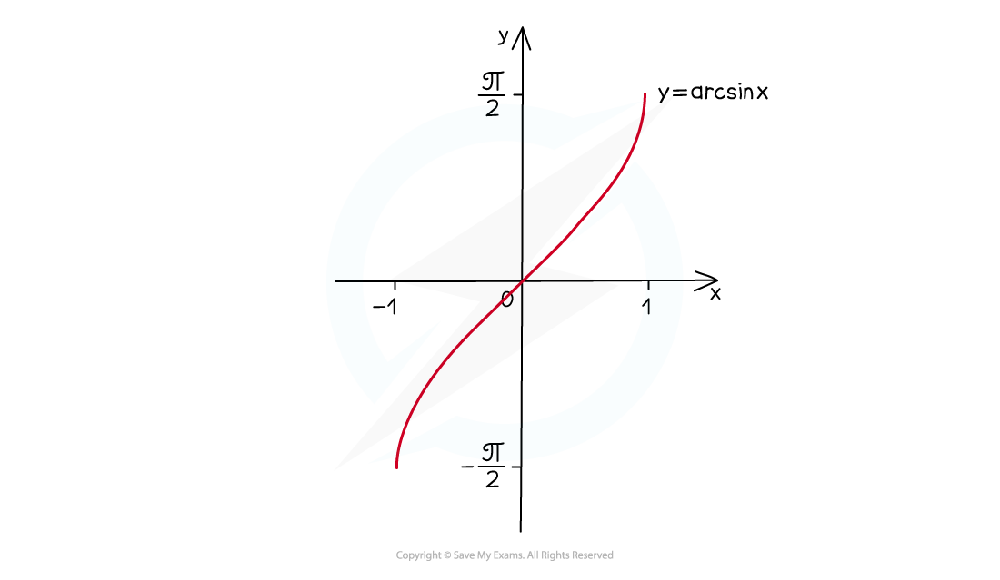
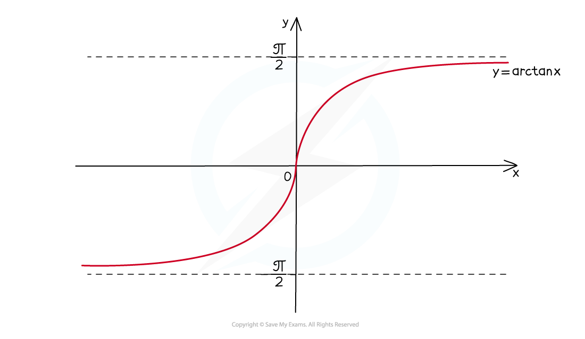

# Inverse Trigonometric Functions

## Inverse Trig Functions

> **Spec point** — `spcpt_pSmbBRKHGqqnGTvb`

## Inverse trigonometric functions

### What are the inverse trigonometric functions?

- These functions are the **inverse functions** of **sin**, **cos** and **tan**

  - **sin** **(arcsin *****x*****) = *****x***
  - **cos** **(arccos *****x*****) = *****x***
  - **tan** **(arctan *****x*****) = *****x***
- The domains of **sin**, **cos**, and **tan** must first be restricted to make them one-to-one functions (only one-to-one functions have inverses)

### What are the restricted domains?

- domain of **sin *****x*** is restricted to **-π/2 ≤ *****x *****≤ π/2  **(**-90° ≤ *****x***** ≤ 90°**)

- domain of **cos *****x*** is restricted to **0 ≤ *****x *****≤ π  **(**0° ≤ *****x***** ≤ 180°**)

- domain of **tan *****x*** is restricted to **-π/2 < *****x *****< π/2  **(**-90° < *****x***** < 90°**)

### How do I sketch the graph of y = arcsin x?

- The graph of ***y *****= arcsin *****x*** looks like this:

- *the ***domain **is **-1 ≤ *****x *****≤ 1**
- the **range** is **-π/2 ≤ arcsin *****x*****≤ π/2  **(**-90° ≤ arcsin *****x***** ≤ 90°**)

### How do I sketch the graph of y = arccos x?

- The graph of ***y *****= arccos *****x*** looks like this:

- *the ***domain **is **-1 ≤ *****x *****≤ 1**
- the **range** is **0 ≤ arccos *****x *****≤ π  **(**0° ≤ arccos *****x***** ≤ 180°**)

### How do I sketch the graph of y = arctan x?

- The graph of ***y *****= arctan *****x*** looks like this:

- the* ***domain **is ***x *****∈ ℝ**  (ie arctan *x* is defined for *all* real number values of *x*)
- the **range** is **-π/2 < arctan *****x *****< π/2  **(**-90° < arctan *****x***** < 90°**)
- horizontal **asymptotes** at ***y*****= - π/2** and ***y***** = π/2**

> **Exam Hint**
> - Make sure you know the shapes of the graphs for **sin**, **cos** and **tan.**
> - As inverses, the graphs of **arcsin**, **arccos** and **arctan** are reflections of **sin**, **cos** and **tan** in the line ***y *****= *****x.***
> - The values returned by the **sin****-1**, **cos****-1** and **tan****-1 **keys on your calculator are the values from the ranges of **arcsin**, **arccos** and **arctan.**

> **Worked Example**
> 
