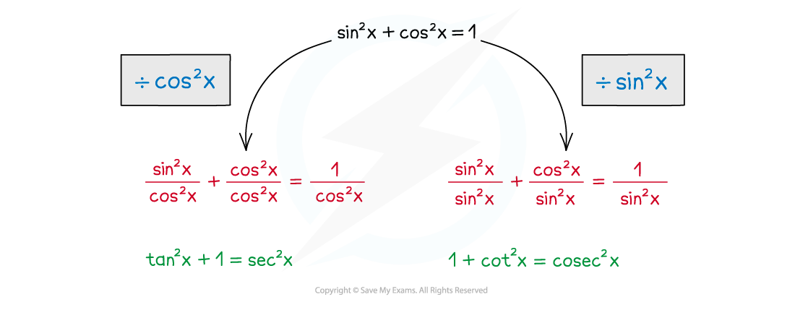

# Identities with Reciprocal Trigonometric Functions

## Trigonometry - Further Identities

> **Spec point** — `spcpt_JRwzRh2ryj4m6Gj9`

## Identities with reciprocal trigonometric functions

### What are the reciprocal trigonometric identities?

- There are two identities with **sec**,** cosec** and **cot **that you need to know and be able to use:

  - **tan****2*****x *****+ 1 ≡ sec****2*****x***
  - **1 + cot****2*****x***** ≡ cosec****2*****x***
- These are not really 'new' identities – they can both be derived from **sin****2*****x *****+ cos****2*****x***** ≡ 1**

  - To derive the identity for **sec****2*****x***  divide  **sin****2*****x *****+ cos****2*****x***** ≡ 1  **by **cos****2*****x***
  - To derive the identity for **cosec****2*****x *** divide  **sin****2*****x *****+ cos****2*****x***** ≡ 1  **by **sin****2*****x***

> **Exam Hint**
> - These identities are not given in the exam formulae booklet – make sure you know how to find them.
> - They will be needed to prove some trigonometric identities and solve some trigonometric equations.

> **Worked Example**
> 
