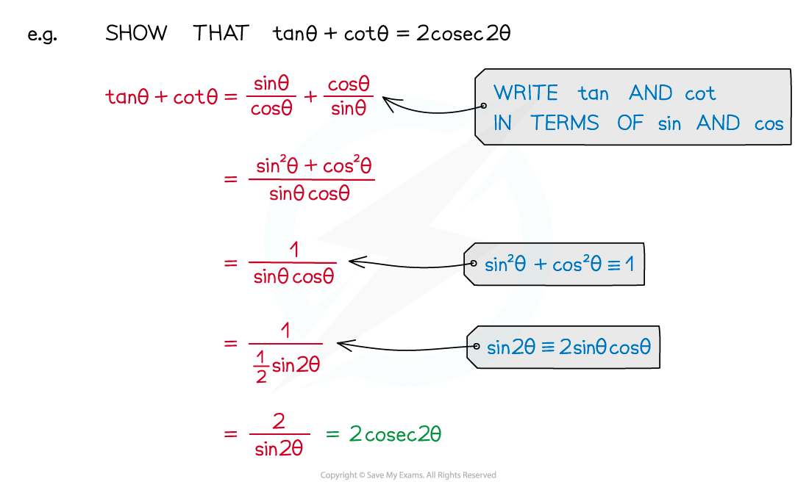
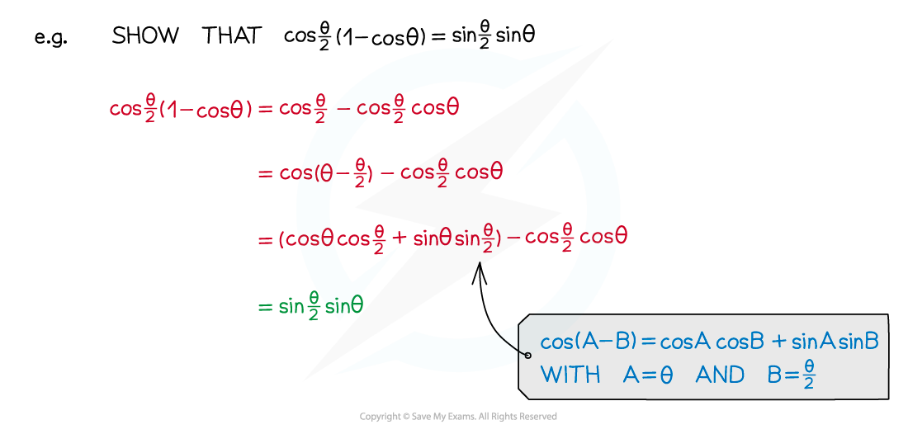
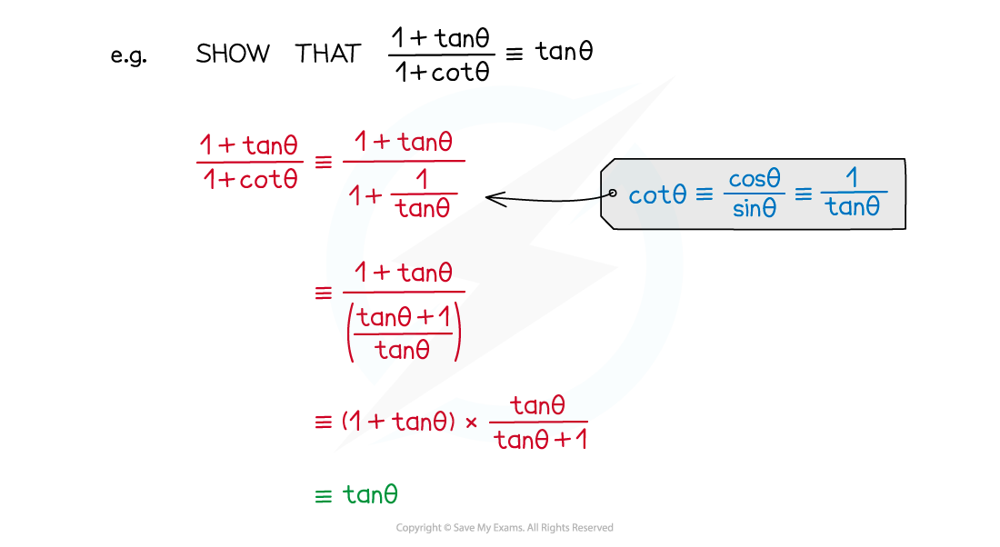

# Trigonometric Proof

## Trigonometric Proof

> **Spec point** — `spcpt_2V76zDK8DyYhw7nQ`

## Trigonometric proof

### How do I prove harder identities?

- You can use trigonometric identities you already know to prove new identities
- Make sure you know the **simple trigonometric identities** and **further trigonometric identities**
- To prove an identity start on one side and proceed step by step until you get to the other side

- Clever substitution into the **compound angle formulae **can be a useful tool for proving identities

- Make sure you are confident handling fractions and fractions-within-fractions

- Always keep an eye on the 'target' expression – this can help suggest what identities to use

> **Exam Hint**
> - Don't forget that you can start a proof from either end – sometimes it might be easier to start from the right-hand side (see the Worked Example)
> - A number of trigonometric identities are given to you in the formulae booklet – make sure you know which ones are (and aren't) in there

> **Worked Example**
> 
