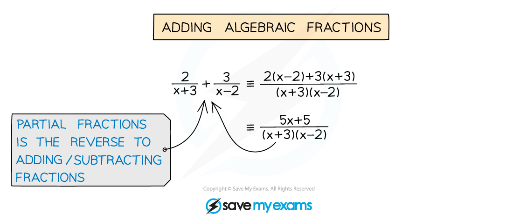
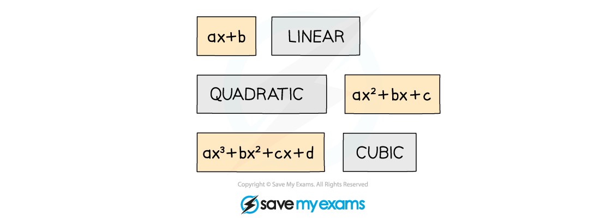
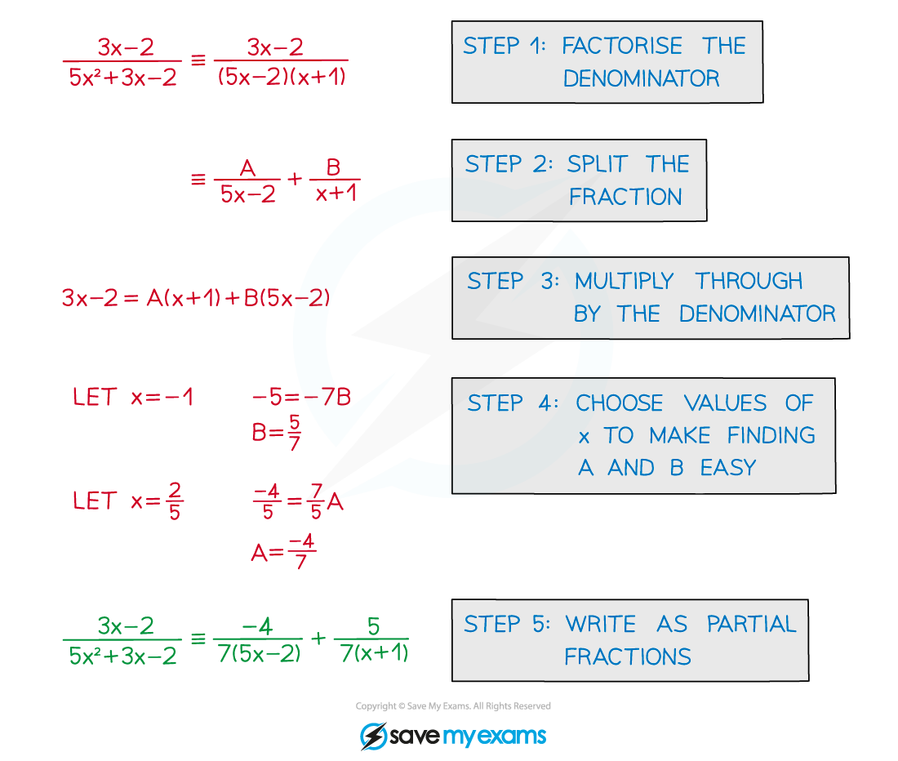
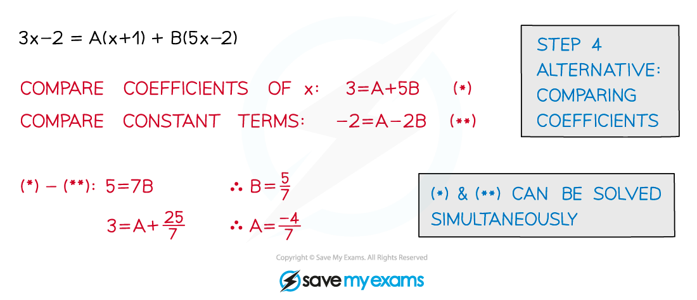

# Partial Fractions with Linear Denominators

## Linear Denominators

> **Spec point** — `spcpt_xb6FKshx3XgKkYfc`

## Linear Denominators

#### What are partial fractions?

- This is the reverse process to **adding** (or subtracting) fractions
- When adding fractions a common denominator is required
- In partial fractions the common denominator is split into parts (factors)
- Partial fractions are used in **binomial** **expansions** (see Multiple GBEs) and **integration **(see Integration by Parts)

#### What are linear denominators?

- A **linear** **factor** is of the form (**ax + b**)
- A **non-linear** **denominator** may be written as the **product** of linear factors
- If the denominator can be **factorised**

#### How do I find partial fractions?

STEP 1        **Factorise** the **polynomial** in the **denominator**

(Sometimes the numerator can be factorised too)

STEP 2        **Split** the fraction into a **sum** with **single** linear denominators

STEP 3        Multiply by the denominator to get rid of fractions

STEP 4        **Substitute** values of **x** to find **A**, **B**, etc

(An alternative method is **comparing coefficients**)

STEP 5        Write the original as partial fractions

#### Comparing coefficients

- The quantity of each term must be equal on both sides
- “The number of **x****2** on the LHS” = “The number of **x****2** on the RHS”
- “The number of …” is called the **coefficient** of x2

> **Worked Example**
> 
