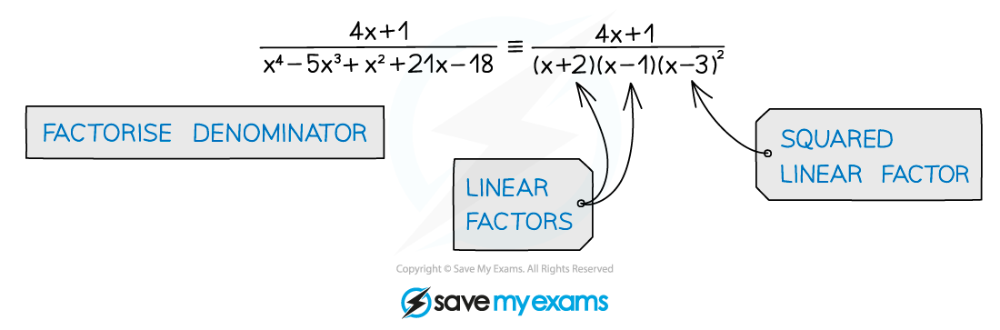
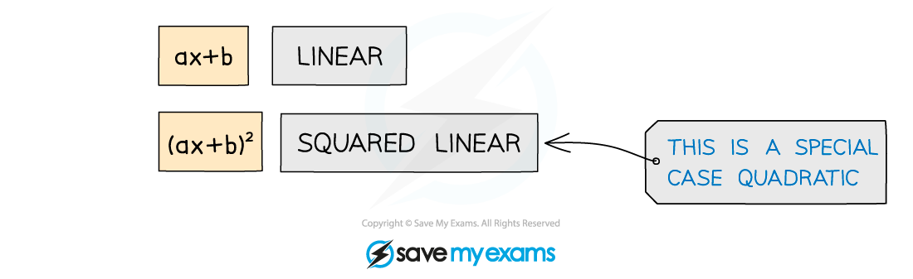
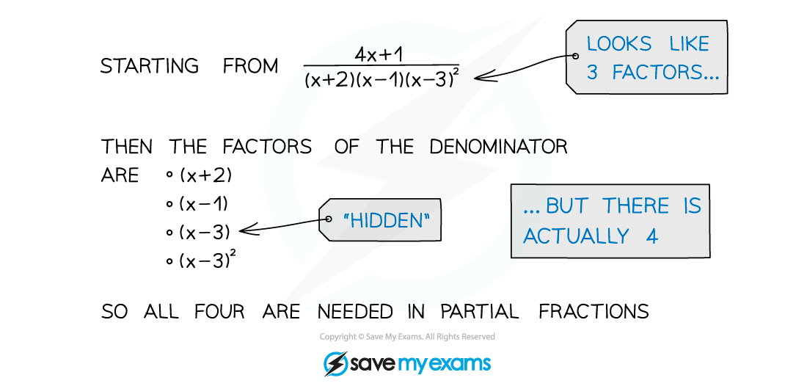
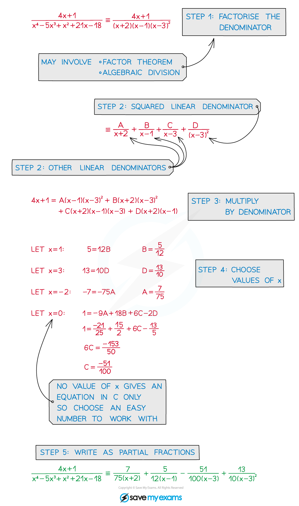

# Partial Fractions with Squared Linear Denominators

## Squared Linear Denominators

> **Spec point** — `spcpt_f5fqHB9YCMFNPmSz`

## Partial fractions with squared linear denominators

### What are partial fractions with squared linear denominators?

- In partial fractions the common denominator is split into parts (factors)
- This is the reverse process to **adding** (or subtracting) fractions
- In harder questions there is a repeated factor, this is a **squared** **linear** **factor**

- A **linear** **factor** is of the form (**ax + b**)
- It is possible **b = 0** so a linear factor could be of the form **ax** (eg **4x**)
- A **squared linear factor** is of the form (**ax + b**)**2**
- With b = 0 this would be of the form (**ax**)2 (**x**2 would be too!)

### How do I find partial fractions with squared linear denominators?

STEP 1        **Factorise** the denominator (Sometimes the numerator can be factorised too)

STEP 2        **Split** the fraction into a **sum** with a **squared** **linear** **denominator **and any other single linear denominators

STEP 3        Multiply by the denominator to get rid of fractions

STEP 4        Substitute values of **x** to find **A**,** B**, etc (or use comparing coefficients)

STEP 5        Write the **original** as partial fractions

> **Worked Example**
> 
