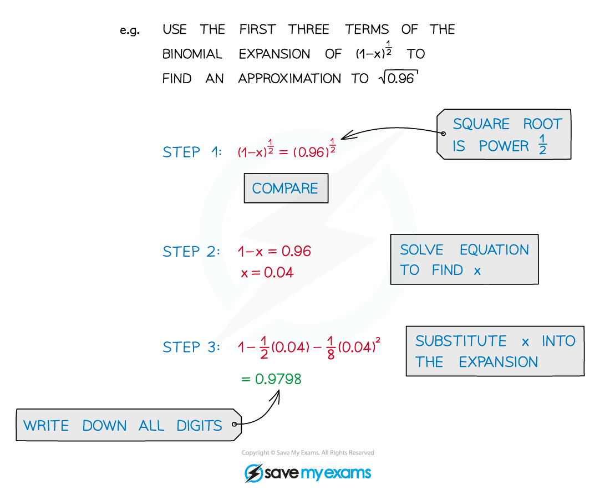

# Approximating Values using the Binomial Expansion

## Approximating Values

> **Spec point** — `spcpt_sgyKrvgcrwm34Pkz`

## Approximating values using the binomial expansion

### What is the general binomial expansion?

- The **general** **binomial** **expansion**, as given in the formula booklet, is

- If **n ∈ ℕ** then the expansion is **finite** (see Binomial Expansion)
- Otherwise the expansion is infinitely long

  - It is only valid for **|x| < 1** (-1 < x < 1)
  - Only the first few terms of an expansion are usually needed

### How do I use a binomial expansion to approximate a value?

- Ignoring higher powers of **x** leads to an approximation
- The more terms the closer the approximation is to the true value
- For most purposes, squared or cubed terms are accurate enough

STEP 1  Compare the value you are approximating to (**a + bx**)**n**
STEP 2  Solve the appropriate equation to find the value of **x**
STEP 3  Substitute this value of **x** into the expansion to find the approximation

> **Exam Hint**
> - You can get a good idea if your approximation is correct by working out the “real” answer using your calculator.
> - Sometimes it helps to factorise out a number before approximating
> 
>   - $\sqrt{710}=10\sqrt{7.1}$

> **Worked Example**
> 
> 
> 
> 
> 
