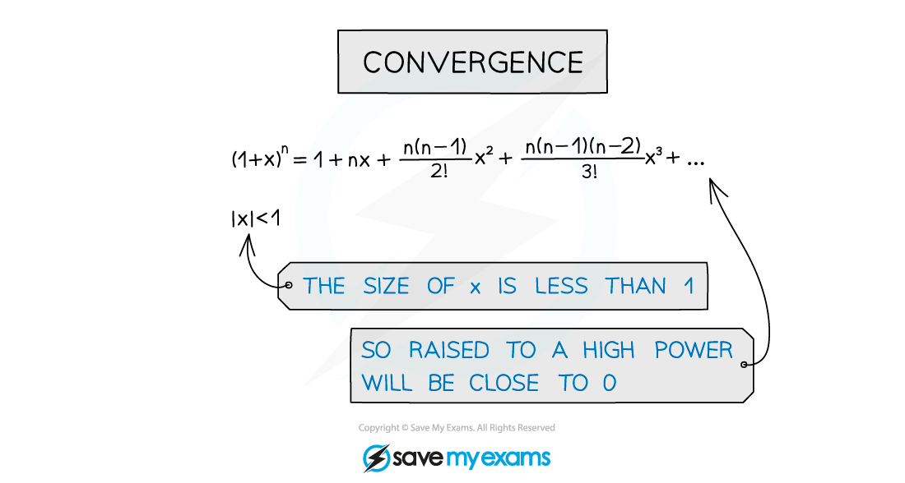
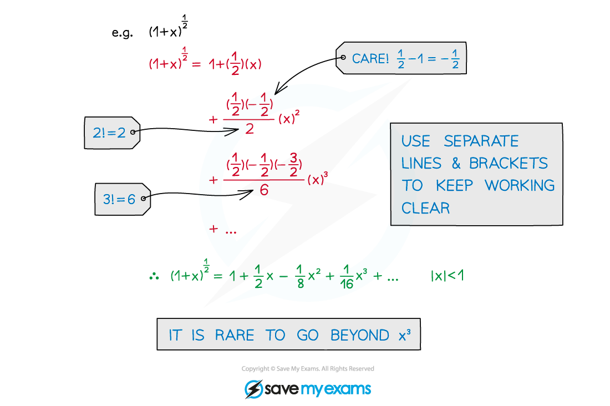
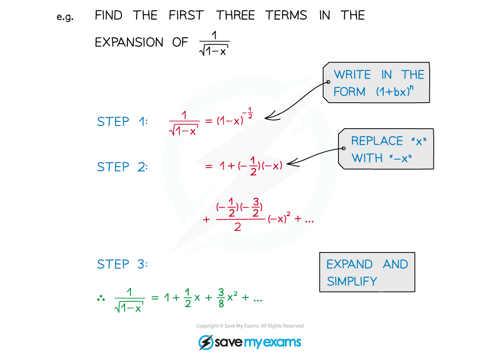

# General Binomial Expansion

## General Binomial Expansion

> **Spec point** — `spcpt_WRV9vk2NPcPg4nms`

## General binomial expansion

### What is the general binomial expansion?

- The binomial expansion applies for positive integers, **n ∈ ℕ**
- The **general** **binomial** **expansion** applies to other types of powers too

- The **general** **binomial** **expansion** applies for all real numbers, **n ∈ℝ**
- Usually fractional and/or negative values of **n** are used
- It is derived from (**a + b**)**n**, with **a = 1** and **b = x**
- **a = 1 **is the main reason the expansion can be reduced so much

- Unless **n ∈ ℕ**, the expansion is infinitely long
- It is only valid for **|x| < 1**

  - This is another way of writing **-1 < x < 1**
  - This is often called the **validity** **statement**
  - The restriction **|x| < 1** means the **series** will ***converge***
  - Higher powers of **x** can be ignored (as **r → ∞**, **x****r**** → 0**)
  - Only the first few terms of an expansion are needed

### How do I apply the general binomial expansion?

STEP 1       Write the expression in the form (**1 + x**)**n**
STEP 2       Expand and simplify

Use a line for each term to make things easier to read and follow

Use brackets - fractions and negatives get ugly!

STEP 3       If required, check and state the validity statement

### How do I use the general binomial expansion to expand (1+bx)n?

STEP 1       Write the expression in the form (**1 + bx**)**n**
STEP 2       Replace “**x**” by “**bx**” in the expansion

Check carefully to see if **b** is negative

STEP 3       Expand and simplify

Use a line for each term to make things easier to read and follow

Use brackets

STEP 4       If required, check and state the validity statement
      The validity statement changes

Replace “**x**” with “**bx**” so now **|bx| < 1**

> **Worked Example**
> 
> 
> 
