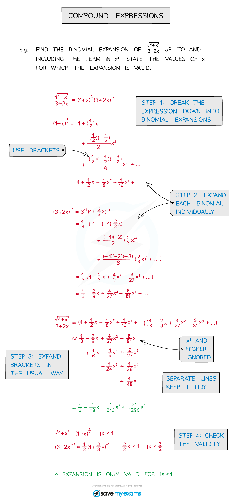
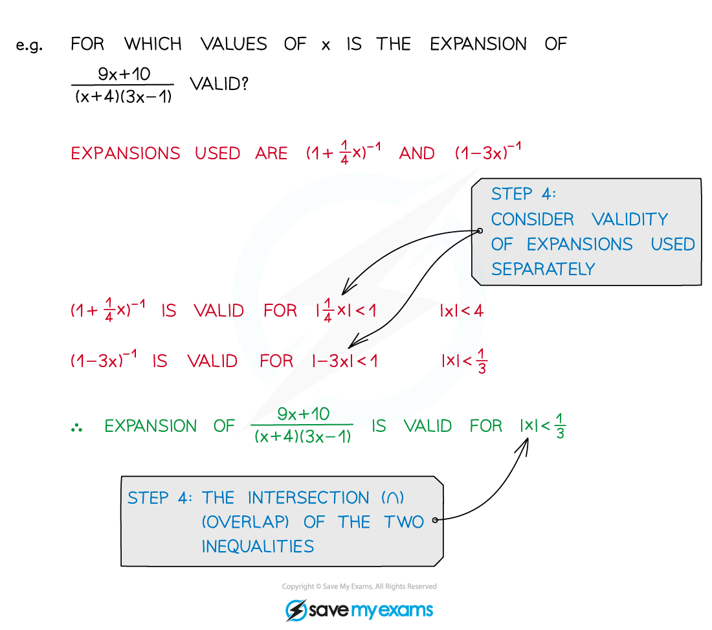

# Multiple General Binomial Expansions

## General Binomial Expansion - Multiple

> **Spec point** — `spcpt_NTrg5qZWvkW2Qvvk`

## Multiple general binomial expansions

### What is the general binomial expansion?

- The **general** **binomial** **expansion**, as given in the formula booklet, is

- If **n ∈ ℕ** then the expansion is **finite** (see Binomial Expansion)
- Otherwise the expansion is infinitely long

  - It is only valid for **|x| < 1** (-1 < x < 1)
  - Only the first few terms of an expansion are usually needed

### What are multiple general binomial expansions?

- More than one part of an expression can be a binomial expansion
- These may sometimes be called **compound** **expressions**
- The expansion will only be valid for the lowest **|x|** boundary from all the expansions used

### How do I expand multiple binomials?

STEP 1        Break the expression down into binomial expansions

STEP 2        Expand each binomial individually, up to a suitable number of terms

- Be careful with negatives and fractions
- Use brackets as appropriate

STEP 3        Collect the expansions together and simplify

- This could be expanding brackets, collecting like terms, etc
- Ignore any terms of degree higher than required

STEP 4        Check the validity of each binomial expansion

- The overall validity is the intersection (∩)

### How do I use partial fractions to form multiple general binomial expansions?

- Partial fractions allow rational expressions to be written in a form where the general binomial expansion can then be applied 

- Validity is an important part of the general binomial expansion

> **Worked Example**
> 
> 
> 
