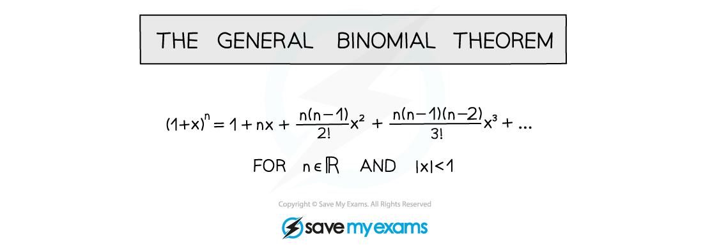
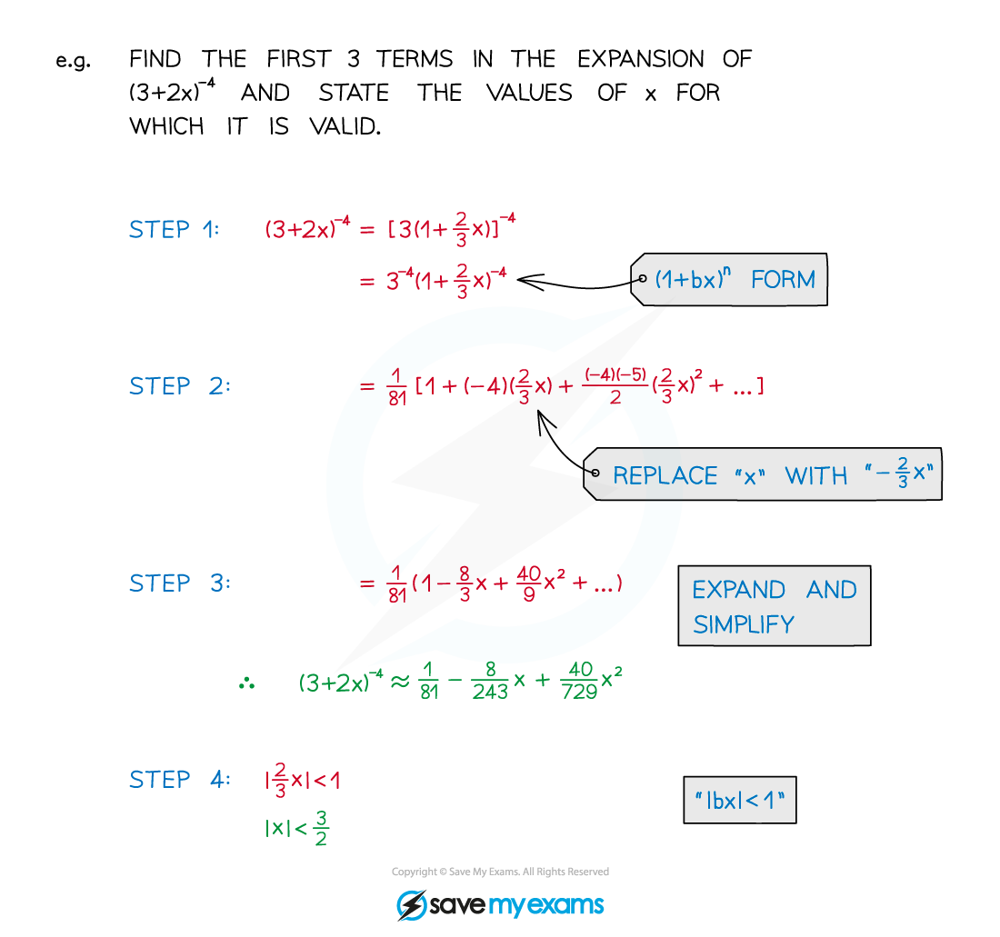

# Subtleties of the General Binomial Expansion

## General Binomial Expansion - Subtleties

> **Spec point** — `spcpt_f9PhGNgtDD7ss4X9`

## Subtleties of the general binomial expansion

### What is the general binomial expansion?

- The binomial expansion applies for positive integers, **n ∈ ℕ**
- The **general** **binomial** **expansion** applies to other types of powers too

- The **general** **binomial** **expansion** applies for all **real** numbers, **n ∈ ℝ**
- Usually fractional and/or negative values of **n** are used
- It is derived from (**a + b**)**n**, with **a = 1** and **b = x**
- Even when **a ≠ 1** the general binomial expansion can still be used

### How do I use the general binomial expansion to expand (a+kx)n?

The general binomial expansion can be applied to expanding (**a + kx**)**n**

STEP 1        Rewrite the question into (**1 + bx**)**n** form

- Roots are fractional powers
- Denominators are negative powers
- A factor may be needed to make “**a = 1**”

STEP 2        Replace “x” by “bx” in the expansion

Check carefully to see if **b** is negative

STEP 3        Expand and simplify

Use a line for each term to make things easier to read and follow

Use brackets

STEP 4        If required, check and state the validity statement, **|bx| < 1**

> **Worked Example**
> 
> 
> 
