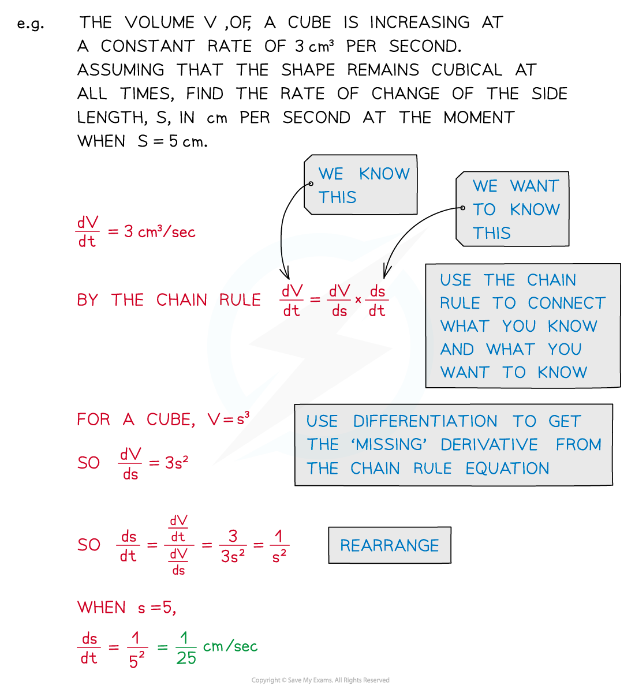

# Connected Rates of Change

## Connected Rates of Change

> **Spec point** — `spcpt_C6Fzf2sj3cytTWq5`

## Connected rates of change

### What are connected rates of change?

- In situations involving more than two variables you can use the **chain rule** to connect multiple rates of change into a single equation

- Equations involving derivatives (ie rates of changes) are known as **differential equations** 

  - These can be solved using methods of integration (see Differential Equations )
  - However setting up the equation from the information given can involve the chain rule and connected rates of change
- Note from the examples above that you will often need to differentiate a formula to get one of the rates of change you need

> **Exam Hint**
> - These problems can involve a lot of letters – be sure to keep track of what they all refer to.
> - Be especially sure that you are clear about which letters are **variables** and which are **constants** – these behave very differently when differentiation is involved!

> **Worked Example**
> 
