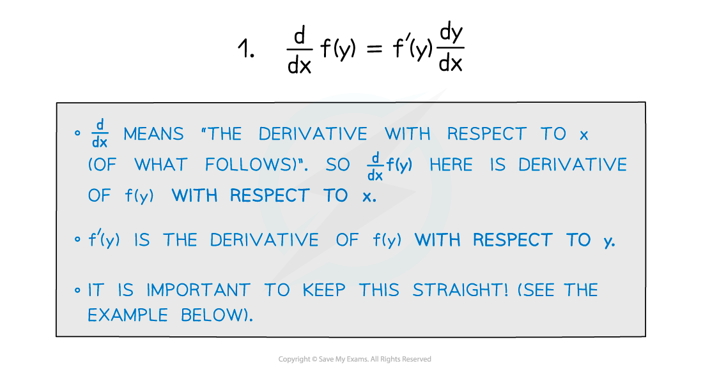
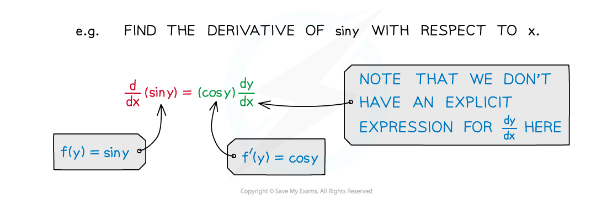
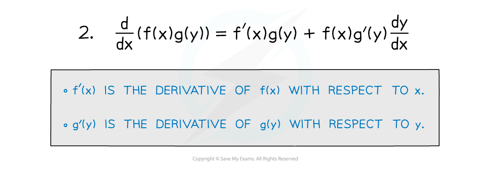
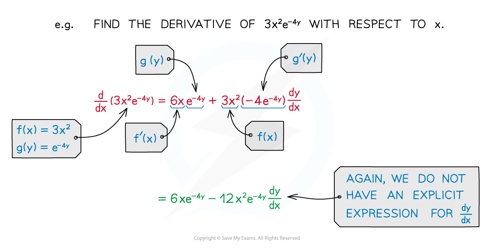
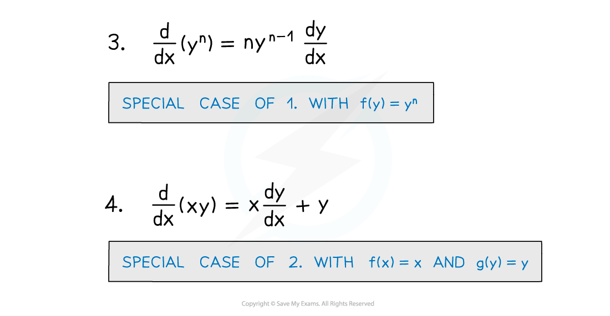
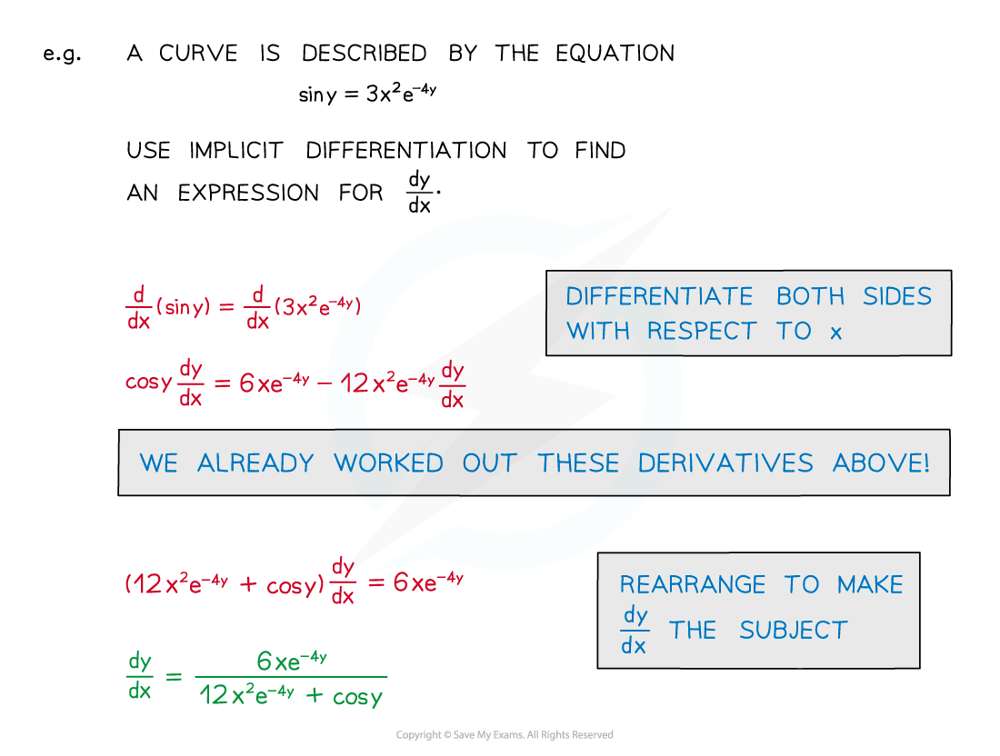

# Implicit Differentiation

## Implicit Differentiation

> **Spec point** — `spcpt_pYT5j4mkfqgGVyG8`

## Implicit differentiation

### What is implicit differentiation?

- An equation connecting ***x*** and ***y*** is not always easy to write **explicitly** in the form ***y*****= f(*****x*****)** or ***x***** = f(*****y*****)**
- However you can still differentiate such an equation **implicitly** using the **chain rule:**

- Combining this with the **product rule** gives us:

- These two special cases are especially useful:

- When ***x*** and ***y*** are connected in an **equation** you can differentiate both sides with respect to ***x*** and rearrange to find a formula (usually in terms of ***x*** **and *****y*** ) for **d*****y*****/d*****x***

  - Note that **d*****y*****/d*****x*** is a single algebraic object
  - When rearranging do not treat **d*****y*****/d*****x*** as a fraction
  - Especially do not try to separate **d*****y*** and **d*****x*** and treat them as algebraic objects on their own!

> **Exam Hint**
> - When using implicit differentiation you will not always be able to write **d*****y*****/d*****x*** simply as a function of ***x****.*
> - However, this does not stop you from answering questions involving the derivative.

> **Worked Example**
> 
