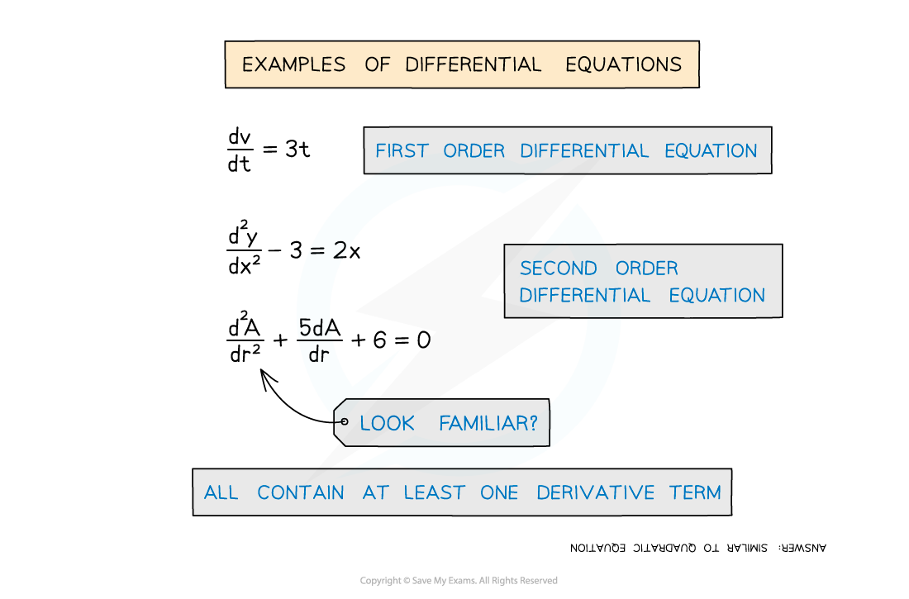
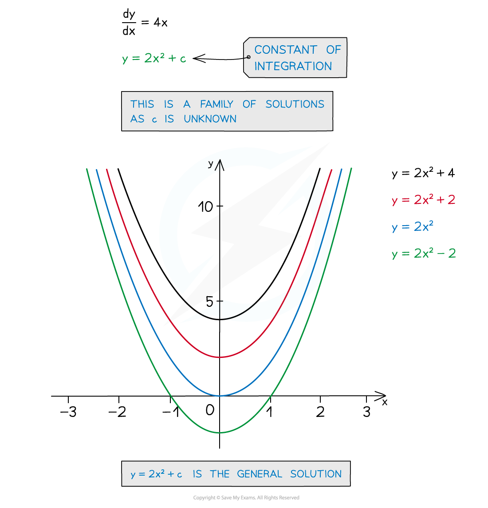

# General Solutions

## General Solutions

> **Spec point** — `spcpt_kp9mJX8PDbPPf4w6`

## General solutions

### What is a differential equation?

- Any equation, involving a **derivative** **term**, is a **differential** **equation**
- Equations involving only first derivative terms are called **first** **order** **differential** **equations**
- Equations involving second derivative terms are called **second** **order** **differential** **equations**

### What is a general solution?

- Integration will be involved in **solving** the differential equation

  - ie working back to “**y = f(x)**”
- A constant of integration, **c** is produced
- This gives an infinite number of solutions to the differential equation, each of the form **y = g(x) + c  **(ie  **y = f(x)  **where  **f(x) = g(x) + c**)
- These are often called a **family of solutions** … 

  - … and the solution **y= g(x) + c** is called the **general solution**

> **Worked Example**
> 
