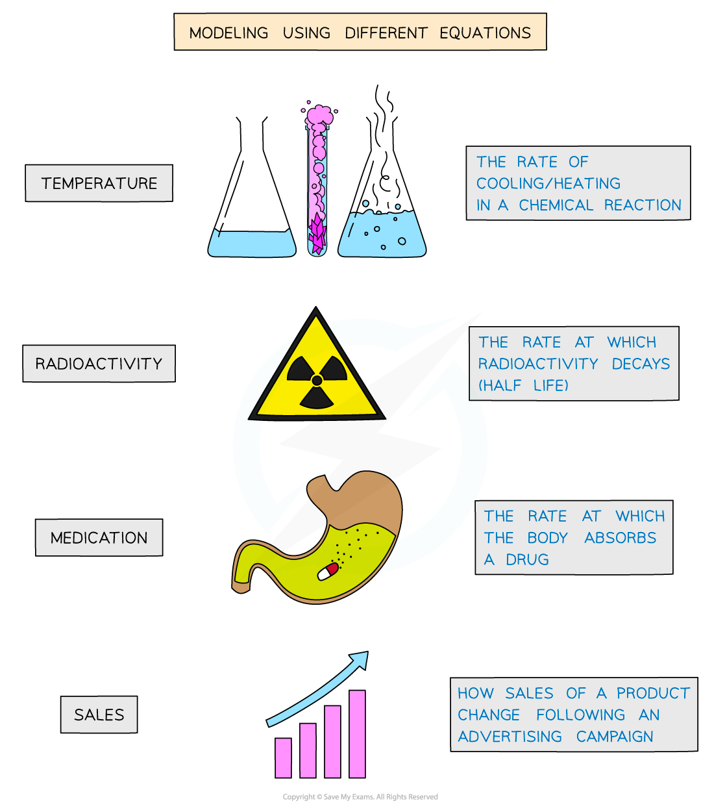
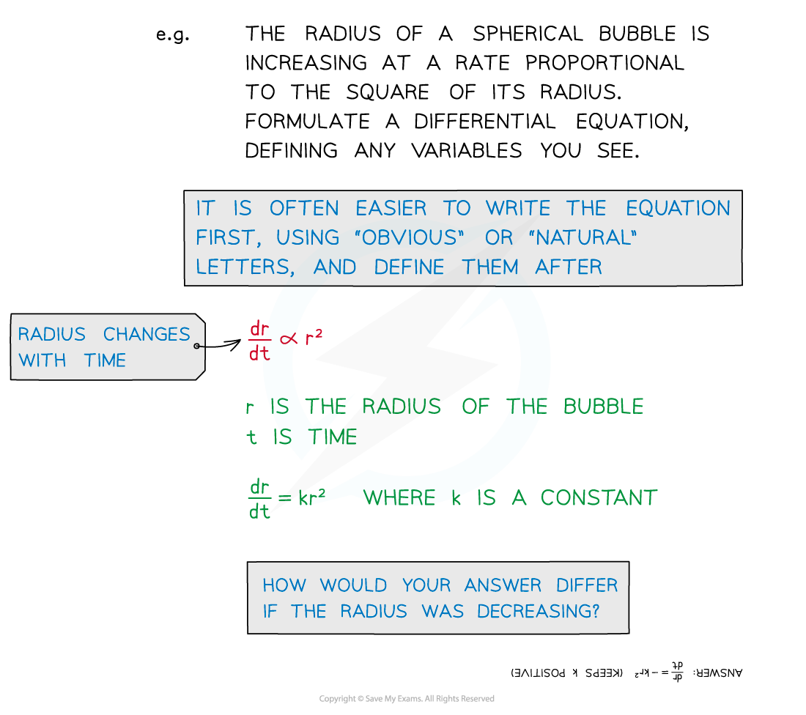
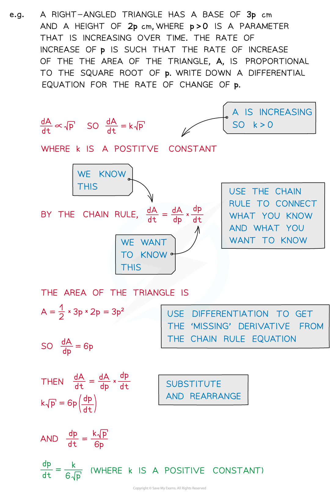

# Modelling with Differential Equations

## Modelling with Differential Equations

> **Spec point** — `spcpt_fT888hj3nWRtGBpn`

## Modelling with differential equations

### What can be modelled with differential equations?

- Derivative terms like  $\frac{dy}{dx}$ are “rates of change”
- There are many situations that involve “change”

- Temperature
- Radioactivity
- Medication
- Sales

### How do I set up a model with differential equations?

- The first task is to set up a differential equation from a description in words:

- Important phrases here are … 

  - … “**rate** **of** **change**” ... reference to a derivative term like $\frac{dy}{dx}$
  - … **directly**/**inversely** **proportional** to ... $y=kx$, $y=\frac{k}{x}$
  - … **formulate** ... means to write as an equation
  
    - you may need to choose and define letters for variables
    - **V** for volume, **h** for height (of a cylinder, say)

- Some differential equations may involve Connected Rates of Change

> **Exam Hint**
> - Use a highlighter (or underline) to pick out important words/phrases
> - Read and re-read the question several times
> - Jot down bits and pieces as you go; do not expect to go straight from reading to writing down a differential equation.

> **Worked Example**
> 
