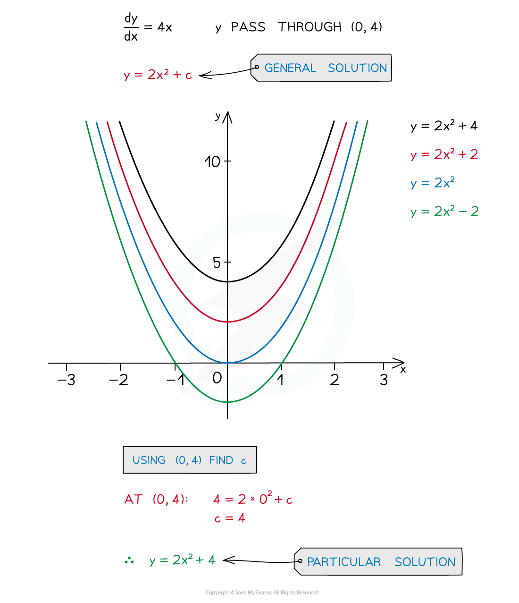
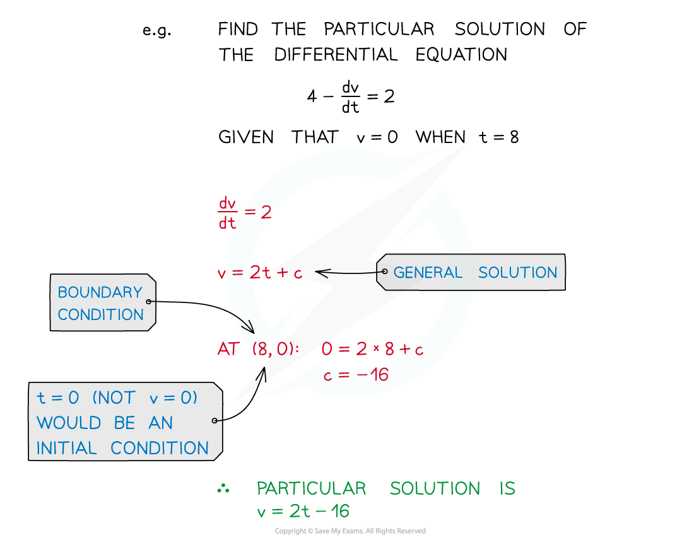
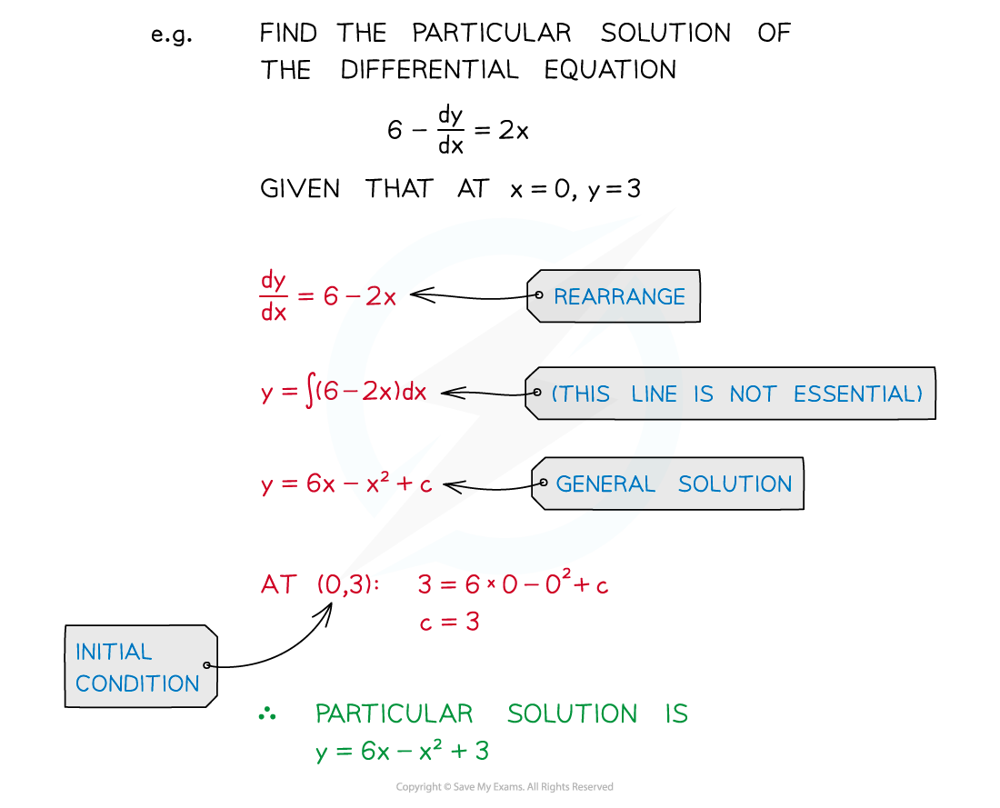

# Particular Solutions

## Particular Solutions

> **Spec point** — `spcpt_JfCD3zwDvrF2qW4F`

## Particular solutions

### What is a particular solution?

- Ensure you are familiar with **General** **Solutions** first
- With extra information, the constant of integration, **c**, can be found
- This means the **particular** **solution** (from the family of solutions) can be found

### What is a boundary condition and an initial condition?

- A **boundary condition** is a piece of extra information that lets you find the particular solution

  - For example knowing **y = 4** when **x = 0** in the preceding example
  - In a model this could be a particle coming to rest after a certain time, ie **v = 0** at time **t**

- Differential equations are used in modelling, experiments and real-life situations
- A boundary condition is often called an **initial** **condition** when it gives the situation at the start of the model or experiment

  - This is often linked to time, so **t = 0**

- It is possible to have two boundary conditions

  - eg a particle initially at rest has velocity, **v = 0** and acceleration, **a = 0** at time, **t = 0**
  - for a **second order** differential equation you need **two** boundary conditions to find the particular solution

> **Worked Example**
> 
> 
> 
