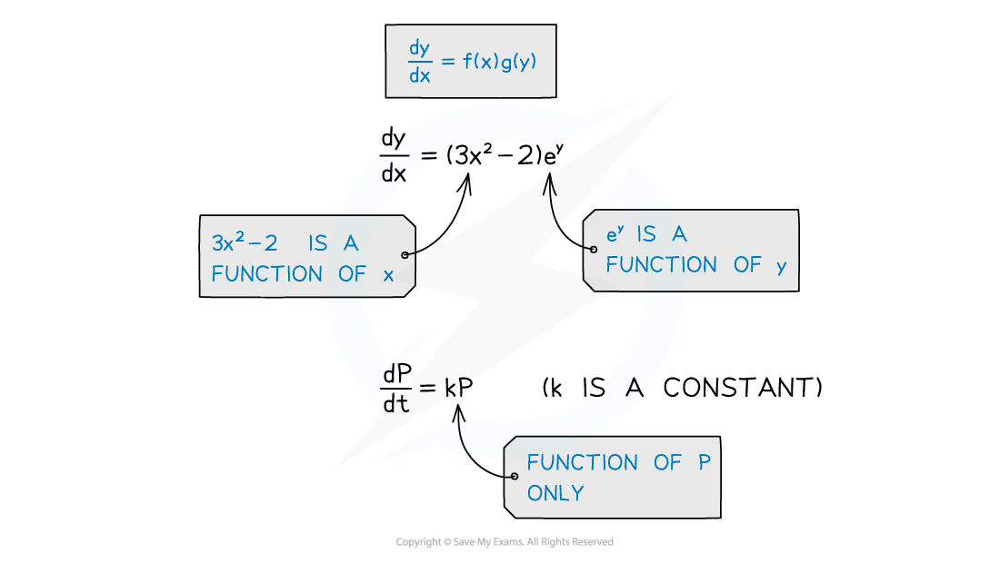
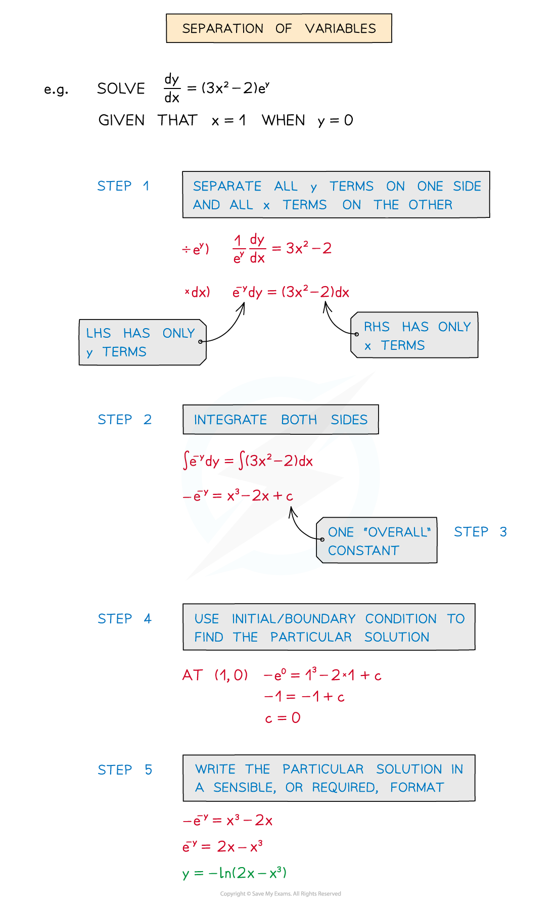

# Separation of Variables

## Separation of Variables

> **Spec point** — `spcpt_sH6wmW3VVsjtnMYT`

## Separation of variables

### What does it mean for a differential equation to be separable?

- Many differential equations used in modelling have two variables involved (ie **x** and **y**)
- If there is a product of functions in different variables, the differential equation is separable

  - ie **dy/dx = f(x) × g(y)**

- Differential equations of the form **dy/dx=** **g(y) **should be thought of as  **dy/dx=** **1 × g(y)**

  - where f(x) = 1

### How do I solve a differential equation using  separation of variables?

- STEP 1: Separate all y terms on one side and all x terms on the other side
- STEP 2: Integrate both sides
- STEP 3: Include one “overall” constant of integration
- STEP 4: Use the initial or boundary condition to find the particular solution
- STEP 5: Write the particular solution in sensible, or required, format

> **Worked Example**
> 
