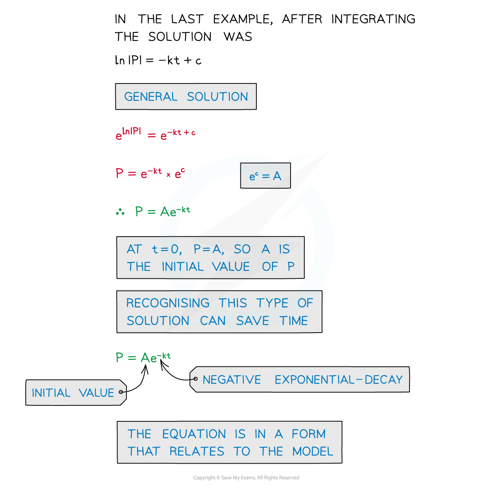
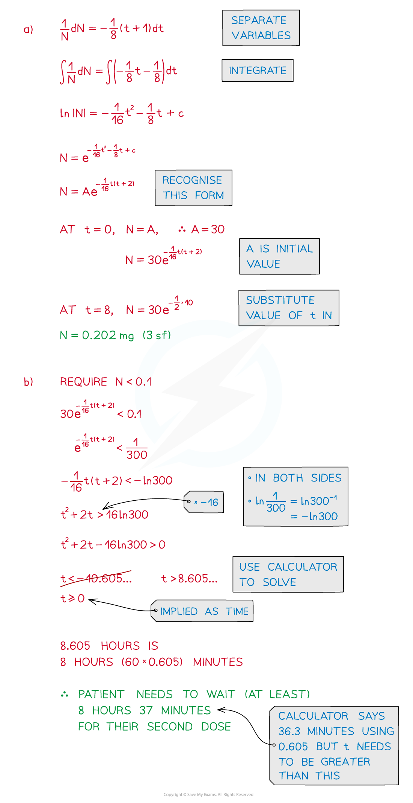
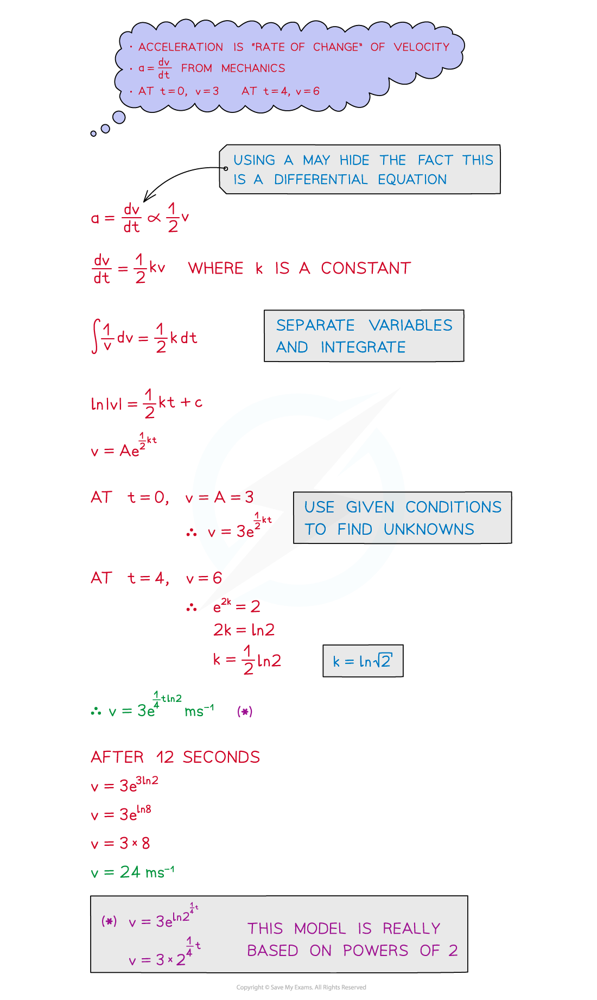
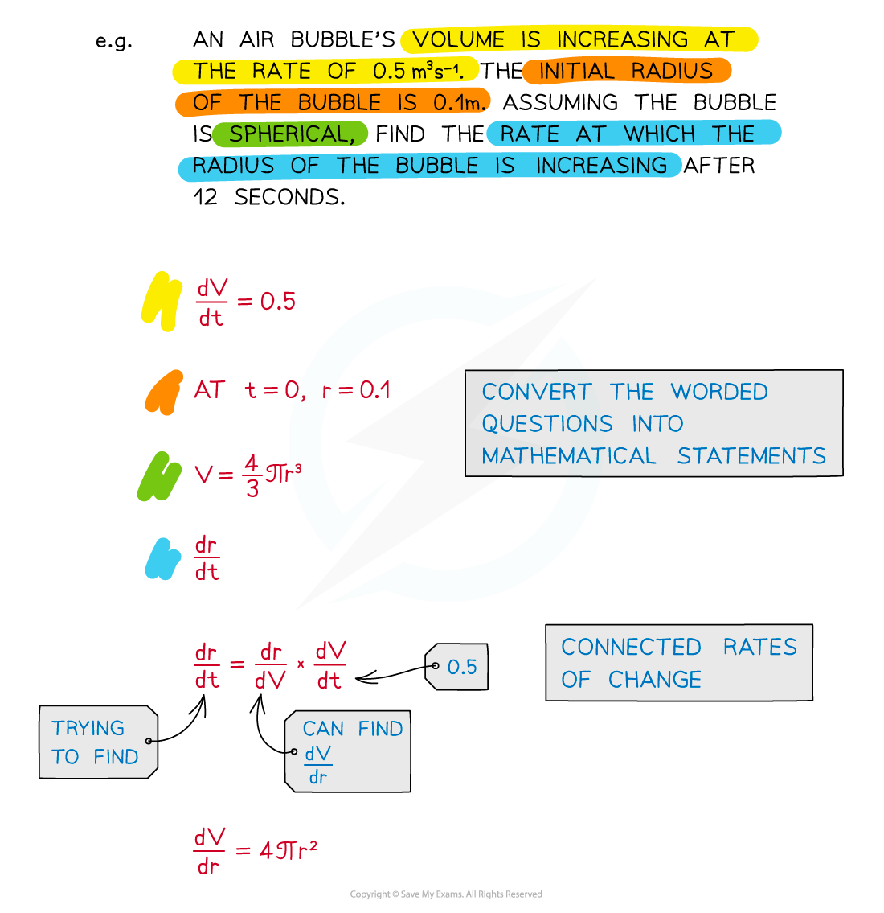
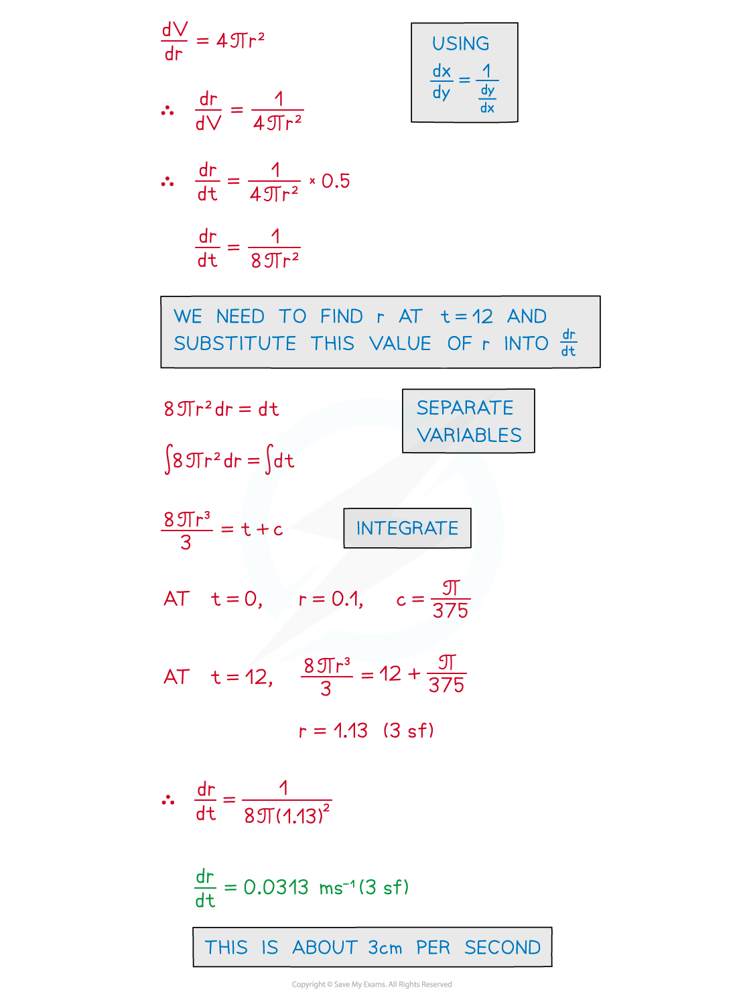
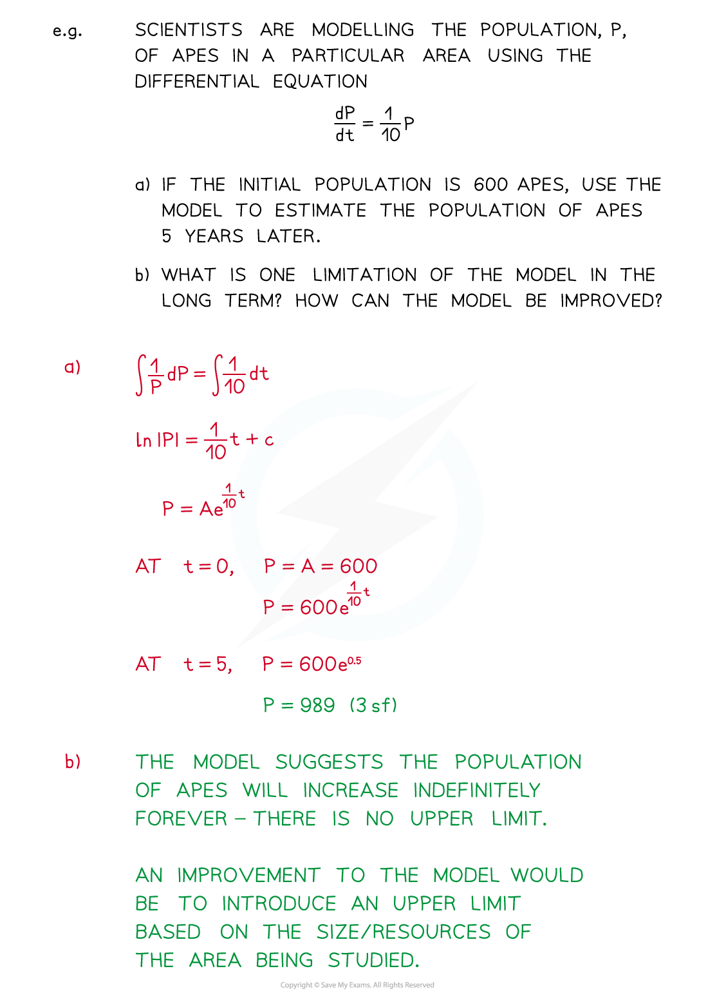

# Solving & Interpreting Differential Equations

## Solving & Interpreting Differential Equations

> **Spec point** — `spcpt_PnxgBf2qYcvSjRfZ`

## Solving & interpreting differential equations

### How do I solve a differential equation from a given model?

- Solving differential equations from a given model using the same techniques as before, for example separation of variables
- The precise integration method will depend on the type of question (see Decision Making)
- **Particular** **solutions** are usually required to Differential Equations 

  - An **initial**/**boundary** **condition** is needed

- Solutions can be rewritten in a format relevant to the model

- The solution can be used to make predictions at other times

  - Temperature after four minutes
  - Volume of sales after another three months

### How can I use the solution of a differential equation to answer modelling questions?

- Questions may ask you to interpret your solutions in the context of the problem

- There could be links to other areas of A level maths – such as mechanics

- Sometimes **multiple** rates of change may be involved in a model or problem

  - See Connected Rates of Change

### How can I interpret a model using the solution to the differential equation?

- Models may not always be realistic in the long term

  - A population will not grow indefinitely – it will reach a natural limit
  - You will be expected to interpret and comment on the model

> **Worked Example**
> 
> 
> 
