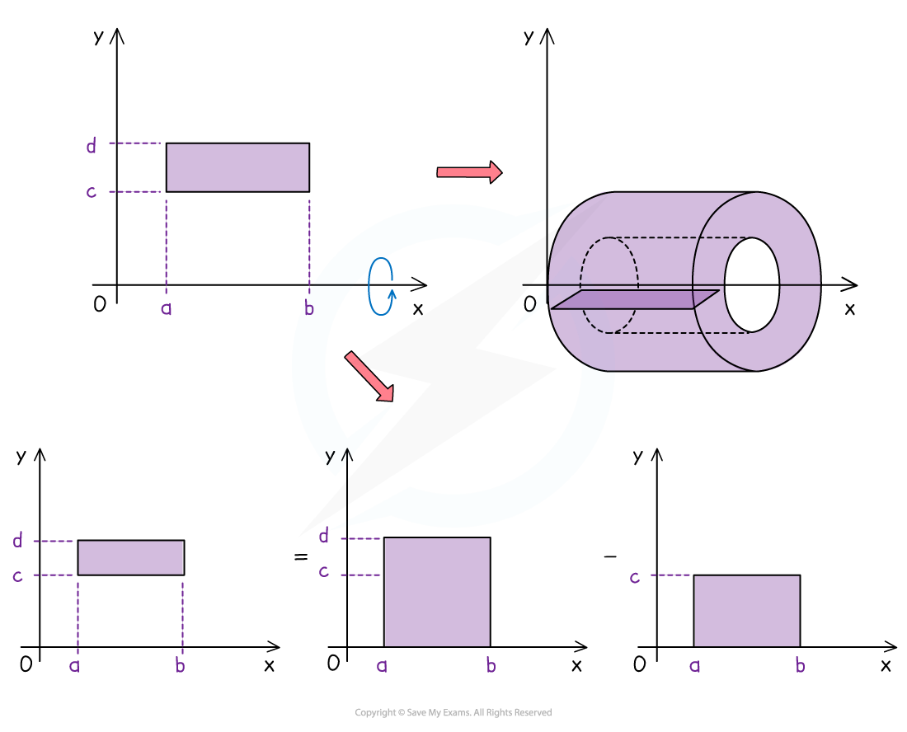
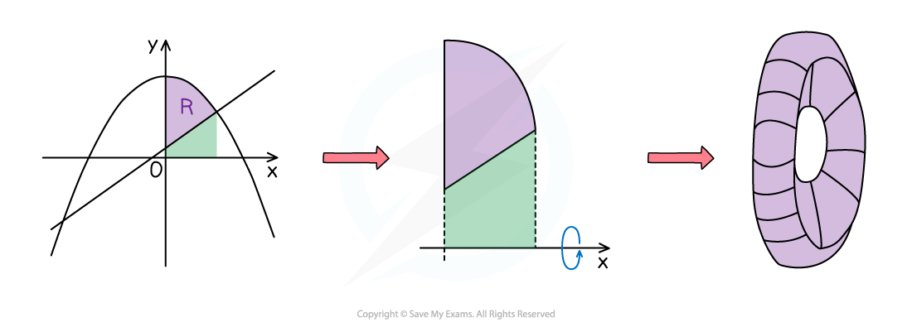

# Adding & Subtracting Volumes

## Adding and Subtracting Volumes

> **Spec point** — `spcpt_Gqg9pFnhtP3GjvBq`

## Adding and Subtracting Volumes

#### Why might I need to add or subtract volumes of revolution?

- As with the **area between a curve and a line** or the **area between 2 curves**, a required volume may be created by two functions

  - Make sure you are familiar with the methods in **Volumes of Revolution**
- The volumes created here can be created from areas that do not have the *x*-axis as one its boundaries

  - A **cylinder** is created by rotating a rectangle that borders the *x*-axis around the *x*-axis by 360°
  - An **annular** **prism** (a cylinder with a whole through it – like a toilet roll) is created by rotating a rectangle that does **not** have a boundary with the  *x*‑axis around the *x*-axis by 360°
- A rectangle would be defined by two vertical and two horizontal lines

- $x=a,x=b,y=c,y=d$

  - Where a, b, c & d are all positive and a < b and c < d
- The volume of revolution of this rectangle would be

  - `V equals pi integral subscript a superscript b d squared d x minus pi integral subscript a superscript b c squared d x`

#### How do I know whether to add or subtract volumes of revolution?

- When the **area** to be **rotated** around an axis has more than one function (and an axis) defining its boundary it can be trickier to tell whether to **add** or **subtract** **volumes** of **revolution**

  - It will depend on the **nature** of the **functions** and their **points** of **intersection**
  - Whether **rotation** is around the $x$**-axis** or the $y$**-axis**
- Consider the region ***R***, bounded by a curve, a line and the $y$-axis, in the diagram below 
- If ***R*** is **rotated** around the $x$**-axis** the **solid** of **revolution** formed will have a ‘hole’ in its centre

- Think in 2D and area

  - “region under the curve”
  **SUBTRACT**
  “region under the line”

#### How do I solve problems involving adding or subtracting volumes of revolution?

- Visualising the solid created becomes increasingly useful (but also trickier) for shapes generated by separate volumes of revolution

  - Continue trying to sketch the functions and their solids of revolution to help

- **STEP 1: **Identify the functions $(y_{1},y_{2},...)$ involved in generating the volume

  - Determine whether these will need to be added or subtracted

- **STEP 2: **Square *y* for all functions

  - Do this first without worrying about π or the integration and limits

- **STEP 3: **Identify the limits for each volume involved and form the integrals required

  - The limits could come from a graph

- **STEP 4: **Evaluate the integral for each function and add or subtract as necessary

  - The answer may be required in **exact form**
  - If not, round to **three significant figures** (unless told otherwise)

> **Worked Example**
> 
> 
> 

> **Exam Hint**
> - It is possible, in subtraction questions, to combine the separate integrals into one
> 
>   - This is possible when the limits for each function are often the same in subtraction questions
> 
> `V equals pi integral subscript a superscript b y subscript 1 squared d x minus pi integral subscript a superscript b y subscript 2 squared d x equals pi integral subscript a superscript b stretchy left parenthesis y subscript 1 squared minus y subscript 2 squared stretchy right parenthesis d x`
> 
> - This doesn’t really apply to addition questions as if the limits are the same, you would be adding some of the same volume twice
> - If in any doubt avoid this approach as **accuracy** is far more important
