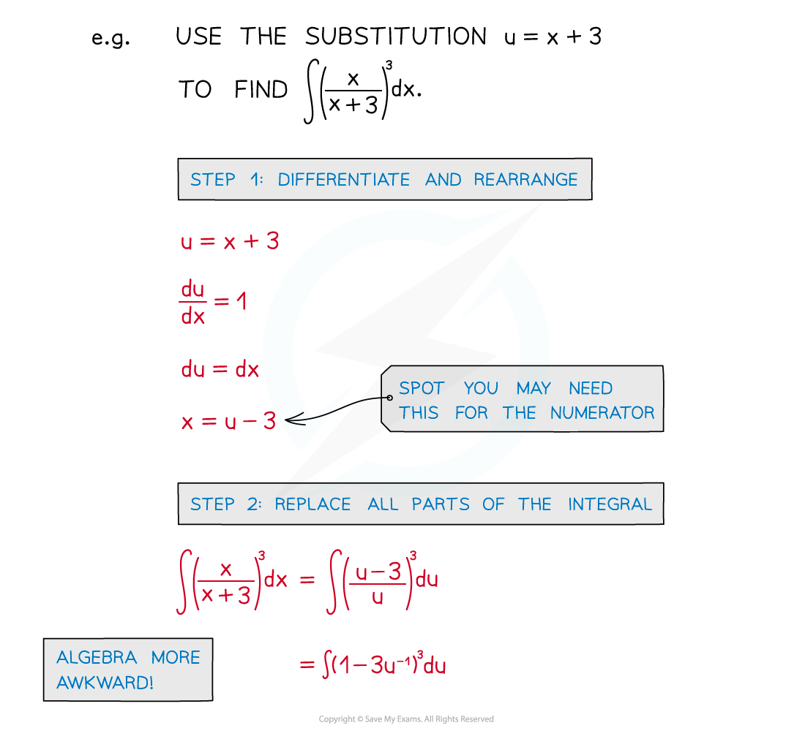
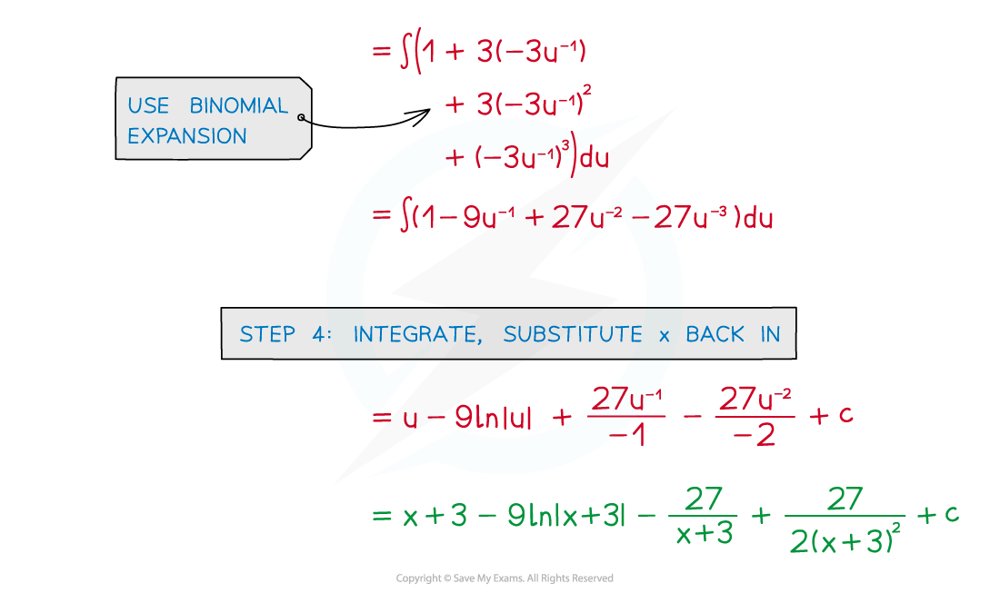

# Harder Substitution

## Harder Substitution

> **Spec point** — `spcpt_XhXVThpfcZ9CPFM8`

## Harder substitution

### What is integration by substitution?

- Make sure you are familiar with Reverse Chain Rule and Substitution (RCR)
- In more difficult questions the substitution will be given to you

### How do I integrate using a given substitution?

- The process is very much the same as before but expect the algebra to be trickier

- STEP 1: Differentiate the substitution and rearrange

  - $\frac{du}{dx}$ here can be treated like a fraction (eg × **dx** to get rid of fractions)

- STEP 2: Replace all parts of the integral

  - all **x** terms should be replaced with equivalent **u** terms, including **dx**
  - if a definite integral change the limits from **x** to **u** too
- STEP 3: Integrate and either

  - substitute **x** back in or
  - evaluate the definite integral using the **u** limits
- STEP 4: Find **c**, the constant of integration, if needed

> **Worked Example**
> 
> 
> 
> 
> 
