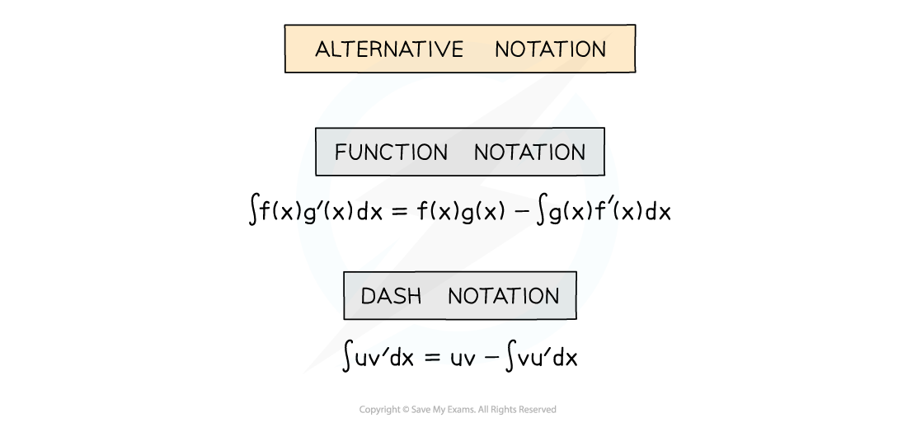
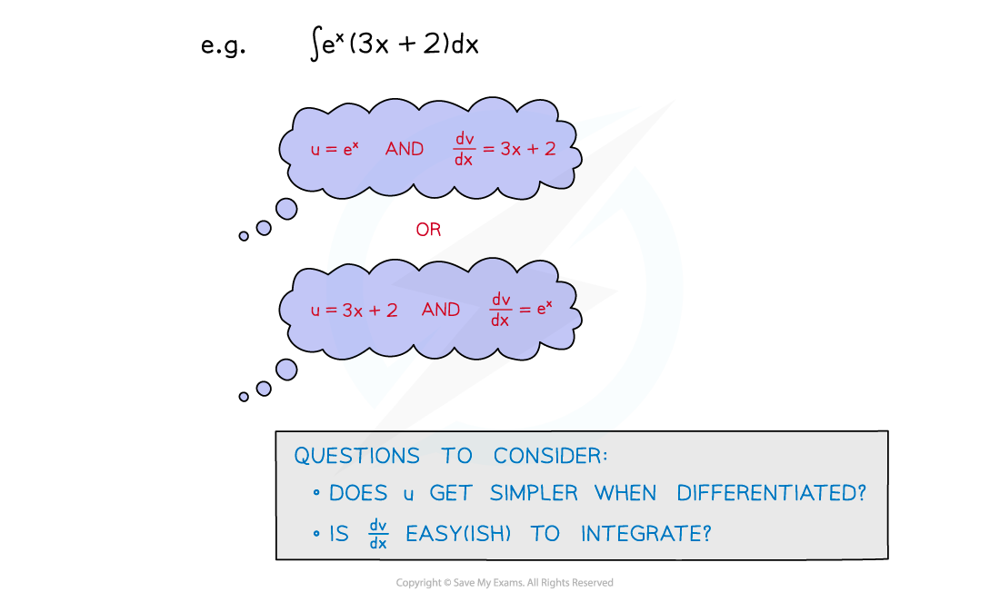
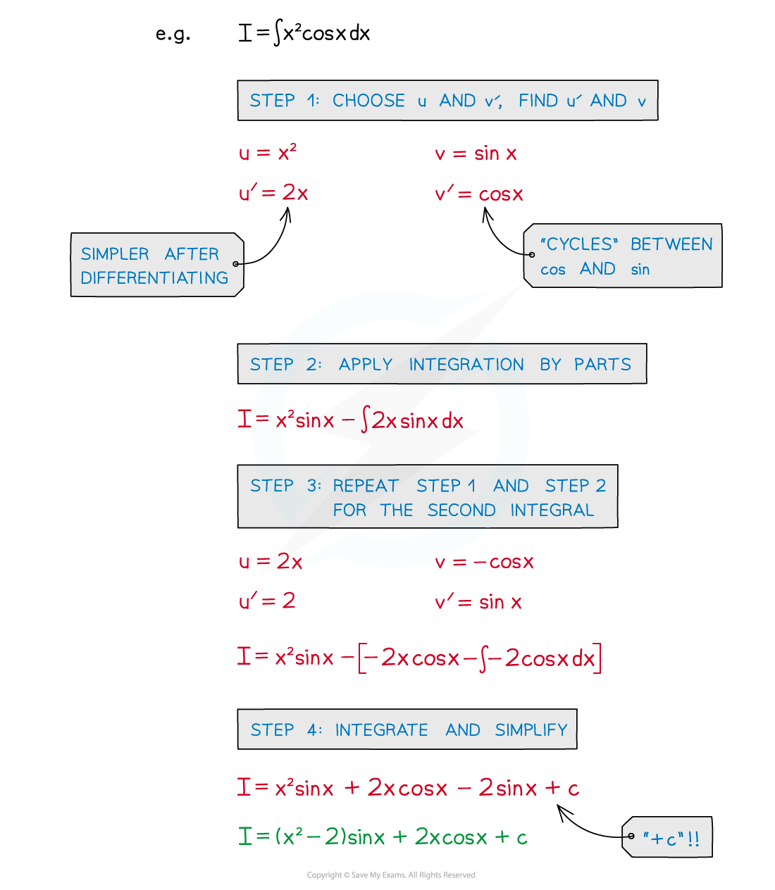
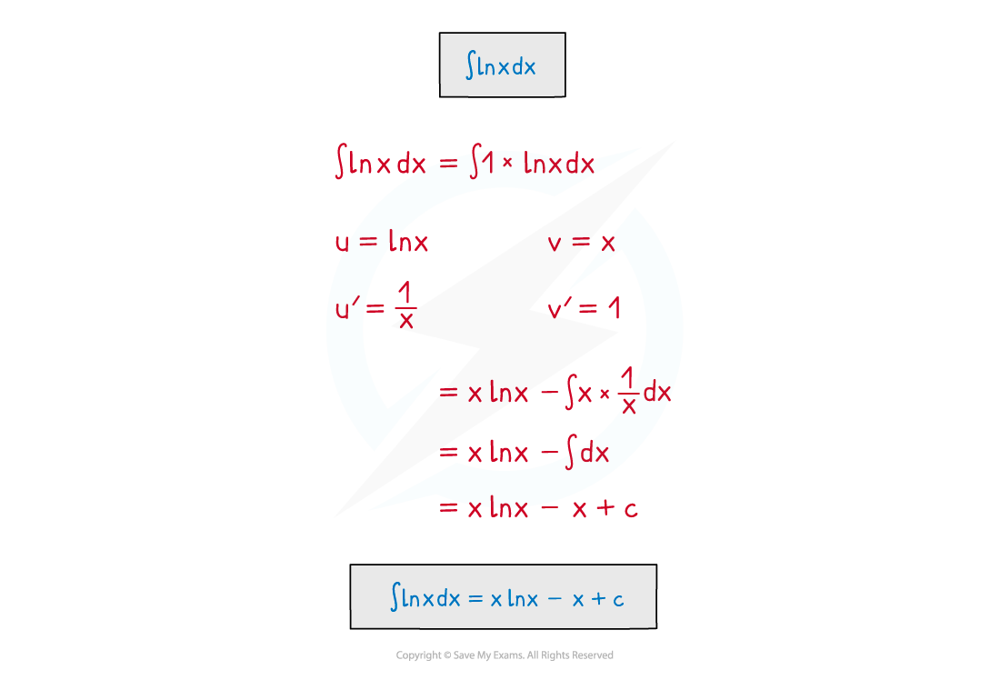
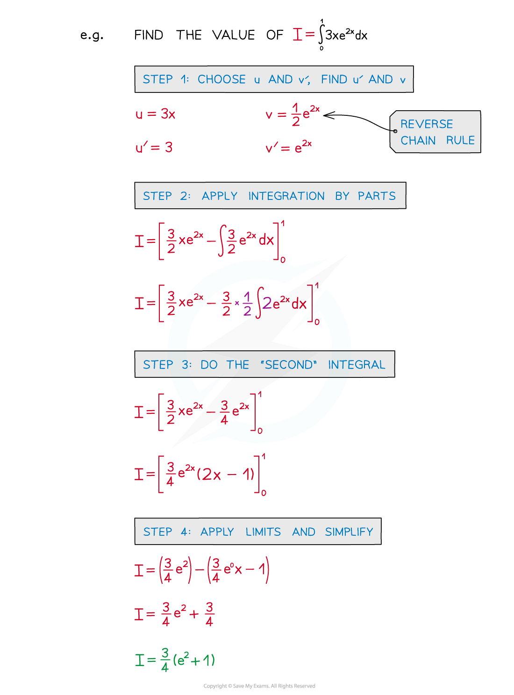

# Integration by Parts

## Integration by Parts

> **Spec point** — `spcpt_ysNvB269Jc4fKjT3`

## Integration by parts

### What is integration by parts?

- For integrating the product of two functions - reverse product rule
- Crucially the product is made from **u** and **dv/dx** (rather than **u** and **v**)
- Alternative notation may be used

### How do I use integration by parts?

- The hardest part is choosing **u** and **dv/dx** as there is no method for doing so
- **u**, ideally, becomes **simpler** when differentiated but this is not always possible
- **dv/dx** should be a function that can be integrated fairly easily
- Be wary of functions that ‘cycle’/’repeat’ when differentiated/integrated 

  - **e****x** → **e****x**
  - **sin x** → **cos x** → **-sin x** → **-cos x** → **sin x**

- **STEP 1**
Choose u and v’, find u’ and v
- **STEP 2**
Apply Integration by Parts

  - Simplify anything straightforward
- **STEP 3**
Do the ‘second’ integral

  - If an **indefinite** integral remember “**+c**”, the **constant** **of** **integration**
- **STEP 4**
Simplify and/or apply limits

### Can I use integration by parts twice?

- It is possible that integration by parts may need to be applied more than once

### How do I integrate ln x?

- A classic ‘set piece’ in almost every A level maths textbook ever written!
- In general, rewriting **f(x)** as **1×f(x)** can be a powerful problem-solving technique
- This could be a question in the exam

### Can I find definite integrals using integration by parts?

- You can find the value of a definite integral using integration by parts

  - Use the layout shown in the example below

> **Exam Hint**
> - Always think about what an elegant, slick, professional maths solution looks like – solutions normally get more complicated at first but quickly get simpler.
> - If your work is continuing to get more complicated, stop and check for an error.
> - Try to develop a sense of ‘having gone too far down the wrong path’.
> - This general advice is useful to remember:
> - Is the second integral harder than the first?
> - Try swapping your choice of **u** and **dv/dx**
> - It is rare to have to apply integration by parts more than twice

> **Worked Example**
> 
