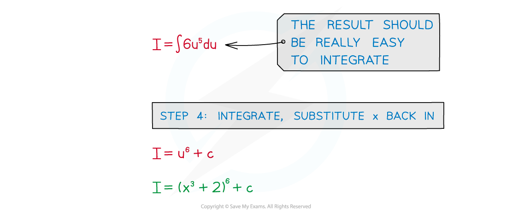
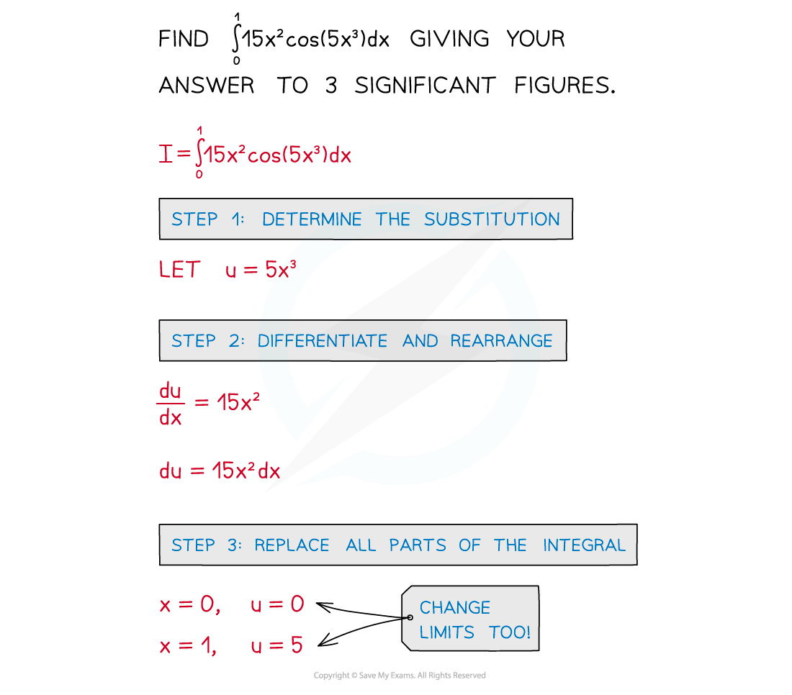
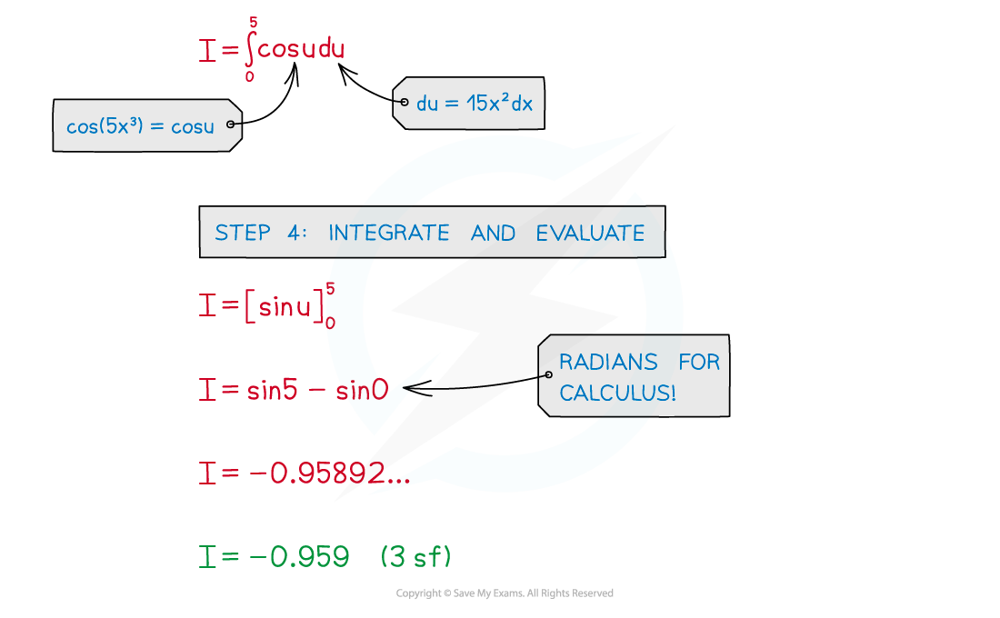

# Integration by Substitution

## Substitution (Reverse Chain Rule)

> **Spec point** — `spcpt_Mn93R9Cd6pxFDHgQ`

## Substitution (Reverse Chain Rule)

#### What is integration by substitution?

- Make sure you are familiar with Chain Rule and Reverse Chain Rule
- In more awkward problems it is harder to spot the reverse chain rule
- It is possible to use a substitution
- These kinds of substitutions usually will **not** be given

  - The substitution is deemed ‘obvious’ 

#### How do I integrate when a substitution is not given?

- Look to substitute the ‘second’ (rather than the ‘main’) function
- STEP 1: Determine the substitution

  - What is the ‘main’ function? ‘second’ function?
- STEP 2: Differentiate the substitution and rearrange

  - **du/dx** here can be treated like a fraction (eg × **dx** to get rid of fractions)
- STEP 3: Replace all parts of the integral

  - all **x** terms should be replaced with equivalent **u** terms, including **dx**
  - if a definite integral change the limits from **x** to **u** too
- STEP 4: Integrate and either …

  - …substitute **x** back in or
  - … evaluate the definite integral using the **u** limits
- STEP 5: Find **c**, the constant of integration, if needed

> **Exam Hint**
> - A lot of the “work” in these problems happens in your head :
> 
>   - what is the ‘main’ function?
>   - what should the substitution be?
>   - are there any numbers to ‘adjust’ and ‘compensate’ for?
> - Be sure that what you write down is clear and easy to follow, and remember that you can check your final answer by differentiating it.

> **Worked Example**
> 
> 
> 
