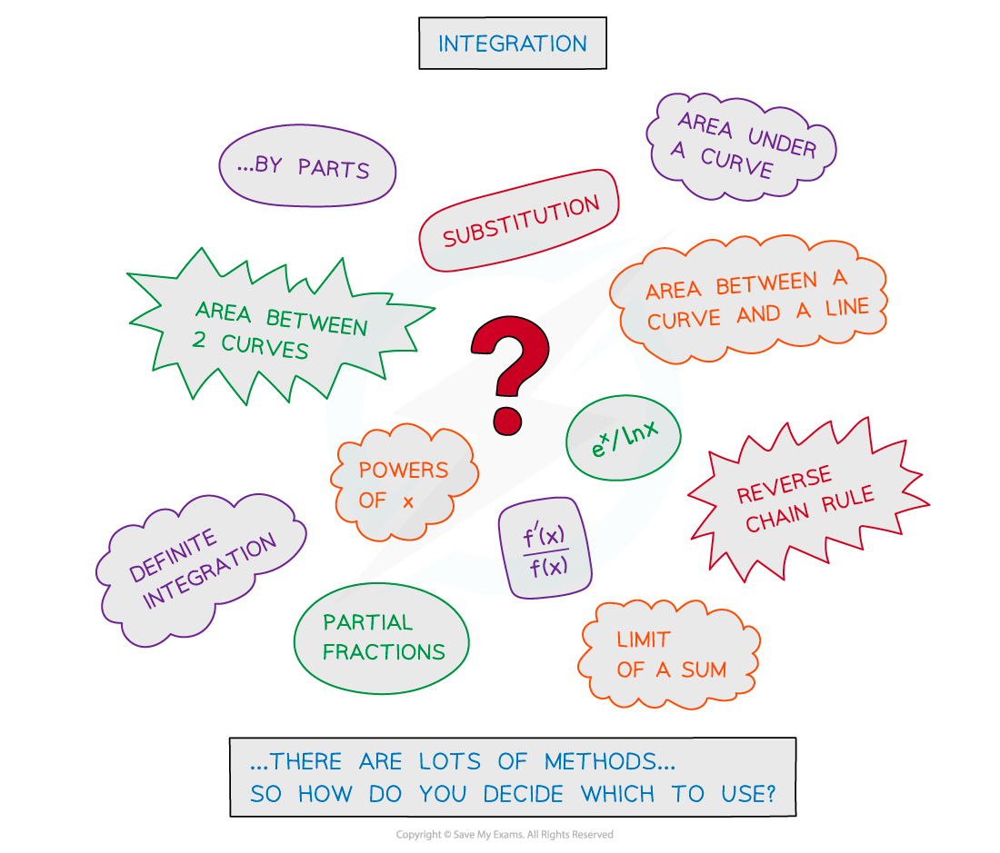
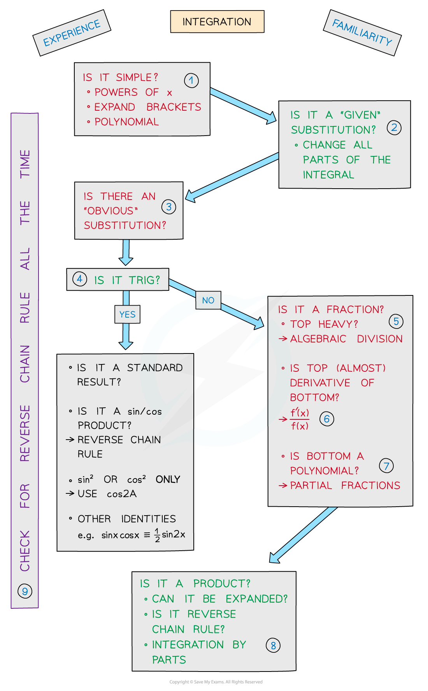

# Integration Decision Making

## Decision Making

> **Spec point** — `spcpt_SrFpVvthH46W55tj`

## Integration decision making

### What is integration decision making?

- The hardest part of integration is deciding which technique to use
- There are lots of them!

### How do I know which integration method to use?

- The main two requirements for success with integration are

  - **Experience**
  - **Familiarity**
- Always check for Reverse Chain Rule …

  - … particularly after changing part of an integral …
  - … by using a trig identity for example

Key to diagram above:

(1) Powers of $x$**   **

(2) Substitution

(3) Obvious substitution

(4) Trig

(5) Algebraic Division

(6) $\frac{f'(x)}{f(x)}$

(7) Partial fractions

(8) Integration by Parts

(9) Reverse Chain Rule

> **Exam Hint**
> - If in doubt, try something … You may gain marks for attempting a suitable substitution.
> - You may gain marks from using a trig identity.
> - You may gain marks from attempting to simplify or rewrite a fraction.

> **Worked Example**
> 
> 
> 
> 
> 
