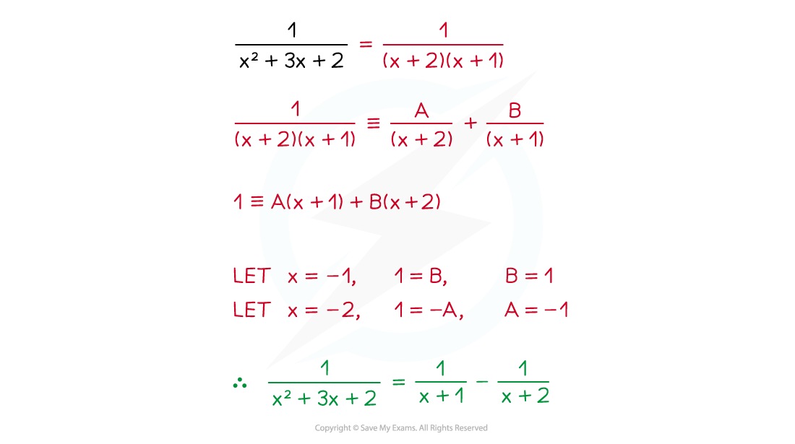
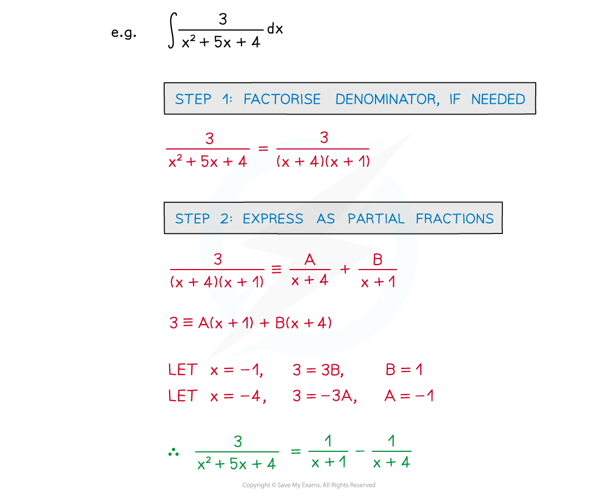
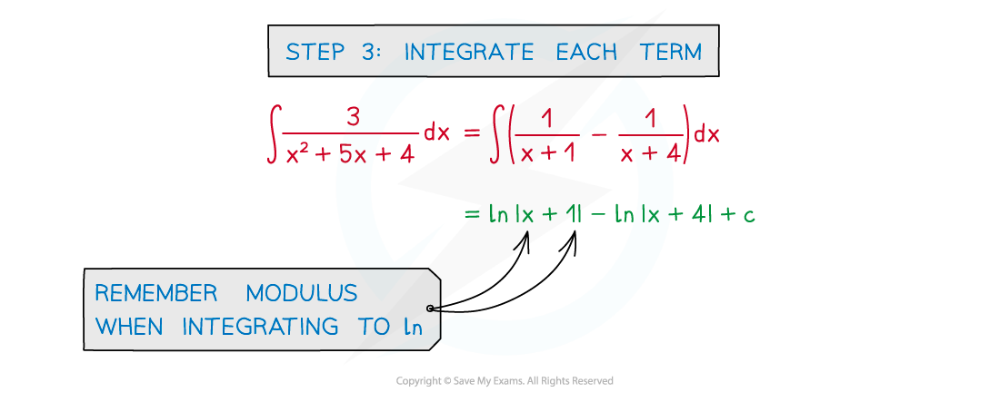

# Integration using Partial Fractions

## Integration using Partial Fractions

> **Spec point** — `spcpt_ZFbY6XYPkJtMsk93`

## Integration using partial fractions

### What are partial fractions?

- This is the reverse process to adding (or subtracting) fractions

  - The common polynomial denominator is split into factors
- Make sure you are familiar with the notes on Partial Fractions

### How do I integrate using partial fractions?

- Fractions with linear denominators can be integrated (See Integrating Other Functions)

- A fraction with a polynomial denominator (degree 2+) can be integrated by …

  - … splitting using partial fractions
  - … integrating each partial fraction

- STEP 1: Factorise denominator, if needed
- STEP 2: Express as partial fractions
- STEP 3: ‘Adjust’ and ‘compensate’ each term so it can be integrated (See Reverse Chain Rule)
- STEP 4: Integrate each term (usually involves **ln**) and simplify

> **Exam Hint**
> - When there are several parts, read the whole question:
> - An early part may be a “show that” involving partial fractions
> - A later part may be to integrate the original fraction
> - If you can’t do, or get stuck on, the partial fractions bit of the question you can still use the “show that” result to help with the integration.

> **Worked Example**
> 
> 
> 
> 
> 
