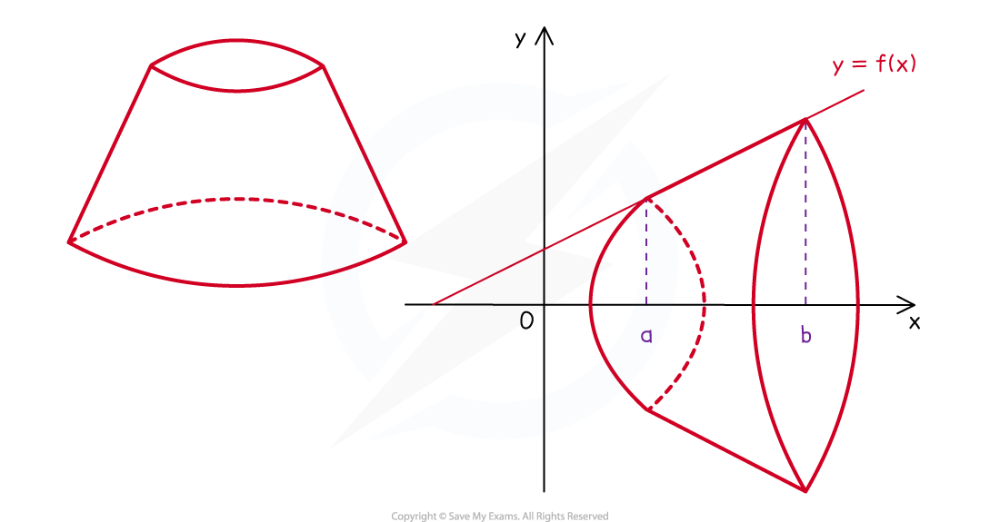

# Modelling with Volumes of Revolution

## Modelling with Volumes of Revolution

> **Spec point** — `spcpt_vKYDHtGp9nMnQPyB`

## Modelling with Volumes of Revolution

#### What is meant by modelling with volumes of revolution?

- Many every day objects such as buckets, beakers, vases and lamp shades can be modelled as a **solid** **of** **revolution**
- This can then be used to find the **volume** of the **solid** (**volume of revolution**) and/or other information about the solid that could be useful before an object is manufactured
- An object that would usually stand **upright** may have to be **modelled** **horizontally** so its **volume** of **revolution** can be found

**An upright lamp shade modelled horizontally as a straight-line segment**
**( **$y=f(x)$** between **$x=a$ ** and **$x=b$**)** ** rotated **$360^{\circ}$** around the **$x$ **-axis**

#### What modelling assumptions are there with volumes of revolution?

- The solids formed are usually the **main** **shape** of the **body** of the **object**

  - For example, the handles on a vase would **not** be included
  - The lip on the top edge of a bucket would **not** be considered
- A common question or **assumption** concerns the **thickness** of a container

  - The thickness is generally ignored as it is relatively small compared to the size of the object
  
    - thickness will depend on the purpose of the object and the material it is made from
  - Some questions may refer to the solid formed being the ‘inside’ of an object or refer to the ‘internal’ dimensions
  - If the thickness of the material is significant it would involve two related solids of revolution (**Adding & Subtracting Volumes**)

#### How do I solve modelling problems with volumes of revolution?

- **Visualising** and sketching the solid formed can help with starting problems
- Familiarity with applying the volume of revolution formulae for rotations around both the *x*-axis

*x*-axis `V equals pi integral subscript a superscript b y squared d x`

- The volume of a solid may involve adding or subtracting different volumes of revolution

  - Subtraction would need to be used for solids formed from areas that do not have a boundary with the axis of rotation
- Questions may go on to ask related questions in context so do take notice of the context

  - A question about a **bucket** being formed may ask about its **capacity**
- This would be measured in **litres** so there may also be a mix of **units** that will need conversion (e.g. 1000cm3 = 1 litre)

> **Worked Example**
> 
> 
> 

> **Exam Hint**
> - Consider the context of the question to gauge whether your final answer is realistic
> 
>   - a vase holding just 0.126 litres of water will not hold many flowers, but the question did state it was a *miniature* vase
