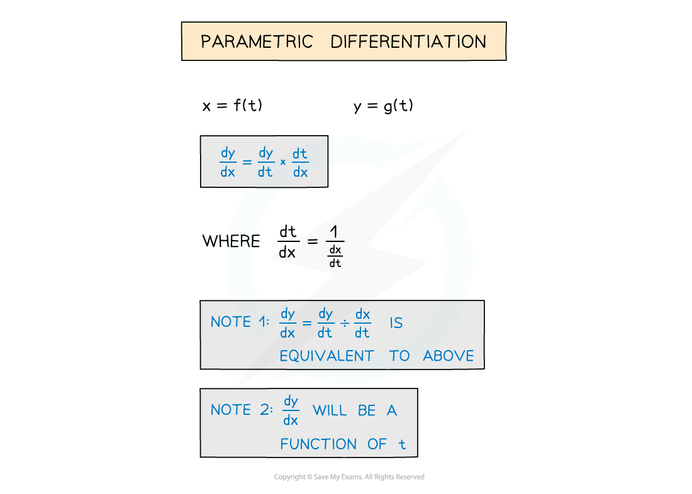
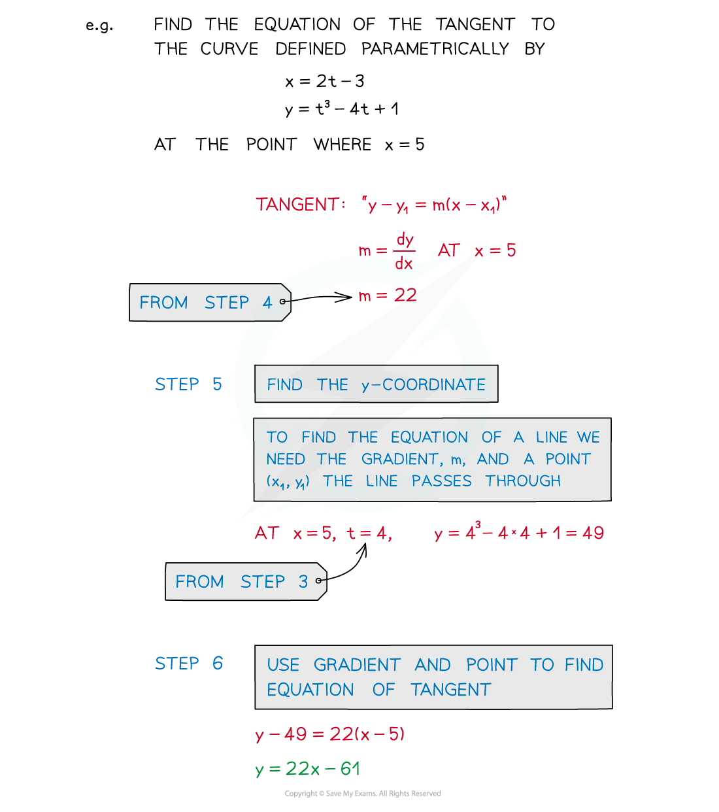
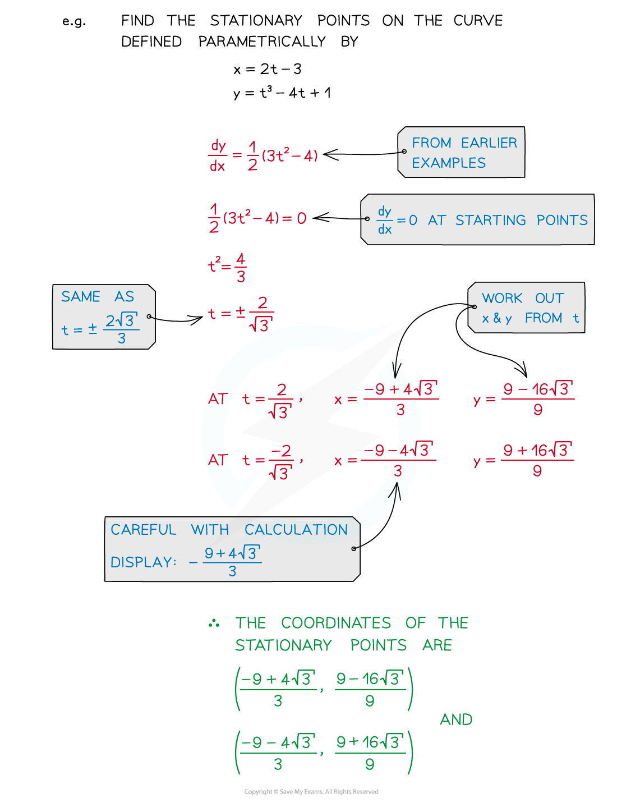
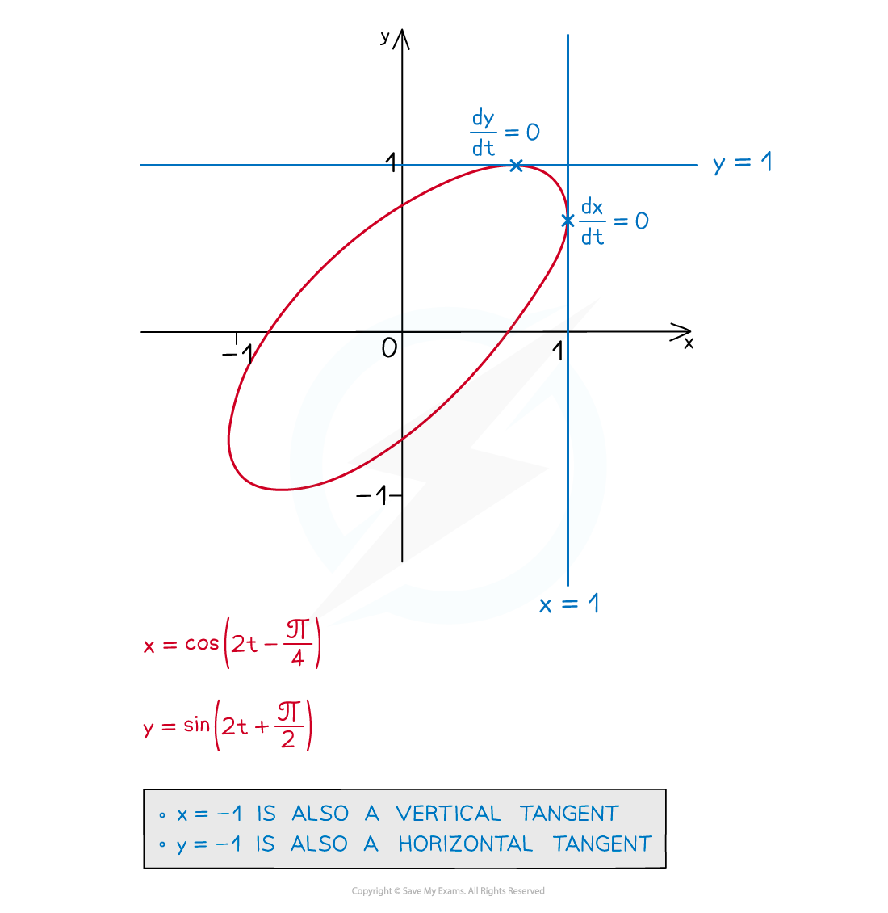

# Parametric Differentiation

## Parametric Differentiation

> **Spec point** — `spcpt_YXNKYW4W32K6HFn5`

## Parametric differentiation

### How do I find dy/dx from parametric equations?

- Ensure you are familiar with Parametric Equations – Basics first

** **

- This method uses the chain rule and the reciprocal property of derivatives

  - $\frac{dy}{dx}=\frac{dy}{dt}\times\frac{dt}{dx}$
  - $\frac{dt}{dx}=1\div\frac{dx}{dt}$
- Equivalently, $\frac{dy}{dx}=\frac{dy}{dt}\div\frac{dx}{dt}$
- $\frac{dy}{dx}$ will be in terms of *t* – this is fine

  - Questions usually involve finding gradients, tangents and normals
- The chain rule is always needed when there are three variables or more – see Connected Rates of Change

### How do I find gradients, tangents and normals from parametric equations?

#### To find a gradient

- **STEP 1**
Find **dx/dt** and **dy/dt**
- **STEP 2**
Find **dy/dx** in terms of **t**

  - Using either **dy/dx = dy/dt ÷ dx/dt** or **dy/dx = dy/dt × dt/dx** where **dt/dx = 1 ÷ dx/dt**
- **STEP 3**
Find the value of **t** at the required point
- **STEP 4**
Substitute this value of **t** into **dy/dx** to find the gradient** ** 

#### To then go on to find the equation of a tangent

- **STEP 5**
Find the **y** coordinate
- **STEP 6**
Use the gradient and point to find the equation of the tangent

#### To find a normal...

- **STEP 7**
Use perpendicular lines property to find the gradient of the normal **m****1**** × m****2**** = -1**
- **STEP 8**
Use gradient and point to find the equation of the normal **y - y****1**** = m(x - x****1****)**

### How do I solve problems using parametric differentiation?

- Questions may require use of tangents and normals as per the coordinate geometry sections

  - Find points of intersection between a tangent/normal and **x**/**y** axes
  - Find areas of basic shapes enclosed by axes and/or tangents/normals
- Find stationary points (**dy/dx = 0**)

- You may also be asked about horizontal and vertical tangents

  - At horizontal (parallel to the **x**-axis) tangents, **dy/dt = 0**
  - At vertical (parallel to **y**-axis) tangents, **dx/dt = 0**

> **Worked Example**
> 
> 
> 
