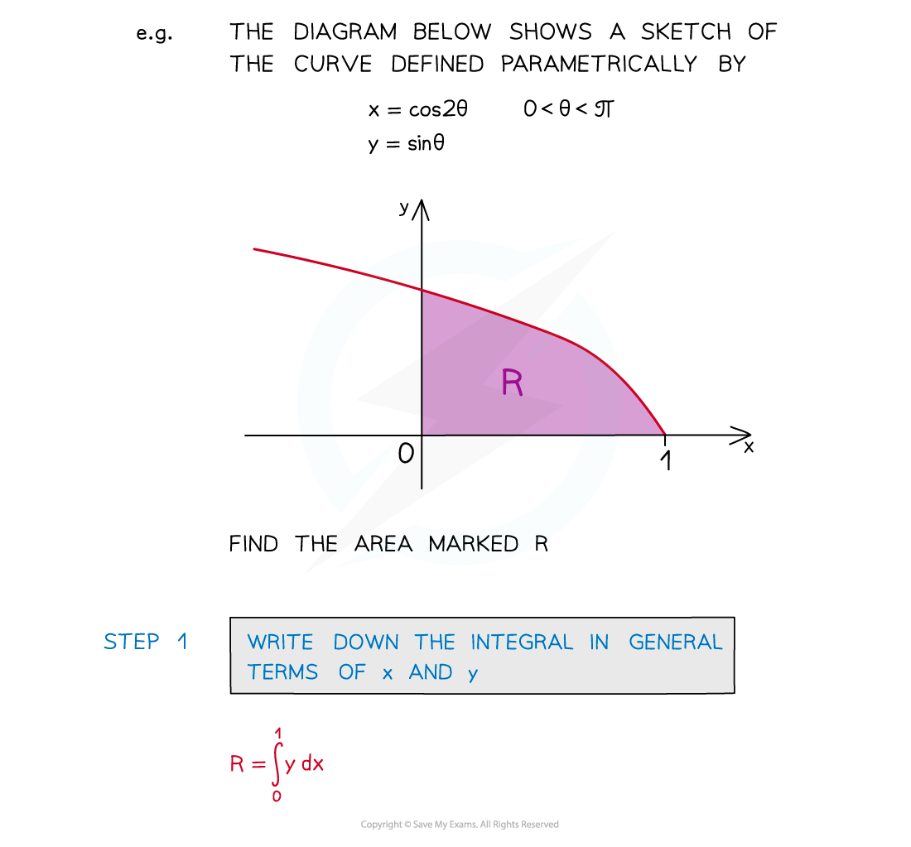
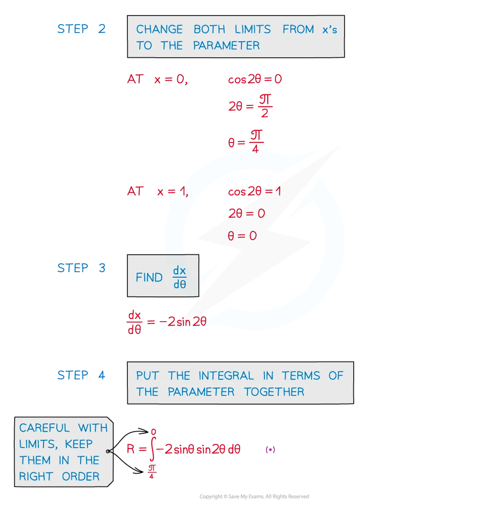

# Parametric Integration

## Parametric Integration

> **Spec point** — `spcpt_WPr865MC2MCwFhys`

## Parametric integration

### How does integration work with parametric equations?

- Integration is used to find the area under a curve where the curve has been defined by parametric equations 

  - **x = f(t)**
  - **y = g(t)**

- The key point is to ensure the limits of the integral are changed to the parameter

> **Worked Example**
> 
> 
> 
