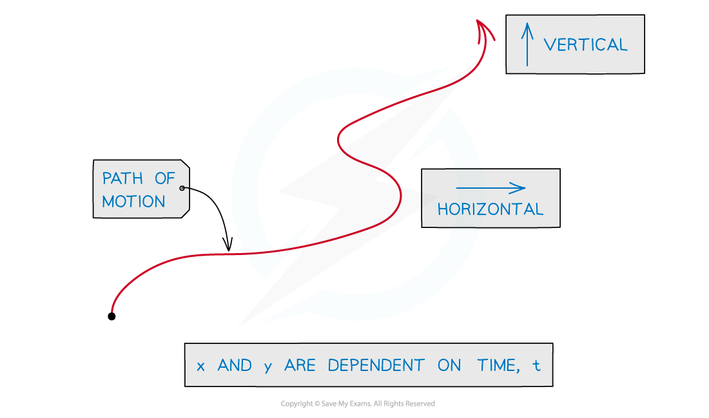
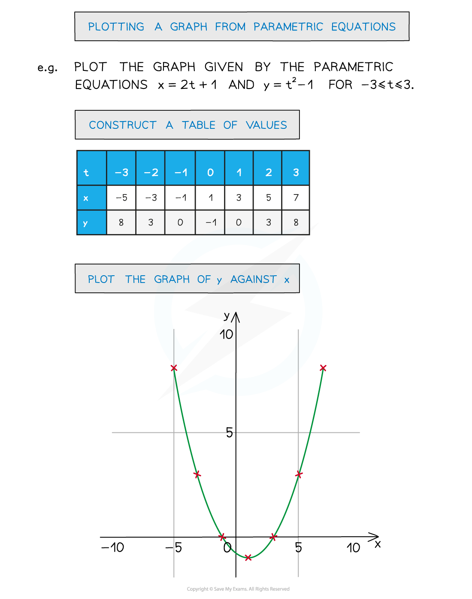
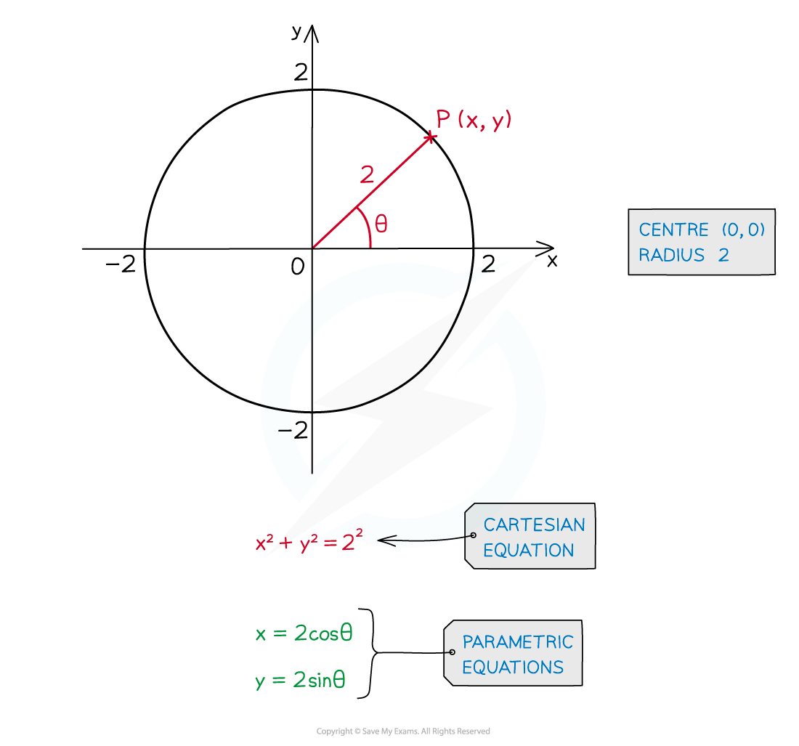

# Basics of Parametric Equations

## Parametric Equations - Basics

> **Spec point** — `spcpt_gYgCP3dHkgCGT23b`

## Basics of parametric equations

### What are parametric equations?

- Graphs are usually described by a **Cartesian** **equation**

  - The equation involves **x** and **y** only
- Equations like this can sometimes be rearranged into the form, **y = f(x)**

** **

- In **parametric** **equations** both **x** and **y** are dependent on a third variable

  - This is called a **parameter**
  - **t** and **θ** are often used as parameters
- A common example …

  - **x** is the horizontal position of an object
  - **y** is the vertical position of an object
  - and the position of the object is dependent on time **t**
- **x** is a function of **t**, **y** is a function of **t**

  - **x = f(t)**
  - **y = g(t)**

### How do I plot parametric equations?

- It is still possible to plot a graph of **y** against **x **from their parametric equations

- Also see Parametric Equations – Sketching Graphs

### What are the parametric equations of a circle?

- For a circle, centre (0, 0) and radius **r**

  - **x = rcos θ**
  - **y = rsin θ**
  - (Note that **r** is constant, this is not two parameters)
- For a circle, centre (**a**, **b**) and radius** r**

  - **x = rcos θ + a**
  - **y = rsin θ + b**

> **Worked Example**
> 
