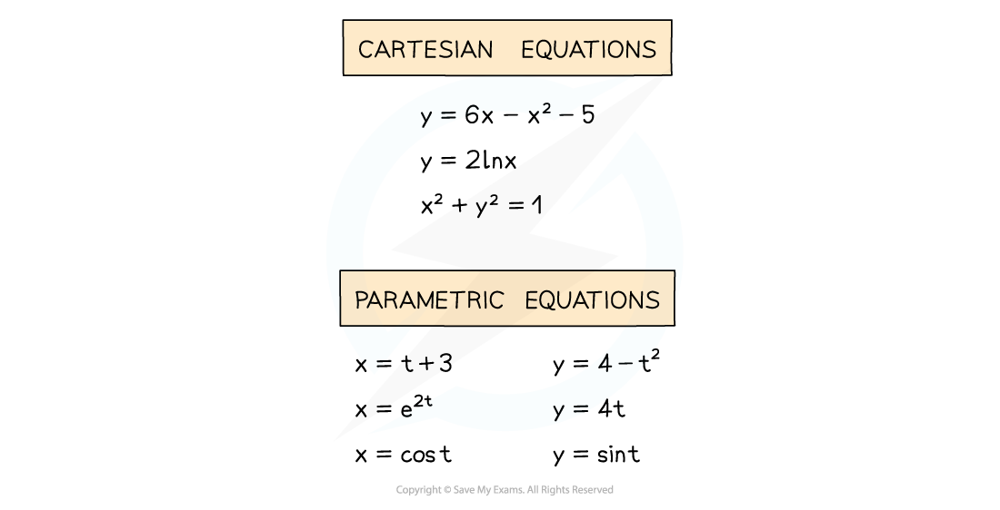
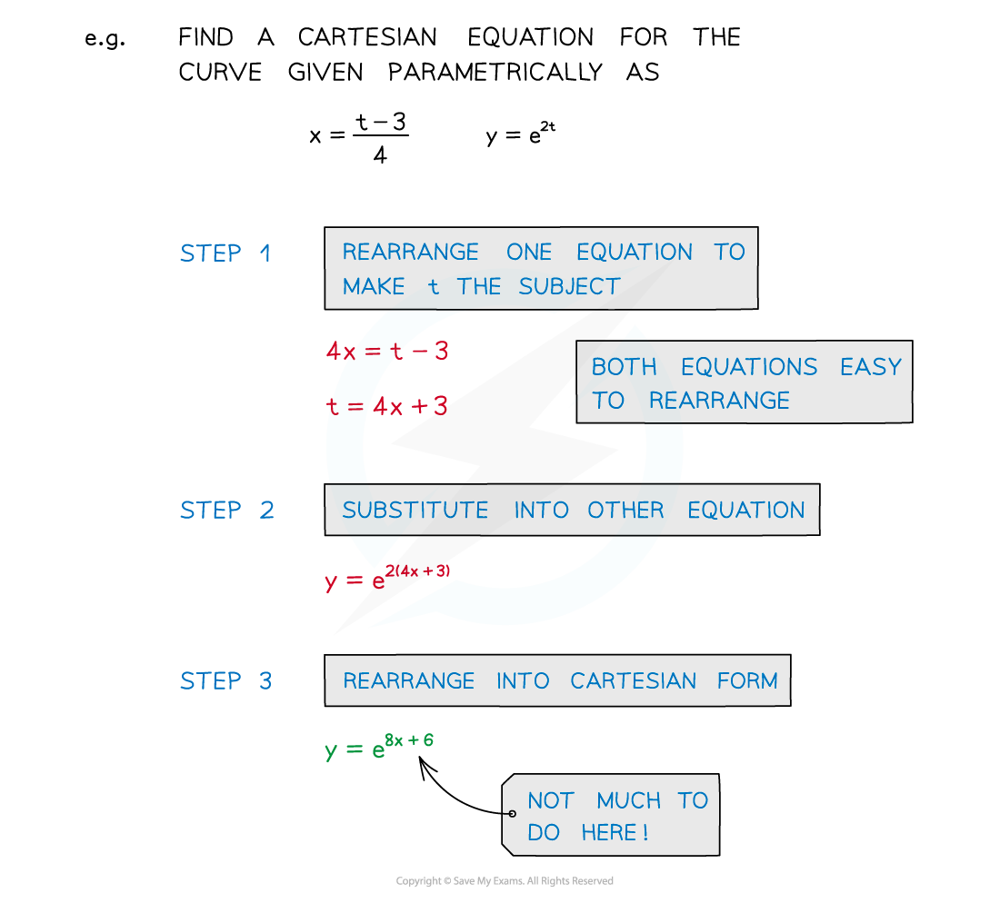
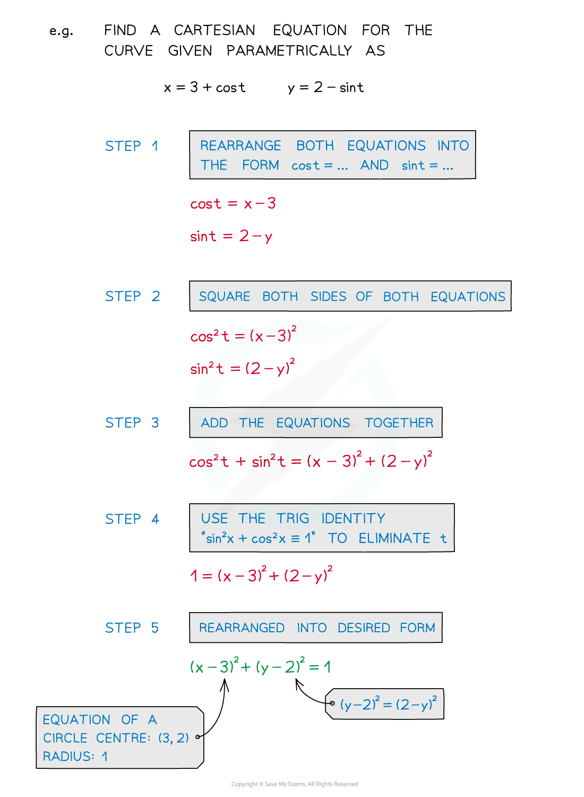

# Eliminating the Parameter of Parametric Equations

## Parametric Equations - Eliminating the Parameter

> **Spec point** — `spcpt_pQyRTSWg3RWsPB7W`

## Eliminating the parameter of parametric equations

### What does eliminating the parameter mean?

- In parametric equations, **x = f(t)** and **y = g(t)**
- There is still a connection directly linking **x** and **y**

  - This will be the **Cartesian** equation of the graph

### How do I find the Cartesian equation from parametric equations?

- **STEP 1**
Rearrange one of the equations to make t the subject

  - Either **t = p(x)** or **t = q(y)**
- **STEP 2**
Substitute into the other equation
- **STEP 3**
Rearrange into the desired (Cartesian) form

### How can I eliminate the parameter using trigonometric identities?

- **STEP 1**
Rearrange both equations into the forms “cos t = …” and “sin t = …”
- **STEP 2**
Square both sides of both equations
- **STEP 3**
Add the equations together
- **STEP 4**
The trig identity “**sin****2**** x + cos****2**** x ≡ 1**” eliminates **t**
- **STEP 5**
Rearrange into desired (Cartesian) form

  - This technique is seen in Trigonometric Identities

> **Exam Hint**
> When choosing which equation to rearrange, aim for “as simple as possible”:
> 
> - Linear equations are simpler than quadratics
> 
>   - eg Rearrange **x = 2t + 3** or **y = 3t****2**** +3t -4** ?
> - Single exponential terms are quite easy to deal with
> 
>   - eg **x = e****t**** → t = ln x**
> 
> Trig identities may be needed and remember **squared** terms are good!
> 
> - eg **sin****2**** x + cos****2**** x ≡ 1**

> **Worked Example**
> 
