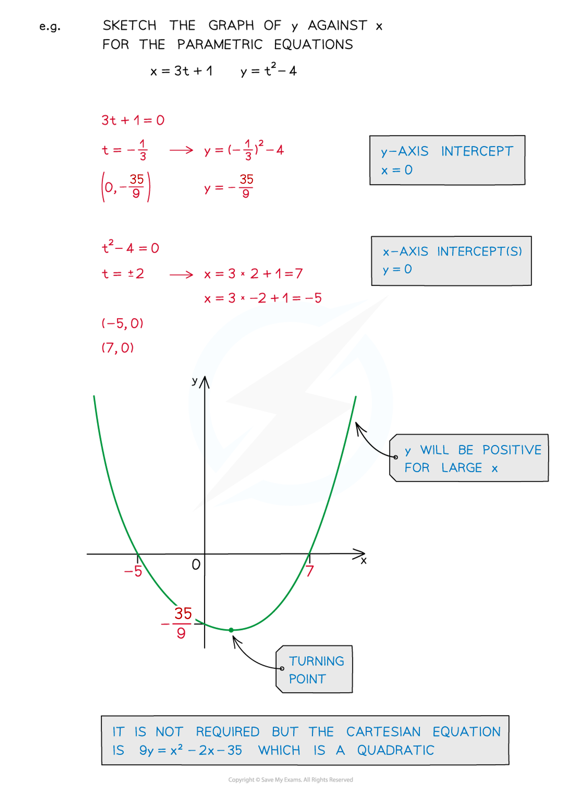
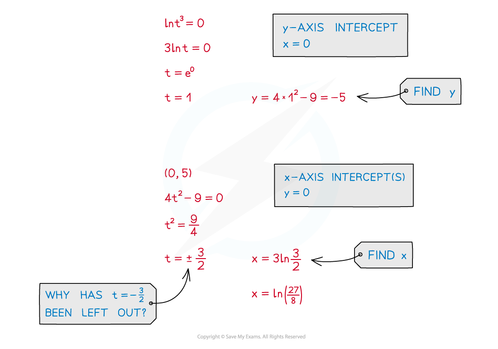
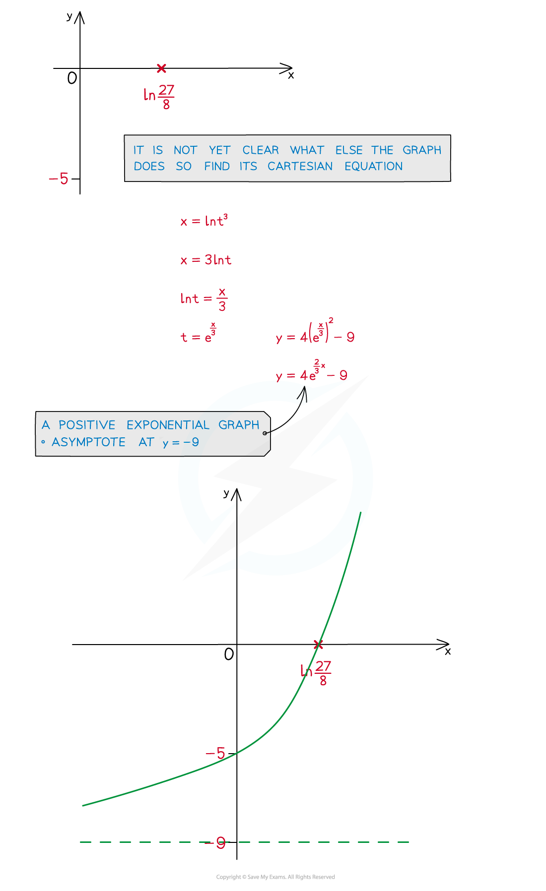

# Sketching Graphs of Parametric Equations

## Parametric Equations - Sketching Graphs

> **Spec point** — `spcpt_WTvZHvT7cMnVH3pg`

## Sketching graphs of parametric equations

### How do I sketch a graph from parametric equations?

- **Plotting** a graph is covered in Parametric Equations - Basics

- Still find the key features of a graph …
- … the **y**-axis intercept

  - … the **x**-axis intercept(s)
  - … asymptotes
  - … location of (and if required coordinates of) stationary points (see Parametric Differentiation)
- **Sketch** these points and join up accordingly

> **Exam Hint**
> - Not all curves defined parametrically lead to familiar shaped graphs and it may be worth plotting a few extra points by calculating them.
> - Your calculator may be able to produce a table of values quickly, however, remember you are sketching and not plotting.
> - It may be easier to find the Cartesian equation first and draw the graph from that – this will depend on the question.
> - It is only a **definite** strategy if you cannot make progress otherwise.
> - If you are given the sketch of a graph it is usually only for reference and can be used to check answers for axes intercepts, etc.

> **Worked Example**
> 
