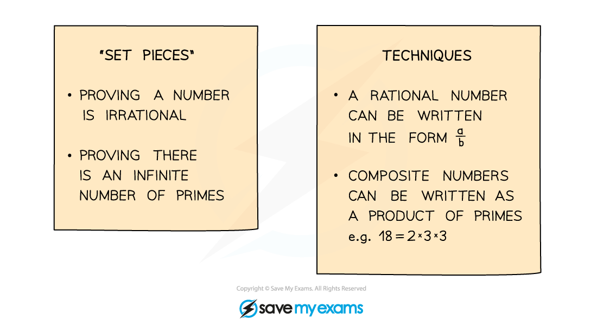
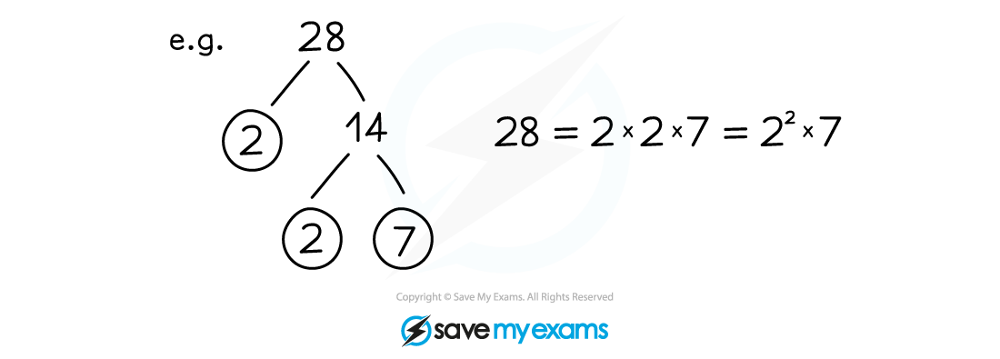

# Proof by Contradiction

## Proof by Contradiction

> **Spec point** — `spcpt_KkNkQFVjpSr6W7Qc`

## Proof by contradiction

### What is proof by contradiction?

- A proof by contradiction assumes the **opposite** result is true
- Then, through a series of logical steps, shows that this cannot be so

### How do I use proof by contradiction?

- This type of proof often involves explanation in words alongside mathematical statements
- Start with a statement assuming the opposite is true

  - e.g. 'Assume...'

- Use **prime** **factorisation** to write a ***composite number*** as a product of primes

> **Worked Example**
> 
