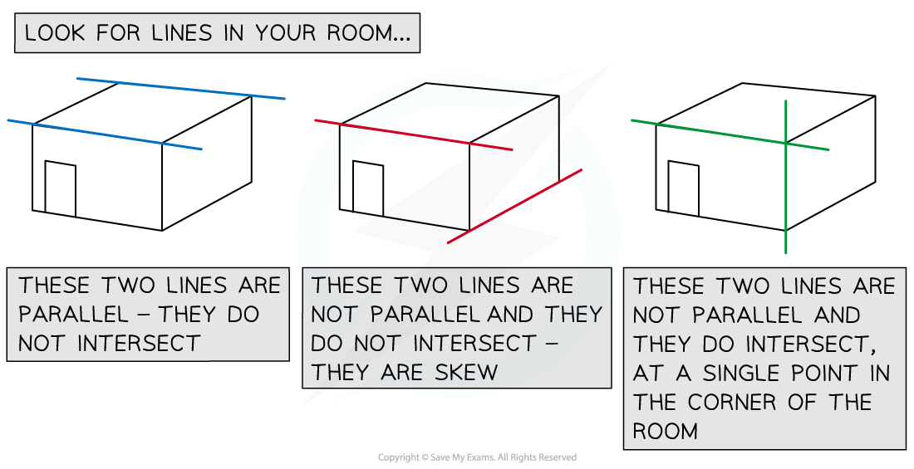

# Parallel, Intersecting & Skew Lines

## Parallel, Intersecting & Skew Lines

> **Spec point** — `spcpt_k868kHQFjJdH2rtC`

## Parallel, intersecting & skew lines

In two dimensions, lines are either parallel or they intersect at a single point. If they are parallel, then either they have no points in common, or they share every point in common.

In three dimensions, there is a further possibility: a pair of lines might not be parallel and have no points of intersection. We say that the lines are ***skew***.

### How do I know if two lines in 3D are parallel?

- Two lines are parallel if, and only if, their **direction vectors **are ***parallel***

  - This means the direction vectors will be **scalar multiples** of each other
  - For example, the lines whose equations are `bold r equals open parentheses table row 2 row 1 row cell negative 7 end cell end table close parentheses plus s open parentheses table row 2 row 0 row cell negative 8 end cell end table close parentheses`  and  `bold r equals open parentheses table row 1 row cell negative 1 end cell row 5 end table close parentheses plus t open parentheses table row cell negative 1 end cell row 0 row 4 end table close parentheses`  are parallel since their direction vectors `open parentheses table row 2 row 0 row cell negative 8 end cell end table close parentheses`  and `open parentheses table row cell negative 1 end cell row 0 row 4 end table close parentheses` are parallel vectors as `open parentheses table row 2 row 0 row cell negative 8 end cell end table close parentheses equals negative 2 open parentheses table row cell negative 1 end cell row 0 row 4 end table close parentheses`

- There are two possibilities for two parallel lines: either they **never intersect** or they are the** identical**

  - Recall that the vector equation of a line can take **many forms** – for example, the lines represented by the equations   `bold r equals open parentheses table row 1 row cell negative 8 end cell end table close parentheses plus s open parentheses table row cell negative 4 end cell row 8 end table close parentheses`  and  `bold r equals open parentheses table row cell negative 3 end cell row 0 end table close parentheses plus t open parentheses table row 1 row cell negative 2 end cell end table close parentheses`    are actually the same line even though the equations look entirely different

- To see that the lines are identical, first check that they are **parallel**

  - they are because `open parentheses table row cell negative 4 end cell row 8 end table close parentheses equals negative 4 open parentheses table row 1 row cell negative 2 end cell end table close parentheses` and so the direction vectors are parallel

- Next, determine whether **any point **on one of the lines also lies on the other.

  - In the example above, is the position vector of a point on the first line – does it also lie on the second line? Yes, because `open parentheses table row 1 row cell negative 8 end cell end table close parentheses equals open parentheses table row cell negative 3 end cell row 0 end table close parentheses plus 4 open parentheses table row 1 row cell negative 2 end cell end table close parentheses`

- If two parallel lines share **any point**, then they share **all points** – i.e. they are **identical**

### What are skew lines?

- First, start with another question: do lines which are not parallel necessarily intersect?

  - In **2 dimensions**, the answer is **yes**
  - However, lines in **3 dimensions** **do not necessarily intersect**

- Lines that are **not parallel** and which **do not intersect** are called **skew lines**

### How do I know if two lines in 3D are parallel, skew, or intersecting?

- First, look to see if the direction vectors are parallel:

  - if the **direction vectors are parallel**, then the **lines are parallel**
  - if the **direction vectors are not parallel**, the **lines are not parallel**

- If the lines are **parallel**, check to see if they are **identical**:

  - If they **share any point**, then they are **identical**
  - If **any point** on one line is **not on the other line**, then the lines are **not identical**

- If the lines are **not parallel**, check whether they intersect:

  - Using **different letters,** e.g. *s* and *t*, for the parameters, write down coordinates for a general point on each line
  - Supposing that the lines do intersect: equate the two coordinates and write down **three equations**
  
    - One for each component (**i, j, k**)
  - Solve **any two pairs** of these equations simultaneously to find *s* and *t*
  - **Check** whether the values of *s* and *t *you have found satisfy the third equation
  
    - If **all three** equations are satisfied, then the lines **intersect**
    - If **not all three** equations are satisfied, then the lines are **skew**

- If a pair of lines are** not parallel** and **do intersect**, the unique point of intersection can be found by substituting the value of one of the parameters you have found into the coordinates for points on the appropriate line.

> **Worked Example**
> 
> 
> 

> **Exam Hint**
> - Make sure that you use different letters, e.g. *s* and *t*, to represent the parameters in vector equations of different lines.
