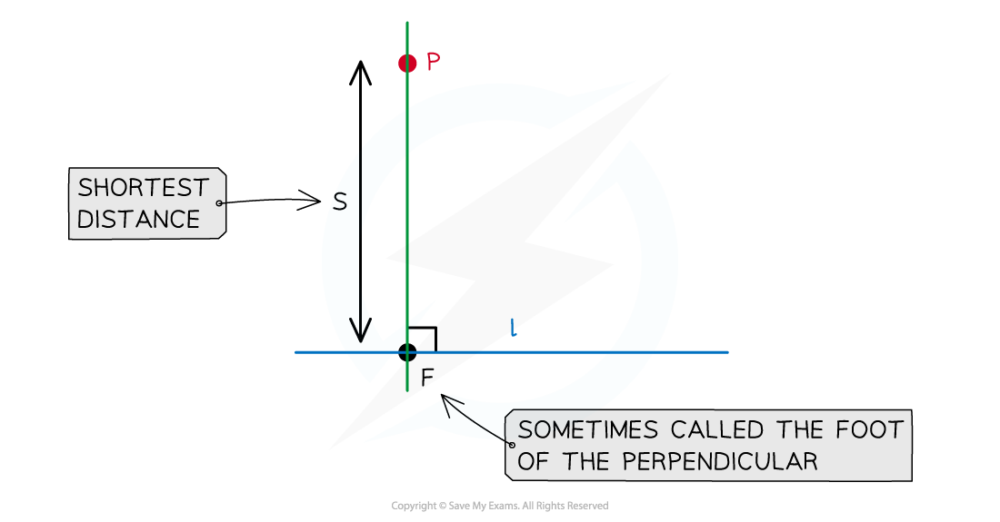

# Uses of the Scalar Product

## Uses of the Scalar Product

> **Spec point** — `spcpt_GjkGPBQxw5qX3wHd`

## Uses of the scalar product

This revision note covers several applications of the scalar product for vectors – namely, how you can use the scalar product to:

- find the angle between vectors or lines
- test whether vectors or lines are perpendicular
- find the closest distance from a point to a line

### How do I find the angle between two vectors?

- Recall that a formula for the scalar (or ‘dot’) between vectors $a$ and $b$ is

`bold a bold times bold b equals open vertical bar bold a close vertical bar open vertical bar bold b close vertical bar cos invisible function application theta`

- where $θ$ is the angle between the vectors when they are placed **‘base to base’**

  - that is, when the vectors are positioned so that they start at the same point
- We arrange this formula to make $\mathrm{cos}θ$ the subject:

  - `cos space theta equals fraction numerator bold a times bold b over denominator open vertical bar bold a close vertical bar space open vertical bar bold b close vertical bar end fraction`
- To find the angle between two vectors

  - Calculate the scalar product between them
  - Calculate the magnitude of each vector
  - Use the formula to find $\mathrm{cos}θ$
  - Use inverse trig to find $θ$

### How do I find the angle between two lines in 3D?

- To find the angle between two lines, find the angle between their **direction vectors**

- For example, if the lines have equations $r=a_{1}+sd_{1}$ and $r=a_{2}+td_{2}$, then the angle $θ$ between the lines is given by

`theta equals cos to the power of negative 1 end exponent open parentheses fraction numerator bold d subscript 1 bold times bold d subscript 2 over denominator open vertical bar bold d subscript 1 close vertical bar open vertical bar bold d subscript 2 close vertical bar end fraction close parentheses`

### How do I know if vectors or lines are perpendicular?

- Two (non-zero) vectors $a$ and $b$ are **perpendicular** if, and only if, `bold a bold times bold b equals 0`

  - If the **a **and **b **are perpendicular then:
  
    - `theta equals 90 degree rightwards double arrow cos space theta equals 0 rightwards double arrow open vertical bar bold a close vertical bar open vertical bar bold b close vertical bar cos space theta blank equals 0 rightwards double arrow bold a bold times bold b equals 0`
  - If  `bold a bold times bold b equals 0` then:
  
    - `open vertical bar bold a close vertical bar open vertical bar bold b close vertical bar cos space theta blank equals 0 rightwards double arrow cos space theta equals 0 rightwards double arrow theta equals 90 degree rightwards double arrow` **a **and **b **are perpendicular
  - For example, the vectors $2i-3j+5k$ and $-4i-j+k$ ** **are perpendicular since

`open parentheses 2 i minus 3 j plus 5 k blank close parentheses times open parentheses negative 4 i minus j plus k close parentheses equals 2 cross times open parentheses negative 4 close parentheses plus open parentheses negative 3 close parentheses cross times open parentheses negative 1 close parentheses plus 5 cross times 1 equals negative 8 plus 3 plus 5 equals 0`

### How do I find the shortest distance from a point to a line?

- Suppose that we have a line $l$ with equation $r=a+td$  and a point** **$P$ not on $l$
- Let $F$ be the **point on** $l$ which is **closest to **$P$ (sometimes called the **foot of the perpendicular**)

  - Then the line between $F$ and $P$ will be perpendicular to the line $l$
- To find the closest point $F$

  - Call $f=\overset{\rightarrow}{\mathrm{OF}}$ and $p=\overset{\rightarrow}{OP}$
  - Since $F$ lies on $l$, we have $f=a+t_{0}d$, for a unique real number $t_{0}$
  - Find the vector $\overset{\rightarrow}{FP}$ using $p-f$
  - $\overset{\rightarrow}{FP}$ **is perpendicular to **$d$ so form an equation using `open parentheses bold p minus bold f close parentheses times bold d equals 0`
  - Solve this equation to find the value of $t_{0}$
  - Use the value of $t_{0}$ to find $f$
- The **shortest distance** between the point $P$ and the line $l$ is the **length **`open vertical bar stack F P with rightwards arrow on top close vertical bar`
- Note that the **shortest distance between the point and the line** is sometimes referred to as the **length of the perpendicular**

> **Worked Example**
> 
> 
> 

> **Exam Hint**
> It can be easier and clearer to work with column vectors when dealing with scalar products.
