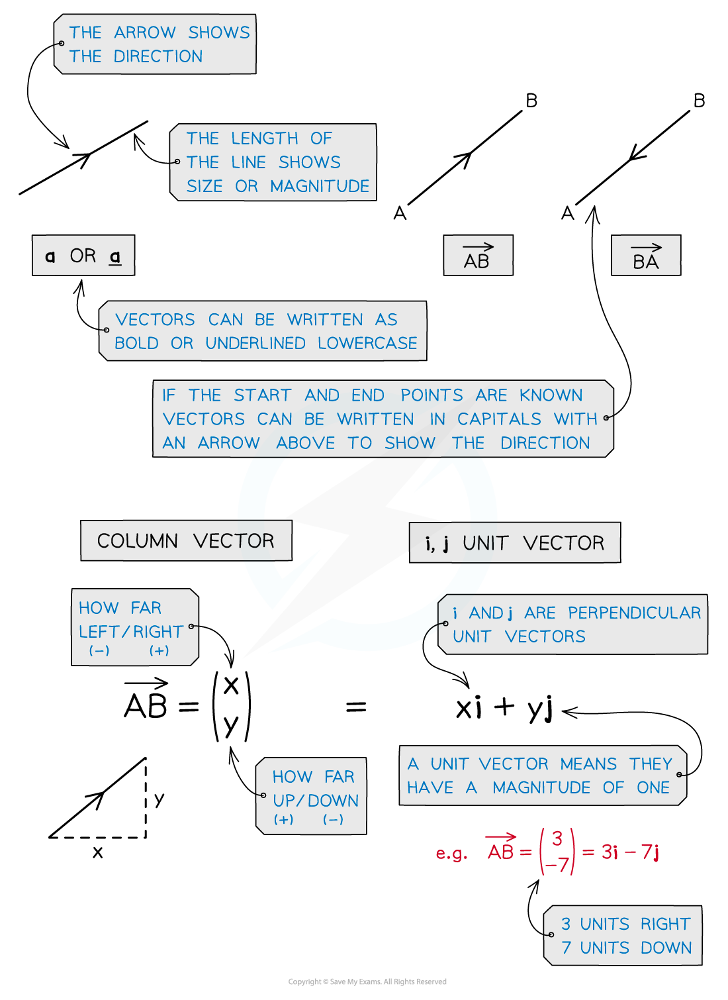

# Basic Vectors

## Basic Vectors

> **Spec point** — `spcpt_ts8KGt4XJ4wcQFvV`

## Basic vectors

### What is a vector?

- Vectors represent a movement of a certain **magnitude** (size) in a given **direction**
- You should have already come across **vectors** when translating functions of graphs
- They appear in many contexts of maths including **mechanics** for modelling forces
- Vectors can be represented in different ways such as a **column vector** or as an **i and j unit vector**

> **Exam Hint**
> - Think of vectors like a journey from one place to another.
> - Diagrams can help, if there isn’t one, draw one.
> - In your exam you can’t write in **bold **so should <u>underline</u> your vector notation.

> **Worked Example**
> 
> 
> 
