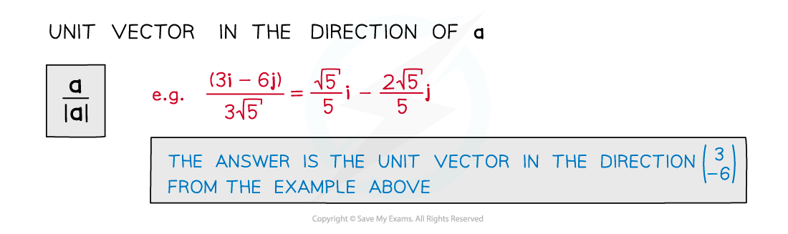
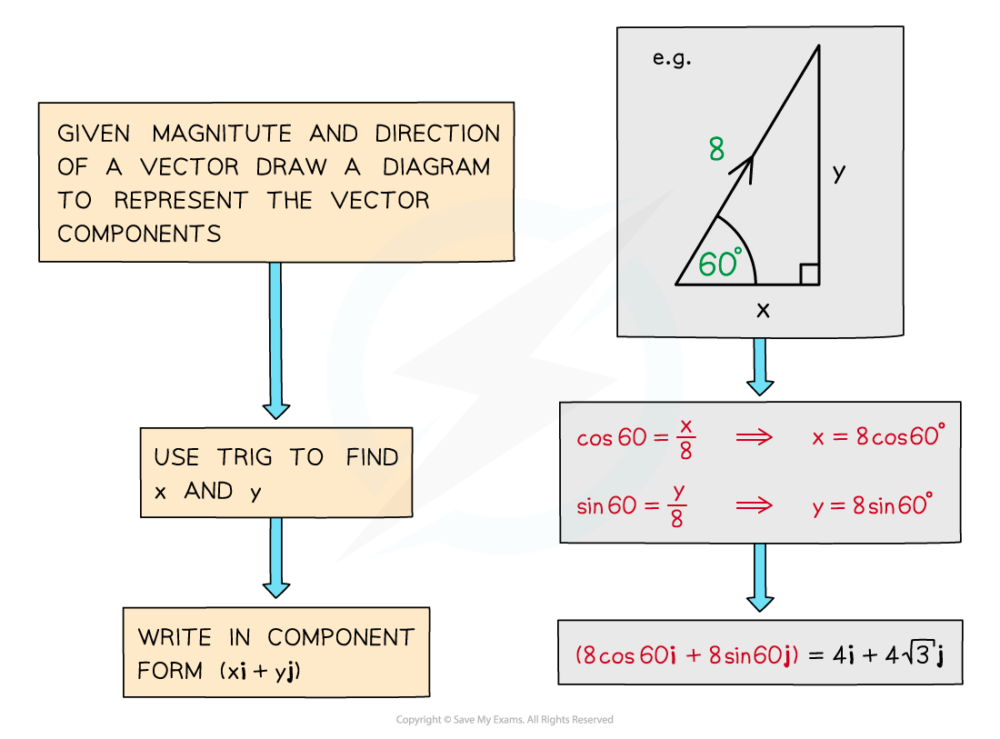
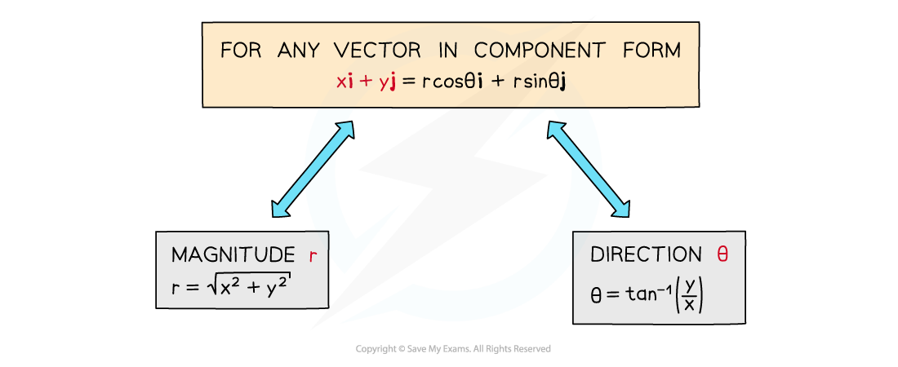

# Magnitude & Direction

## Magnitude & Direction

> **Spec point** — `spcpt_Mjs3DbfDZSWQm4sw`

## Magnitude & direction

### What is the magnitude of a vector?

- The magnitude of a vector is simply its size
- It also tells us the distance between two points
- You can find the magnitude of a vector using *Pythagoras’ theorem*
- The magnitude of a vector $a$** **is written `vertical line bold a vertical line` when typed (or `vertical line bottom enclose straight a vertical line` when handwritten)

- To work out the **unit vector **in the direction of a given vector
- A **unit vector** has a **magnitude** of 1 So to find the unit vector of a given vector, divide by its magnitude

### What is the direction of a vector?

- Vectors have opposite direction if they are the same size but opposite signs

  - e.g. if $a$ or `stack B C with rightwards arrow on top equals stretchy left parenthesis table row cell negative 3 end cell row 8 end table stretchy right parenthesis`  then $-a$ or `stack C B with rightwards arrow on top equals stretchy left parenthesis table row 3 row cell negative 8 end cell end table stretchy right parenthesis`

- The direction of a vector is what makes it more than just a *scalar*

  - Eg. two objects with velocities of 7 m/s and ‑7 m/s are travelling at the **same speed** but in **opposite directions**
- Two vectors are **parallel** if and only if one is a **scalar multiple** of the other
- For real-life contexts such as mechanics, direction can be calculated from a given vector using **trigonometry **(see Right-Angled Triangles)
- It is usually calculated **anticlockwise** from the **positive x-axis** (unless otherwise stated eg. a bearing)

### How do I write a vector in component form?

- We have already seen that vectors can be written in different forms
- Component form means writing a vector in terms of **i** and **j** **components**
- Given the **magnitude** and **direction** of a vector you can work out its components and vice versa

** **

> **Exam Hint**
> - Diagrams can help, especially when working out direction – if there isn’t a diagram, draw one.
> - Remember, resolving a vector just means writing it in component form.

> **Worked Example**
> 
