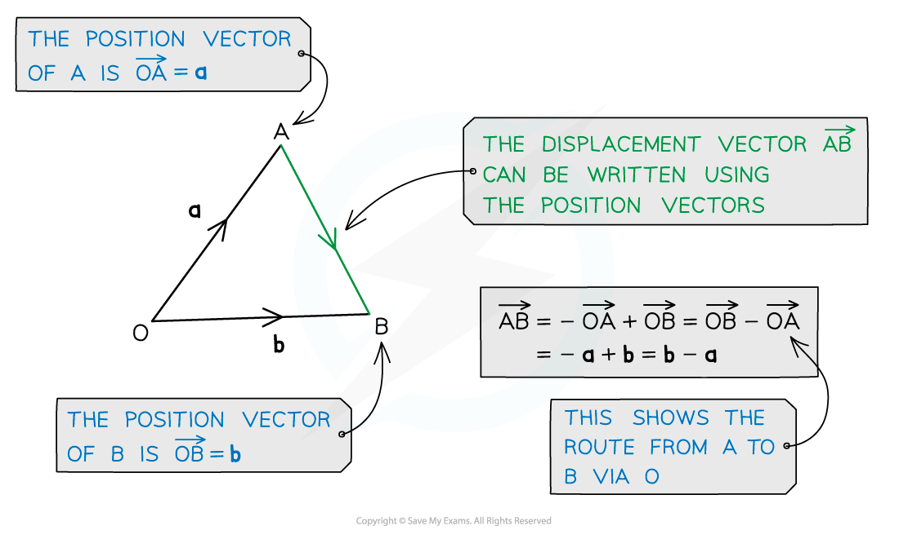
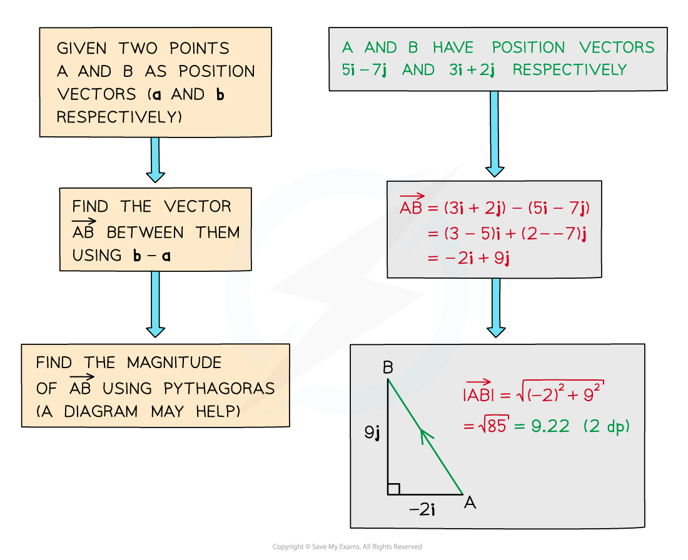

# Position Vectors

## Position Vectors

> **Spec point** — `spcpt_6fw2v3vcB3GvKrhp`

## Position vectors

### What is a position vector?

- Position vectors describe the **position of a point** in relation to the *origin*
- They are different to **displacement vectors** which describe the **direction and distance** between any two points

### Distance between two points

- The distance between two points is the **magnitude** of the vector between them (see Magnitude Direction)

### How do I find the magnitude of a displacement vector?

- You can use **coordinate geometry** to find **magnitudes **of **displacement vectors** from *A * to *B*

  - From the **position vectors** of *A*  and *B*  you know their coordinates
  
    - If  `bold a equals stack O A with rightwards arrow on top equals x subscript 1 bold i plus y subscript 1 bold j equals open parentheses table row cell x subscript 1 end cell row cell y subscript 1 end cell end table close parentheses`,  then point A has coordinates `open parentheses x subscript 1 comma space y subscript 1 close parentheses`
    - If  `bold b equals stack O B with rightwards arrow on top equals x subscript 2 bold i plus y subscript 2 bold j equals open parentheses table row cell x subscript 2 end cell row cell y subscript 2 end cell end table close parentheses`,  then point B has coordinates `open parentheses x subscript 2 comma space y subscript 2 close parentheses`
  - The **distance** between two points is given by `d space equals blank square root of open parentheses x subscript 1 minus blank x subscript 2 close parentheses squared space plus space open parentheses y subscript 1 minus blank y subscript 2 close parentheses squared end root blank`
  
    - So  `open vertical bar stack A B with rightwards arrow on top close vertical bar space equals blank square root of open parentheses x subscript 1 minus blank x subscript 2 close parentheses squared space plus space open parentheses y subscript 1 minus blank y subscript 2 close parentheses squared end root blank`
  - For example, if points A and B have position vectors $5i+3j$ and $3i-6j$ respectively
  
    - then  `open vertical bar stack A B with rightwards arrow on top close vertical bar equals square root of open parentheses 5 minus 3 close parentheses squared plus open parentheses 3 minus open parentheses negative 6 close parentheses close parentheses squared end root equals square root of 85 equals 9.22 space open parentheses 3 space straight s. straight f. close parentheses`

- Alternatively, you could find `open vertical bar stack A B with rightwards arrow on top close vertical bar` by

  - first using  $\overset{\rightarrow}{AB}=-\overset{\rightarrow}{OA}+\overset{\rightarrow}{OB}$ to find $\overset{\rightarrow}{AB}$ in **vector form**
  
    - and then calculating its **magnitude** directly
  - See the Worked Example below

> **Exam Hint**
> - Remember if asked for a position vector, you must find the vector all the way from the origin.
> - Diagrams can help, if there isn’t one, draw one.

> **Worked Example**
> 
